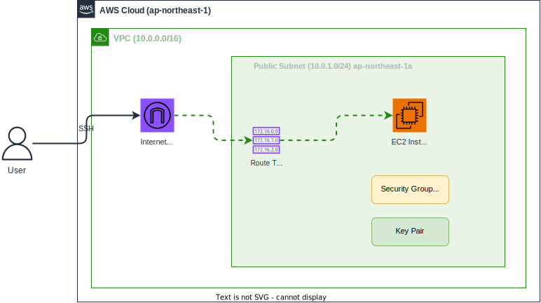

# セッション1：VPC + EC2 を段階的に構築しよう（必須・1時間）

## 学習目標

- AI Agentと対話しながらインフラを設計・構築する流れを体験する
- Terraformによるインフラ構築のパターンを習得する

## 🎯 このセッションの到達状態

以下のAWS環境が構築され、SSH接続できる状態になっています。



| リソース | 設定値 |
|---------|-------|
| VPC | 10.0.0.0/16 |
| パブリックサブネット | 10.0.1.0/24（ap-northeast-1a） |
| インターネットゲートウェイ | VPCにアタッチ |
| ルートテーブル | 0.0.0.0/0 → IGW |
| セキュリティグループ | SSH（22番ポート）のみ許可 |
| キーペア | SSH接続用 |
| EC2インスタンス | t3.micro / Amazon Linux 2023 |

> 💡 このEC2はセッション2でnginxをインストールしてWebページを公開し、セッション4以降でAnsibleの操作対象になります。

### 構築の流れ

```
Step 0: Plan モードで設計を相談     ← AI と対話しながらインフラ設計    (5分)
    ↓
Step 1: VPC を作る                  ← お手本プロンプトで体験            (10分)
    ↓
Step 2: ネットワーク環境を整える     ← 目的を伝えてプロンプトを考える    (10分)
    ↓
Step 3: SSH の準備をする             ← ゴールだけ示してヒントで挑戦      (10分)
    ↓
Step 4: EC2 を作る                   ← 自力で挑戦！                     (10分)
    ↓
Step 5: SSH 接続で動作確認                                              (10分)
    ↓
振り返り                                                                (5分)
```

> 🎓 **このセッションのポイント**: Step が進むにつれてプロンプトのサポートが減っていきます。「Claude Code にどう伝えれば動いてくれるか」を自分で考える力を身につけましょう。

---

## 📚 事前準備

> ⚠️ **環境変数が未設定の場合**: `echo $TF_VAR_prefix` で値が表示されない場合は講師に確認してください。

1. [環境セットアップガイド](../reference/ENVIRONMENT_SETUP.md) が完了していること
2. SSH鍵ペアを生成しておくこと：

```bash
mkdir -p keys
```

```bash
ssh-keygen -t rsa -b 4096 -f keys/training-key -N ""
```

```bash
chmod 400 keys/training-key
```

> 💡 **なぜ `keys/` フォルダに保存するのか**: プロジェクトディレクトリ内に保存することで、他のセッションからも同じパスで参照できます。`~/.ssh/` に保存するとパスが環境依存になるため、プロジェクト内に保存します。

> ⚠️ **作業ディレクトリについて**: Claude Codeへのプロンプトは **プロジェクトルート**（このREADMEがあるフォルダ）から実行してください。

---

## Step 0: Plan モードで設計を相談しよう（5分）

> 🆕 **AWS や Terraform を知らなくても大丈夫！** Claude Code の Plan モードで、AI と対話しながら「何を作るか」を一緒に考えましょう。

### やること

実装に入る前に、Claude Code と **対話しながらインフラの設計** を行います。
Plan モードでは Claude Code がコードの変更を行わないため、安心して相談できます。

### 手順

1. ターミナルで Claude Code を起動し、Plan モードに切り替えます：

```bash
claude
```

起動したら、`Shift + Tab` または `/plan` と入力して **Plan モード** に切り替えてください。

2. 以下のように相談してみましょう：

```
AWS 上に EC2 インスタンスを1台建てて SSH でログインできるようにしたいです。
必要な AWS リソースと構成を教えてください。
```

3. Claude Code が構成案を提示してくれます。分からない用語があれば **どんどん質問** してください：

```
VPC って何ですか？なぜ必要なんですか？
```

```
セキュリティグループとファイアウォールの違いは？
```

```
インターネットゲートウェイがないとどうなりますか？
```

4. 構成が理解できたら `/exit` で Plan モードを終了します

> 🎓 **このStepの狙い**: 「自分が何を作ろうとしているか」を理解してから構築に入ることで、Step 1 以降のプロンプトの意味が分かるようになります。AWS の知識がなくても、AI に聞きながら設計できる — これが AI 駆動開発の最大の強みです。

---

## Step 1: VPCを作ろう — 🟢 お手本（10分）

> このStepでは **お手本プロンプト** を用意しています。AI Agent 開発の流れを体験しましょう。

### やること

Claude CodeでVPCを作成するTerraformコードを生成・実行します。

### 手順

1. **あなた**がターミナルで Claude Code を起動します（`claude` コマンドを実行）
2. 以下のプロンプトを **Claude Code に** 入力します：

```
terraform/vpc-ec2/ フォルダに、以下の要件でVPCを作成するTerraformコードを作成してください。

- プロバイダー: aws（ap-northeast-1リージョン）
- variables.tf に prefix 変数を定義（デフォルト値なし、環境変数 TF_VAR_prefix から自動取得される）
- VPC CIDR: 10.0.0.0/16
- DNSホスト名とDNSサポートを有効化
- タグ: Name = "${var.prefix}-vpc"
- outputs.tf に VPC ID を出力

terraform init と terraform apply まで実行してください。
```

3. Claude Code が実行計画を提示します → **あなたが内容を確認して承認**
4. Claude Code が `terraform apply` の確認を求めたら → **あなたが `yes` を入力して承認**

### なぜこのプロンプトがうまくいくのか

このプロンプトには **効果的なプロンプトの4要素** が含まれています：

| 要素 | プロンプト内の該当部分 | なぜ効果的？ |
|------|---------------------|-------------|
| **① 保存先を明確に** | `terraform/vpc-ec2/ フォルダに` | AI がどこにファイルを作ればいいか迷わない |
| **② 要件を具体的に** | `CIDR: 10.0.0.0/16` など | 曖昧さがないので、意図通りの結果になる |
| **③ 命名規則を伝える** | `"${var.prefix}-vpc"` | 他の受講者とリソース名が衝突しない |
| **④ 実行指示まで含める** | `terraform init と apply まで実行` | コード生成だけでなく実行まで自動化される |

> 💡 **Session 2 以降でもこの4要素を意識してプロンプトを書いてみてください。** 「保存先・要件・命名・実行指示」を明確にするだけで、AI の出力精度が格段に上がります。

### 確認（あなたがターミナルで実行）

```bash
terraform -chdir=terraform/vpc-ec2 output
```

VPC ID（`vpc-xxxxx`）が表示されれば OK ✅

<details>
<summary>❓ うまくいかない場合</summary>

- エラーが出たら、**エラーメッセージをそのまま Claude Code に伝えて**ください — AI Agent が自動修正してくれます
- 「terraform init から再実行してください」と Claude Code に指示するのも効果的です
- あなたのターミナルで AWS認証情報が設定されているか確認してください（`aws sts get-caller-identity`）

</details>

---

### 🔧 AI とのトラブルシューティング — 基本パターン

> ワークショップ全体を通じて、何か問題が起きたときは以下のパターンで対応できます。
>
> ```
> 1. あなたが Claude Code にタスクを依頼する
> 2. AI Agent が実行し、あなたが結果を確認する（成功 or エラー）
> 3. エラーの場合 → エラーメッセージをそのまま Claude Code に共有
> 4. AI Agent が原因を分析し、修正案を提示・実行
> 5. あなたが結果を再確認
> 6. 解決するまで 3〜5 を繰り返す
> ```
>
> 💡 **ポイント**: AI Agent はエラーメッセージから多くの情報を読み取れます。「動きません」よりも **エラーの全文を貼り付ける** 方が、はるかに正確な診断ができます。

---

## Step 2: ネットワーク環境を整えよう — 🟡 ガイド付き（10分）

> このStepからは **自分でプロンプトを考えてみましょう**。Step 0 で学んだ構成を思い出してください。

### 目的

VPC だけでは EC2 からインターネットに出られません。EC2 をインターネットに接続するためのネットワーク環境を整えましょう。

### ゴール

- パブリックサブネットが作成されている（CIDR: `10.0.1.0/24`、ap-northeast-1a）
- インターネットゲートウェイが VPC にアタッチされている
- ルートテーブルで `0.0.0.0/0` → IGW のルートが設定されている
- `terraform output` でサブネットIDが表示される

> 💡 **ヒント**: 「既存の terraform/vpc-ec2/ のコードに追加して」と伝えれば、Claude Code が既存ファイルを読み取って適切に追加してくれます。

<details>
<summary>📝 プロンプト例（まず自分で考えてから開いてください）</summary>

```
terraform/vpc-ec2/ の既存コードに、EC2がインターネットに接続できるネットワーク環境を追加してください。

- パブリックサブネット（CIDR: 10.0.1.0/24、ap-northeast-1a、パブリックIP自動割り当て有効）
- インターネットゲートウェイ
- ルートテーブル（0.0.0.0/0 → IGW）
- outputs.tf にサブネットIDを追加

terraform apply まで実行してください。
```

</details>

### 確認

```bash
terraform -chdir=terraform/vpc-ec2 output
```

サブネットID（`subnet-xxxxx`）が表示されれば OK ✅

---

## Step 3: SSH の準備をしよう — 🟠 ヒント付き（10分）

> **ゴールとヒントだけ** を示します。どんなプロンプトにするかは自分で考えてみましょう。

### 目的

EC2 に SSH でログインするには、鍵とファイアウォール（セキュリティグループ）の設定が必要です。

### ゴール

- キーペアが作成されている（事前準備で生成した `keys/training-key.pub` を使用）
- セキュリティグループで SSH（22番ポート）のみ許可されている
- `terraform output security_group_id` でセキュリティグループIDが表示される

> ⚠️ **output名について**: 後続のセッションでこのoutputを参照します。プロンプトで名前を必ず `security_group_id` と指定してください。

### ヒント

- キーペア名は `"${var.prefix}-key"` にしましょう
- アウトバウンドは全許可が一般的です

<details>
<summary>📝 プロンプト例（困ったら参考にしてください）</summary>

```
terraform/vpc-ec2/ の既存コードに、SSH接続の準備を追加してください。

- キーペア: keys/training-key.pub を使用、名前は "${var.prefix}-key"
- セキュリティグループ: SSH（22番）のみ許可、名前は "${var.prefix}-ec2-sg"
- outputs.tf にセキュリティグループIDを追加（output名: security_group_id）

terraform apply まで実行してください。
```

</details>

### 確認

```bash
terraform -chdir=terraform/vpc-ec2 output security_group_id
```

セキュリティグループID（`sg-xxxxx`）が表示されれば OK ✅

---

## Step 4: EC2インスタンスを作ろう — 🔴 自力で挑戦！（10分）

> **自力で挑戦** です。ここまでの経験を活かして、自分でプロンプトを書いてみましょう！

### 目的

いよいよ EC2 インスタンスを作成して、SSH 接続できる環境を完成させます。

### ゴール

- EC2 インスタンスが起動している（Amazon Linux 2023、t3.micro）
- これまでに作ったサブネット・キーペア・セキュリティグループが適用されている
- `terraform output instance_public_ip` でパブリックIPが表示される
- `terraform output instance_id` でインスタンスIDが表示される

> ⚠️ **output名について**: 後続のセッションで `instance_public_ip` と `instance_id` を参照します。プロンプトで output名を必ずこの名前で指定してください。

> 🤔 **考えてみよう**: AMI IDはリージョンや日時で変わります。Claude Code にどう指示すれば「常に最新のAMI」を使えるでしょうか？

<details>
<summary>📝 どうしても困ったら（まずは5分自分で試してから！）</summary>

```
terraform/vpc-ec2/ の既存コードに、EC2インスタンスを追加してください。

- Amazon Linux 2023（最新のAMIを自動取得）、t3.micro
- 既存のサブネット、キーペア、セキュリティグループを使用
- outputs.tf にパブリックIP（output名: instance_public_ip）とインスタンスID（output名: instance_id）を追加

terraform apply まで実行してください。
```

</details>

### 確認

```bash
terraform -chdir=terraform/vpc-ec2 output instance_public_ip
```

IPアドレスが表示されれば OK ✅

---

## Step 5: SSH接続を確認しよう（10分）

構築した EC2 に SSH で接続して、環境が正しく構築されたか確認します。

### 手順（すべてあなたがターミナルで実行）

1. **IPアドレスを確認**:

```bash
terraform -chdir=terraform/vpc-ec2 output instance_public_ip
```

2. **SSH接続**（表示されたIPアドレスに置き換えてください）:

```bash
ssh -i keys/training-key ec2-user@<表示されたIPアドレス>
```

3. 接続できたら `exit` で切断:

```bash
exit
```

接続できれば **セッション1完了** 🎉

> 💡 このEC2は次のセッション以降でAnsibleから操作します。**ワークショップ期間中は削除しないでください。**

<details>
<summary>❓ SSH接続できない場合</summary>

- **数分待ってから再試行** — EC2起動直後は接続できないことがあります（1〜2分）
- セキュリティグループでSSH（22番ポート）が許可されているか確認
- キーペアファイルの権限を確認（`chmod 400 keys/training-key`）
- パブリックIPが割り当てられているか確認（`terraform output`）
- EC2インスタンスが起動しているか確認

</details>

---

## 📝 振り返り（5分）

### Agent開発で体験したこと

| 特徴 | 体験したこと |
|------|------------|
| **AI との対話で設計** | Plan モードで AWS の知識がなくても構成を設計できた |
| **コード生成→実行の自動化** | プロンプト入力だけで terraform init → apply まで自動実行 |
| **段階的な構築** | 「既存コードに追加」と指示するだけで段階的に構築できた |
| **承認ワークフロー** | AI Agent が提示する変更内容を確認してから実行（human in the loop） |

### プロンプトの書き方で気づいたこと

Step 1〜4を通して、効果的なプロンプトの要素が見えてきたはずです：

1. **保存先**を明確にする
2. **要件を具体的に**書く（値、名前、設定項目）
3. **命名規則**を伝える（prefix を使う）
4. **実行指示**まで含める

> 次のセッション以降は、この経験を活かして **最初から自分でプロンプトを考えて** Claude Code に指示を出していきます。

### 📖 コードを理解しよう — Claude Code に設計書を作ってもらう

ここまでで作成した Terraform コードの内容を理解しましょう。Claude Code に以下のように依頼してください：

```
terraform/vpc-ec2/ のコードについて、各リソースの役割と依存関係を説明してください。
初心者にも分かりやすくお願いします。
```

> 💡 **なぜこの作業が重要か**: 生成AIがあればコードは書けますが、**コードの意味を理解していないとトラブル時に対応できません**。分からない部分があれば Claude Code に質問しましょう。

---

## ファイル構成

セッション完了時、以下の構成になっています：

```
terraform/
└── vpc-ec2/
    ├── main.tf          # VPC, Subnet, IGW, RT, SG, KP, EC2
    ├── variables.tf     # 変数定義
    └── outputs.tf       # VPC ID, Subnet ID, SG ID, Public IP
```

<details>
<summary>📝 完成形のコード例（クリックで展開）</summary>

> 💡 **パスの解決について**: Terraform の `file()` 関数は、`.tf` ファイルがあるディレクトリを起点にパスを解決します。`terraform -chdir=terraform/vpc-ec2` で実行しても、`file("../../keys/training-key.pub")` は `terraform/vpc-ec2/` から `../../` = プロジェクトルートの `keys/training-key.pub` を正しく参照します。

### variables.tf

```hcl
variable "region" {
  description = "AWSリージョン"
  type        = string
  default     = "ap-northeast-1"
}

variable "vpc_cidr" {
  description = "VPC CIDRブロック"
  type        = string
  default     = "10.0.0.0/16"
}

variable "subnet_cidr" {
  description = "パブリックサブネットのCIDRブロック"
  type        = string
  default     = "10.0.1.0/24"
}

variable "instance_type" {
  description = "EC2インスタンスタイプ"
  type        = string
  default     = "t3.micro"
}

variable "prefix" {
  description = "リソース名の接頭辞（受講者ごとにユニークな値）"
  type        = string
}
```

### main.tf

```hcl
provider "aws" {
  region = var.region
}

# --- VPC ---
resource "aws_vpc" "main" {
  cidr_block           = var.vpc_cidr
  enable_dns_hostnames = true
  enable_dns_support   = true

  tags = {
    Name = "${var.prefix}-vpc"
  }
}

# --- サブネット & インターネット接続 ---
resource "aws_subnet" "public" {
  vpc_id                  = aws_vpc.main.id
  cidr_block              = var.subnet_cidr
  availability_zone       = "${var.region}a"
  map_public_ip_on_launch = true

  tags = {
    Name = "${var.prefix}-public-subnet"
  }
}

resource "aws_internet_gateway" "main" {
  vpc_id = aws_vpc.main.id

  tags = {
    Name = "${var.prefix}-igw"
  }
}

resource "aws_route_table" "public" {
  vpc_id = aws_vpc.main.id

  route {
    cidr_block = "0.0.0.0/0"
    gateway_id = aws_internet_gateway.main.id
  }

  tags = {
    Name = "${var.prefix}-public-rt"
  }
}

resource "aws_route_table_association" "public" {
  subnet_id      = aws_subnet.public.id
  route_table_id = aws_route_table.public.id
}

# --- キーペア & セキュリティグループ ---
resource "aws_key_pair" "training_key" {
  key_name   = "${var.prefix}-key"
  public_key = file("../../keys/training-key.pub")
}

resource "aws_security_group" "ec2_sg" {
  name        = "${var.prefix}-ec2-sg"
  description = "Security group for ${var.prefix} EC2"
  vpc_id      = aws_vpc.main.id

  ingress {
    description = "SSH"
    from_port   = 22
    to_port     = 22
    protocol    = "tcp"
    cidr_blocks = ["0.0.0.0/0"]
  }

  egress {
    from_port   = 0
    to_port     = 0
    protocol    = "-1"
    cidr_blocks = ["0.0.0.0/0"]
  }

  tags = {
    Name = "${var.prefix}-ec2-sg"
  }
}

# --- EC2インスタンス ---
data "aws_ami" "amazon_linux" {
  most_recent = true
  owners      = ["amazon"]

  filter {
    name   = "name"
    values = ["al2023-ami-*-x86_64"]
  }

  filter {
    name   = "virtualization-type"
    values = ["hvm"]
  }
}

resource "aws_instance" "training_ec2" {
  ami           = data.aws_ami.amazon_linux.id
  instance_type = var.instance_type
  subnet_id     = aws_subnet.public.id
  key_name      = aws_key_pair.training_key.key_name

  vpc_security_group_ids = [aws_security_group.ec2_sg.id]

  tags = {
    Name = "${var.prefix}-ec2"
  }
}
```

### outputs.tf

```hcl
output "vpc_id" {
  description = "VPC ID"
  value       = aws_vpc.main.id
}

output "subnet_id" {
  description = "パブリックサブネットID"
  value       = aws_subnet.public.id
}

output "security_group_id" {
  description = "セキュリティグループID"
  value       = aws_security_group.ec2_sg.id
}

output "instance_public_ip" {
  description = "EC2インスタンスのパブリックIP"
  value       = aws_instance.training_ec2.public_ip
}

output "instance_id" {
  description = "EC2インスタンスID"
  value       = aws_instance.training_ec2.id
}
```

</details>

---

## ✅ 完了チェック

以下のコマンドで、このセッションの完了状態を確認できます。

> ⚠️ **check.sh は Claude Code の外で実行してください**。
> `/exit` で bash に戻ってからコマンドを実行し、`claude -c` で再開できます。

```bash
./scripts/check.sh session1
```

---

## ⚠️ リソースの削除

> ワークショップ期間中はEC2を削除しないでください。**全セッション終了後**にあなたのターミナルで以下を実行して削除してください。

```bash
terraform -chdir=terraform/vpc-ec2 destroy
```

---

## ➡️ 次のステップ

[セッション2：Terraform でインフラを構築・変更・再構築しよう](session2_guide.md) に進んでください。
