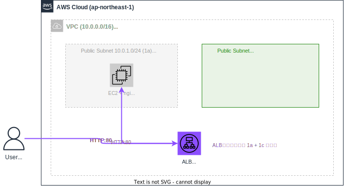

# セッション2.5：ALB を追加しよう（任意・1時間）

> このセッションは **任意（発展課題）** です。セッション2が完了し、余裕がある方向けです。

## 🎯 このセッションのゴール

セッション2で公開したWebアプリケーションを、ALB（ロードバランサー）経由でアクセスできるようにします。



### このセッションで作成するリソース

| リソース | 設定値 |
|---------|-------|
| パブリックサブネット追加 | 10.0.2.0/24（ap-northeast-1c） |
| ALB用セキュリティグループ | HTTP(80) を全体に許可 |
| ALB | training-web-alb（パブリックサブネット × 2 に配置） |
| ターゲットグループ | HTTP:80、ヘルスチェック `/` |
| ALBリスナー | HTTP:80 → ターゲットグループ |

> 💡 **なぜALBに2つのサブネットが必要？** ALBはAWSの仕様で、**異なるAZ**に最低2つのサブネットが必要です。セッション1で作った1aのサブネットに加えて、1cのサブネットを追加します。

---

## 📚 事前準備

- セッション2が完了していること（EC2にnginxがインストール済み）
- EC2のIPアドレスを確認：

```bash
cd terraform/vpc-ec2
terraform output instance_public_ip
cd ../..
```

---

## 構築の流れ

```
Step 1: パブリックサブネット + ALB を追加（35分）
    ↓
Step 2: ブラウザでアクセス確認（10分）
    ↓
振り返り（5分）
```

> 💡 セッション2でnginxは既にインストール済みなので、Terraform の作業がメインです。

---

## Step 1: パブリックサブネット + ALBを追加しよう（35分）

### やること

ALB用に2つ目のパブリックサブネットを追加し、ALB関連リソースを一括で作成します。

### ゴール

`terraform/vpc-ec2/` の既存コードに、以下を追加して apply する：

- パブリックサブネット2: `10.0.2.0/24`（ap-northeast-1c）、パブリックIP自動割り当て有効
- 既存ルートテーブルへの関連付け
- ALBセキュリティグループ: `training-alb-sg`、HTTP(80)を許可
- ALB: `training-web-alb`、パブリックサブネット × 2 に配置
- ターゲットグループ: `training-web-tg`、HTTP:80、ヘルスチェック `/`
- ALBリスナー: HTTP:80 → ターゲットグループ
- EC2セキュリティグループのHTTP(80)ルールのソースを **ALB SGからのみ** に変更
- EC2をターゲットグループに登録

> 💡 **ヒント**: ALBを導入したら、EC2のHTTP(80)ルールは「全体公開（0.0.0.0/0）」から「ALBのSGからのみ」に変更するのがベストプラクティスです。これにより、ユーザーは必ずALBを経由してアクセスすることになります。

<details>
<summary>📝 プロンプト例</summary>

```
terraform/vpc-ec2/ の既存コードに、ALB関連リソースを追加してください。

1. パブリックサブネット2: 10.0.2.0/24 (ap-northeast-1c), パブリックIP自動割り当て有効
   - 既存のルートテーブルに関連付け
2. ALBセキュリティグループ: training-alb-sg, HTTP(80)を0.0.0.0/0から許可
3. ALB: training-web-alb, パブリックサブネット2つに配置
4. ターゲットグループ: training-web-tg, HTTP:80, ヘルスチェック /
5. ALBリスナー: HTTP:80 → ターゲットグループ
6. 既存のEC2セキュリティグループのHTTP(80)ルールのソースを ALB SGからのみ に変更
7. 既存のEC2をターゲットグループに登録（aws_lb_target_group_attachment）
8. outputs.tf に ALBのDNS名を追加

terraform apply まで実行してください。
```

</details>

### 確認

```bash
cd terraform/vpc-ec2
terraform output alb_dns_name
cd ../..
```

ALBのDNS名が表示されれば OK ✅

---

## Step 2: ブラウザでアクセス確認（10分）

ALBのDNS名を使ってブラウザでアクセスします。

`http://<ALBのDNS名>` を開き、セッション2で作成した **カスタムWebページ** が表示されれば完了 🎉

> ⚠️ ALBのヘルスチェックが正常になるまで1〜2分かかることがあります。表示されない場合は少し待ってからリロードしてください。

<details>
<summary>❓ ブラウザで表示されない場合</summary>

- **ALBヘルスチェック待ち**: 1〜2分待ってリロード
- **EC2のセキュリティグループ**: ALB SGからのHTTP(80)が許可されているか確認
- **ALBのセキュリティグループ**: 0.0.0.0/0 からのHTTP(80)が許可されているか確認
- **nginx起動確認**: EC2にSSHして `sudo systemctl status nginx` で確認

</details>

---

## 📝 振り返り（5分）

### 学んだこと

- ALBは **2つのAZ** にまたがるパブリックサブネットが必要
- セキュリティグループは **階層的**（ALB → EC2）に設計する
- ALB導入後は EC2 への直接アクセスを制限するのがベストプラクティス
- `aws_lb_target_group_attachment` でEC2をターゲットに登録する

### 最終構成

```
User → ALB (HTTP:80) → EC2 (nginx:80)
       ↑ パブリックサブネット × 2 に配置
```

---

## ➡️ 次のステップ

[セッション3：サーバー再起動の自動化](session3_guide.md) に進んでください。
