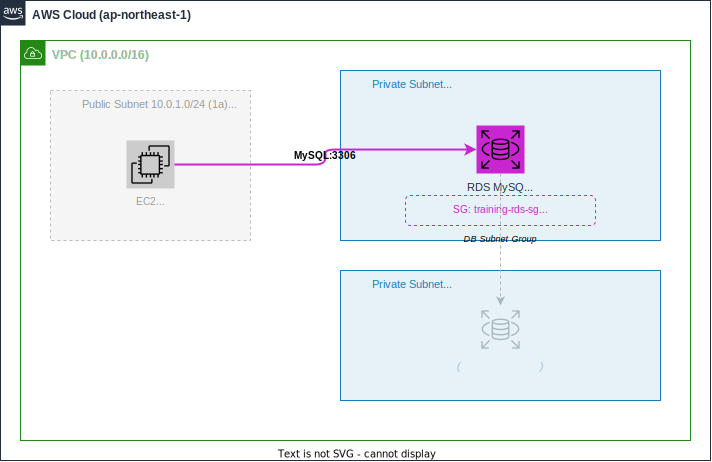

# セッション2：Terraform でインフラを構築・変更・再構築しよう（必須・2時間）

## 🎯 このセッションの到達状態

Terraform の **ライフサイクル（変更 → 削除 → 再構築）** を一通り体験し、`user_data` で nginx が自動インストールされた EC2 にブラウザからアクセスできる状態になっています。



### このセッションで変更・追加するリソース

| リソース | 変更内容 |
|---------|---------|
| セキュリティグループ | HTTP(80) のインバウンドルールを追加 |
| EC2 インスタンス | `user_data` で nginx 自動インストールを追加 |
| EC2 上のソフトウェア | nginx（Webサーバー）をインストール |
| Webコンテンツ | カスタムHTMLページをデプロイ |

> 🎓 このセッションでは Terraform の **plan → apply → destroy → apply** というライフサイクルを体験します。「コードで管理しているからこそ、壊しても一瞬で元に戻せる」という IaC の真価を実感してください。
>
> 💡 **Claude Codeのターミナル操作について**: このセッションでは、Claude CodeがSSHでEC2に接続してコマンドを実行する場面があります。Claude Codeはターミナル機能を使って **自動的にSSH接続→コマンド実行→結果確認** を行います。各コマンド実行前に承認を求められるので、内容を確認してから承認してください。

---

## 📚 事前準備

> ⚠️ **環境変数が未設定の場合**:
> 新しいターミナルを開いた際に `$TF_VAR_prefix` が未設定の場合は、セットアップスクリプトを再実行してください。
> ```bash
> ./scripts/setup.sh
> ```

- セッション1が完了していること（VPC/EC2が構築済み）
- EC2のIPアドレスを確認してメモ：

```bash
terraform -chdir=terraform/vpc-ec2 output instance_public_ip
```

> ⚠️ **作業ディレクトリ**: すべての操作は **プロジェクトルート** から実行してください。

---

## 構築の流れ

```
Step 1: セキュリティグループに HTTP(80) を追加（15分）
    ↓
Step 2: SSH で nginx をインストール・確認（20分）
    ↓
Step 3: terraform plan でインフラを変更してみよう（20分）
    ↓
Step 4: terraform destroy で全リソースを削除（15分）
    ↓
Step 5: user_data で自動化して一発再構築（30分）
    ↓
Step 6: ブラウザで確認 + カスタムページのデプロイ（15分）
    ↓
振り返り（5分）
```

> ⏱️ **時間配分について**: 各 Step の所要時間は目安です。Claude Code の応答速度やエラー対応で前後することがあります。時間が足りない場合は講師に相談してください。

---

## Step 1: セキュリティグループに HTTP を追加しよう（15分）

### やること

現在のEC2セキュリティグループはSSH(22)のみ許可していますが、Webアプリを公開するためにHTTP(80)のアクセスも許可する必要があります。Claude Code にセキュリティグループの変更を依頼しましょう。

### ゴール

- セキュリティグループに **HTTP(80)** のインバウンドルールが追加されている（ソース: `0.0.0.0/0`）
- `terraform apply` が成功している

> 💡 **ヒント**: `aws_security_group` リソースの `ingress` ブロックを追加します。SSH のルールはそのまま残し、HTTP 用のルールを新たに追加してください。

<details>
<summary>📝 プロンプト例</summary>

```
terraform/vpc-ec2/ の既存コードで、EC2のセキュリティグループに HTTP(80) のインバウンドルールを追加してください。
ソースは 0.0.0.0/0 で、既存の SSH ルールはそのまま残してください。

terraform apply まで実行してください。
```

</details>

### 確認（あなたがターミナルで実行）

まず、あなたのターミナルで `terraform output` を実行して全出力を確認します：

```bash
terraform -chdir=terraform/vpc-ec2 output
```

AWSコンソールまたは以下のコマンドで、HTTP(80)ルールが追加されていることを確認します：

```bash
aws ec2 describe-security-groups --group-ids "$(terraform -chdir=terraform/vpc-ec2 output -raw security_group_id)" --query 'SecurityGroups[0].IpPermissions'
```

> 💡 `security_group_id` の output でエラーが出る場合は、`terraform -chdir=terraform/vpc-ec2 output` の結果からSG IDを確認し、直接指定してください。

HTTP(80) のルールが表示されれば OK ✅

---

## Step 2: SSH で nginx をインストールしよう（20分）

### やること

EC2にnginx（Webサーバー）をインストール・起動します。

### ゴール

- EC2 に nginx がインストールされている
- nginx が起動・有効化されている（再起動時も自動起動）
- ブラウザで `http://<EC2のIPアドレス>` にアクセスすると nginx のデフォルトページが表示される

### Claude Code への指示

EC2に接続してnginxをセットアップするよう、Claude Code に指示しましょう。必要な情報は：

- EC2の接続情報（IPアドレス、SSH鍵、ユーザー名）
- インストールしたいソフトウェア（nginx）
- 起動と有効化を行うこと

> ⚠️ **プロンプト内の `<EC2のIPアドレス>` は、事前準備でメモした実際のIPアドレスに置き換えてください。** プレースホルダーのままだとエラーになります。

<details>
<summary>📝 プロンプト例</summary>

```
EC2にSSHで接続して、nginxをインストール・起動してください。

■ 接続情報
- IP: <EC2のIPアドレス>
- SSH鍵: keys/training-key
- ユーザー: ec2-user

■ やること
1. nginxをインストール（dnf）
2. nginxを起動
3. nginxを有効化（サーバー再起動時も自動起動するように）
4. nginxの動作確認（systemctl status）
```

</details>

### 確認

1. Claude Code の実行結果で `active (running)` が表示されていること
2. **あなたが** ブラウザで `http://<EC2のIPアドレス>` にアクセスして **nginx のデフォルトページ** が表示されること

両方確認できれば OK ✅

<details>
<summary>❓ ページが表示されない場合</summary>

Claude Code にトラブルシューティングを依頼しましょう：

```
EC2（<IPアドレス>）にSSHで接続して、以下を確認・修正してください。
- nginx が起動しているか（systemctl status nginx）
- セキュリティグループで HTTP(80) が許可されているか
```

その他のチェックポイント：
- **IPアドレスの確認**: `http://` で始まるURL（`https://`ではない）を使用しているか
- **ファイアウォール**: EC2のOS側でポート80がブロックされていないか（Amazon Linux 2023はデフォルトで許可）

</details>

> 💡 **この手動インストールを覚えておいてください。** Step 4 で環境を全削除した後、Step 5 で同じことを Terraform の `user_data` で自動化します。手動との違いを体感するために、あえてここでは手動でインストールしています。

---

## Step 3: terraform plan でインフラを変更してみよう（20分）

### やること

既存のリソースに変更を加えて、`terraform plan` で **変更前に差分を確認する** 体験をします。

### ゴール

- Terraform コードに **タグの追加** や **descriptionの変更** を行っている
- `terraform plan` で差分を確認し、内容を理解している
- `terraform apply` で変更が反映されている

> 💡 **ポイント**: `terraform plan` は「実際に変更する前に何が変わるかを確認する」コマンドです。本番環境では **plan を必ず確認してから apply する** のが鉄則です。

### Claude Code への指示

以下の変更を Claude Code に依頼しましょう：

<details>
<summary>📝 プロンプト例</summary>

```
terraform/vpc-ec2/ の既存コードに以下の変更を加えてください。

■ 変更内容
1. EC2 インスタンスのタグに Environment = "training" を追加
2. セキュリティグループの description を "${var.prefix} workshop security group" に変更
3. VPC のタグに Project = "ai-agentic-workshop" を追加

まず terraform plan を実行して、変更内容を教えてください。
plan の内容を確認してから apply するか判断します。
```

</details>

### terraform plan の読み方

Claude Code が `terraform plan` を実行すると、以下のような差分が表示されます：

```
  # aws_instance.training will be updated in-place
  ~ resource "aws_instance" "training" {
      ~ tags = {
          + "Environment" = "training"
            "Name"        = "<prefix>-ec2"
        }
    }
```

| 記号 | 意味 |
|------|------|
| `+` | 新しく追加される |
| `-` | 削除される |
| `~` | 変更される（in-place） |
| `-/+` | 削除して再作成される（要注意！） |

あなたが plan の内容を確認したら、Claude Code に `terraform apply を実行してください` と伝えましょう。

### 確認（あなたがターミナルで実行）

```bash
terraform -chdir=terraform/vpc-ec2 output
```

AWSコンソールで EC2 のタグに `Environment: training` が追加されていれば OK ✅

---

## Step 4: terraform destroy で全リソースを削除しよう（15分）

### やること

`terraform destroy` で、セッション1から構築してきた **全リソースを一括削除** します。

> ⚠️ **ここで全リソースを削除しますが、心配いりません。** Terraform のコードが残っているので、Step 5 で一瞬で再構築できます。これが IaC の真価です。

### ゴール

- `terraform destroy` が成功している
- AWS上から VPC、EC2、サブネット、セキュリティグループなどが **すべて削除** されている

### Claude Code への指示

<details>
<summary>📝 プロンプト例（Claude Code に入力）</summary>

```
terraform/vpc-ec2/ の全リソースを terraform destroy で削除してください。
削除前に destroy plan の内容を教えてください。
```

</details>

### 確認

1. Claude Code の出力で `Destroy complete! Resources: N destroyed.` が表示される
2. **あなたが** AWS コンソールで確認（任意）:
   - **VPC** → 対象VPCが消えている
   - **EC2** → インスタンスが terminated になっている

あなたのターミナルで以下を実行して確認します：

```bash
terraform -chdir=terraform/vpc-ec2 output
```

> 💡 出力が空（またはエラー）になっていれば、全リソースが削除されたことを意味します。

全リソースが削除されたことを確認できれば OK ✅

> 🎓 **手動で同じことをやると**: VPCの中のサブネット、ルートテーブル、IGW、セキュリティグループ、EC2... それぞれを **依存関係の逆順** に手動で消す必要があります。`terraform destroy` なら **コマンド1つ** で全部片付きます。

---

## Step 5: user_data で自動化して一発再構築しよう（30分）

### やること

Step 2 では SSH で手動で nginx をインストールしましたが、ここでは Terraform の `user_data` を使って **EC2起動時にnginxが自動インストールされる** ようにコードを改善します。そして `terraform apply` 一発で全環境を再構築します。

### ゴール

- EC2 の定義に `user_data` が追加されている（nginx インストール + 起動のスクリプト）
- `terraform apply` が成功し、VPC + EC2 + nginx が **すべて自動で構築** されている
- **SSH で手動操作することなく**、nginx が起動している

> 💡 **user_data とは**: EC2 インスタンスの初回起動時に自動実行されるスクリプトです。OS のセットアップやソフトウェアのインストールを自動化できます。

### Claude Code への指示

<details>
<summary>📝 プロンプト例（Claude Code に入力）</summary>

```
terraform/vpc-ec2/ の EC2 定義に user_data を追加してください。

■ user_data で実行する内容
1. dnf で nginx をインストール
2. nginx を起動・有効化
3. カスタムのindex.htmlを /usr/share/nginx/html/ に配置
   - タイトル: 「AI駆動IaCワークショップ」
   - 本文: 「このページは Terraform の user_data で自動デプロイされました」

変更後、terraform apply を実行して全リソースを再構築してください。
```

</details>

### 確認（あなたがターミナルで実行）

Claude Code が `terraform apply` を完了したら、あなたのターミナルで新しいIPアドレスを確認します：

```bash
terraform -chdir=terraform/vpc-ec2 output instance_public_ip
```

> ⚠️ **IPアドレスが変わっています。** 再構築したので新しいIPが割り当てられます。

EC2の `user_data` が実行完了するまで **1〜2分** 待ってから、**あなたが** ブラウザで `http://<新しいIPアドレス>` にアクセスします。

- ✅ nginx が起動している（SSH で手動インストールしていない）
- ✅ カスタムページが表示されている（user_data で自動配置）

上記が確認できれば OK ✅

<details>
<summary>❓ ページが表示されない場合</summary>

user_data の実行には1〜2分かかります。少し待ってからリトライしてください。

それでも表示されない場合は、Claude Code に確認を依頼しましょう：

```
EC2（<新しいIPアドレス>）にSSH接続して、以下を確認してください。
- nginx が起動しているか
- user_data のログ（/var/log/cloud-init-output.log）にエラーがないか

接続情報:
- SSH鍵: keys/training-key
- ユーザー: ec2-user
```

</details>

> 🎓 **Step 2 との対比**: Step 2 では SSH → dnf install → systemctl start ... と手動で行いました。user_data なら、**EC2を作るだけで自動的にセットアップが完了** します。サーバーを10台作る場合でも、同じ user_data が全台に適用されます。

---

## Step 6: カスタムWebページを改善・再デプロイしよう（15分）

### やること

Step 5 で user_data を使ってデプロイしたページを改善して、EC2 に再デプロイします。

### ゴール

改善されたWebページがEC2にデプロイされ、ブラウザで変更が反映されている。

> 💡 **ポイント**: 改善を依頼するときは、**何を変えたいのか具体的に** 伝えることが重要です。

> ⚠️ **IPアドレスの確認**: Step 5 で再構築したため、IPアドレスが変わっています。以下で最新のIPを確認してください：
> ```bash
> terraform -chdir=terraform/vpc-ec2 output instance_public_ip
> ```

### 改善のアイデア（好きなものを選んでください）

- 現在の時刻をリアルタイム表示するJavaScriptを追加
- ダークモード切り替えボタンを追加
- セッションの進捗を表示するカード形式のレイアウト
- アニメーション効果を追加
- モダンなデザイン（グラデーション背景、影付きカードなど）

<details>
<summary>📝 プロンプト例</summary>

```
web/index.html を以下の要件で改善して、EC2に再デプロイしてください。

■ 改善内容
- タイトル: 「AI駆動IaCワークショップ ダッシュボード」
- ヘッダーに研修名と参加者名を表示
- セッション1〜6の一覧をカード形式で表示（セッション名と概要）
- レスポンシブデザイン（スマホでも見やすい）
- モダンなデザイン（グラデーション背景、影付きカード等）
- CSSはHTMLファイル内にインラインで記述

■ デプロイ先
- IP: <EC2のIPアドレス>
- SSH鍵: keys/training-key
- ユーザー: ec2-user
- 配置先: /usr/share/nginx/html/index.html
```

</details>

**あなたが** ブラウザで `http://<EC2のIPアドレス>` をリロードして、改善が反映されていることを確認 ✅

---

## 📝 振り返り（5分）

### このセッションで体験したこと

| 作業 | 学び |
|------|------|
| SG にHTTPルール追加 | 既存のTerraformコードを変更してインフラを更新する流れ |
| SSH で nginx インストール | サーバー接続情報を正確に伝えることの重要性 |
| terraform plan で差分確認 | **変更前に影響範囲を確認する** 安全な運用 |
| terraform destroy で全削除 | IaC なら **コマンド1つで全リソースを片付けられる** |
| user_data で自動化+再構築 | **コードがあれば何度でも同じ環境を再現** できる |
| カスタムページの改善・デプロイ | Claude Code を使った反復的な改善サイクル |

### Terraform ライフサイクルの体験

```
terraform plan   → 変更内容を事前に確認（安全）
terraform apply  → コードの通りに環境を構築・変更
terraform destroy → 全リソースを一括削除（手動削除不要）
terraform apply  → 同じコードで一瞬で再構築（IaCの真価）
```

### プロンプトで意識したこと

- **接続情報**を正確に伝える（IP、鍵、ユーザー名、配置先）
- **plan を先に確認** してから apply する習慣
- **user_data** で自動化するという発想

### 📖 コードを理解しよう — Terraform の変更履歴を説明書にする

このセッションでは Terraform のコードを何度も変更しました。最終的なコードが **なぜこの形になっているか** を理解しましょう。Claude Code に以下のように依頼してください：

<details>
<summary>📝 プロンプト例</summary>

```
terraform/vpc-ec2/ の main.tf について、以下の内容を含む解説ドキュメントを作成してください。
保存先: docs/session2_design.md

■ 含めてほしい内容
1. main.tf の各リソースブロックが何をしているかの解説（1つずつ）
2. user_data ブロックの中で実行されるシェルスクリプトの各行の意味
3. セキュリティグループのルール一覧と、各ルールがなぜ必要なのか
4. このセッションで行った変更の流れ（HTTP追加 → destroy → user_data追加 → 再構築）と、それぞれの意図
5. 「terraform plan → apply → destroy → apply」のライフサイクルの意味
```

</details>

生成されたドキュメントを読んで、以下のポイントを確認しましょう：

- [ ] user_data ブロックの各行が何をしているか説明できる
- [ ] `terraform destroy` した後に `terraform apply` で再構築できる理由を説明できる
- [ ] `terraform plan` の出力の見方（add / change / destroy）が説明できる

---

## ファイル構成

セッション完了時、以下の構成になっています：

```
terraform/
└── vpc-ec2/
    ├── main.tf          # VPC, Subnet, IGW, RT, SG(SSH+HTTP), KP, EC2(user_data付き)
    ├── variables.tf     # 変数定義
    └── outputs.tf       # VPC ID, Subnet ID, SG ID, Public IP

web/
└── index.html           # カスタムWebページ
```

---

## ✅ 完了チェック

あなたのターミナルで以下のコマンドを実行して、このセッションの完了状態を確認できます：

```bash
./scripts/check.sh session2
```

---

## ⚠️ リソースの削除

> ワークショップ期間中はリソースを削除しないでください。**全セッション終了後**に削除してください。

```bash
terraform -chdir=terraform/vpc-ec2 destroy
```

---

## ➡️ 次のステップ

- **任意課題に挑戦**: [セッション3：EC2 を count でスケールアウトしよう](session3_guide.md)
- **次のセッションへ**: [セッション4：Ansible によるサーバー運用自動化](session4_guide.md)
