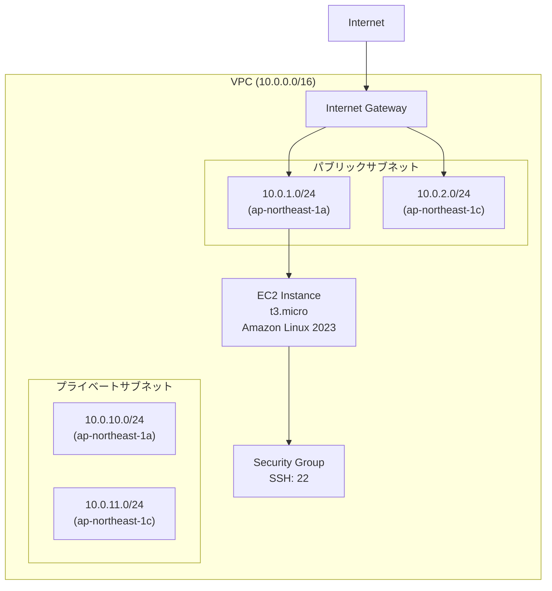

# セッション2：Agent形式でのVPC/Subnet/EC2構築 詳細ガイド

## 📋 目的

このセッションでは、ContinueのAgent機能を使って、VPC、サブネット、EC2インスタンスを構築します。セッション1で学んだPrompt Engineering、Context Engineering、フィードバックループを実践しながら、より複雑なインフラ構築を体験します。

### 学習目標

- Prompt Engineeringの実践（複雑な要件への対応）
- Context Engineeringの実践（既存AWSリソース情報の活用）
- Agent形式での複雑なインフラ構築体験
- フィードバックループの実践（エラー修正、反復的改善、承認ワークフロー）
- Agent形式での開発の振り返り

## 🎯 最終的な目標構成

このセッション終了時点で、以下の構成が完成していることを目指します：

### ネットワーク構成図



### ファイル構成

```
workspace/
└── terraform/
    └── vpc-subnet-ec2/
        ├── main.tf          # メインのTerraformコード
        ├── variables.tf     # 変数定義
        ├── outputs.tf       # 出力定義
        └── terraform.tfvars # 変数の値
```

### 構築されるAWSリソース

- VPC（CIDR: 10.0.0.0/16）
- パブリックサブネット（10.0.1.0/24, 10.0.2.0/24） - 2つの可用性ゾーン
- プライベートサブネット（10.0.10.0/24, 10.0.11.0/24） - 2つの可用性ゾーン
- インターネットゲートウェイ
- ルートテーブル（パブリック/プライベート）
- セキュリティグループ（SSH: ポート22）
- EC2インスタンス（t3.micro, Amazon Linux 2023）

## 📚 事前準備

- [セッション1](session1_guide.md) が完了していること
- AWS認証情報が設定されていること
- Terraformがインストールされていること
- Continueが正しく設定されていること

## 🚀 Agent開発の進め方

### Agent開発のアドバイス

#### 1. Prompt Engineeringのヒント

**悪いプロンプト例**:
```
VPCとEC2を作成してください
```

**良いプロンプト例**:
```
terraform/vpc-subnet-ec2/ フォルダに、下記条件を満たすVPC、サブネット、EC2インスタンスを構築するTerraformコードを生成してください。

要件:
- VPC CIDR: 10.0.0.0/16
- パブリックサブネット: 10.0.1.0/24 (ap-northeast-1a), 10.0.2.0/24 (ap-northeast-1c)
- プライベートサブネット: 10.0.10.0/24 (ap-northeast-1a), 10.0.11.0/24 (ap-northeast-1c)
- EC2インスタンス: t3.micro, Amazon Linux 2023, パブリックサブネットに配置
- インターネットゲートウェイとルートテーブルを適切に設定
- セキュリティグループ: SSH（ポート22）のみ許可、送信は全許可

注意事項:
- 足りていないパラメータがある場合は、そのまま構築するのではなく一度聞き返してください
- 既存のVPCやサブネットと衝突しないように確認してください
- 変数定義を含めてください
- コメントを適切に追加してください
- ベストプラクティスに従ってください
```

**プロンプト作成のポイント**:
- 明確な要件定義（CIDRブロック、可用性ゾーン、インスタンスタイプなど）
- 既存リソースとの衝突回避の指示
- 不足パラメータの聞き返し指示
- ベストプラクティスの要求

#### 2. Context Engineeringのヒント

**既存リソース情報の取得方法**:

Continueのチャット機能を使って、既存のAWSリソース情報を取得できます：

```
ap-northeast-1リージョンで既存のVPC情報を教えてください。
既存のサブネット情報とCIDRブロックの使用状況も教えてください。
```

取得した情報をコンテキストとして提供することで、既存リソースとの衝突を回避できます。

**コンテキスト提供の例**:
```
既存のインフラ情報:
- 既存VPC: vpc-xxxxx (10.1.0.0/16)
- 既存サブネット: 10.1.1.0/24, 10.1.2.0/24

上記の情報を考慮して、新しいVPC、サブネット、EC2インスタンスを作成するTerraformコードを生成してください。
既存のリソースと衝突しないように注意してください。
```

#### 3. フィードバックループの活用方法

**承認ワークフロー**:
- Agentが実行計画を提示したら、必ず確認してから承認してください
- リソースの種類、数、依存関係を確認してください

**エラー修正プロセス**:
- エラーが発生した場合、Agentが自動的に修正提案を提示します
- 修正提案を確認し、適切であれば承認してください

**反復的改善**:
- 構築後、改善したい点があればフィードバックを提供してください
- 例：「セキュリティグループをより厳格にしてください」「タグを追加してください」

### 考えながら進めるポイント

1. **どのようなプロンプトが効果的か**
   - 複数のリソースを構築する場合、どのように要件を整理すべきか
   - 依存関係をどのように表現すべきか

2. **どのようなコンテキストが必要か**
   - 既存のAWSリソース情報をどのように取得すべきか
   - どの情報が重要か（CIDRブロック、可用性ゾーン、既存リソース名など）

3. **エラーが発生した場合の対処方法**
   - エラーメッセージをどのように解釈すべきか
   - Agentの修正提案をどのように評価すべきか

4. **段階的な構築アプローチ**
   - 一度にすべてを構築するか、段階的に構築するか
   - どの順序で構築すべきか（VPC → サブネット → セキュリティグループ → EC2）

## 📝 振り返り

以下の点について振り返り、学んだことをまとめてください：

- **Prompt Engineeringの効果**: 複雑な要件をどのようにプロンプトに反映したか
- **Context Engineeringの重要性**: 既存リソース情報を活用することで、どのような問題を回避できたか
- **フィードバックループの体験**: エラー修正、反復的改善、承認ワークフローをどのように体験したか
- **Agent形式での開発体験**: チャット形式と比較して、どのような改善を感じたか

<details>
<summary>📝 解答例（クリックで展開）</summary>

### 完成したTerraformコード例

#### variables.tf

```hcl
variable "region" {
  description = "AWSリージョン"
  type        = string
  default     = "ap-northeast-1"
}

variable "vpc_cidr" {
  description = "VPC CIDRブロック"
  type        = string
  default     = "10.0.0.0/16"
}

variable "instance_type" {
  description = "EC2インスタンスタイプ"
  type        = string
  default     = "t3.micro"
}

variable "public_subnet_cidrs" {
  description = "パブリックサブネットのCIDRブロック"
  type        = list(string)
  default     = ["10.0.1.0/24", "10.0.2.0/24"]
}

variable "private_subnet_cidrs" {
  description = "プライベートサブネットのCIDRブロック"
  type        = list(string)
  default     = ["10.0.10.0/24", "10.0.11.0/24"]
}

variable "availability_zones" {
  description = "利用可能な可用性ゾーン"
  type        = list(string)
  default     = ["ap-northeast-1a", "ap-northeast-1c"]
}
```

#### main.tf

```hcl
provider "aws" {
  region = var.region
}

# データソース: 最新のAmazon Linux 2023 AMI
data "aws_ami" "amazon_linux" {
  most_recent = true
  owners      = ["amazon"]

  filter {
    name   = "name"
    values = ["al2023-ami-*-x86_64"]
  }

  filter {
    name   = "virtualization-type"
    values = ["hvm"]
  }
}

# VPC
resource "aws_vpc" "training_vpc" {
  cidr_block           = var.vpc_cidr
  enable_dns_hostnames = true
  enable_dns_support   = true

  tags = {
    Name = "training-vpc"
    Environment = "training"
  }
}

# インターネットゲートウェイ
resource "aws_internet_gateway" "training_igw" {
  vpc_id = aws_vpc.training_vpc.id

  tags = {
    Name = "training-igw"
    Environment = "training"
  }
}

# パブリックサブネット1
resource "aws_subnet" "public_subnet_1" {
  vpc_id                  = aws_vpc.training_vpc.id
  cidr_block              = var.public_subnet_cidrs[0]
  availability_zone       = var.availability_zones[0]
  map_public_ip_on_launch = true

  tags = {
    Name = "training-public-subnet-1"
    Environment = "training"
    Type = "public"
  }
}

# パブリックサブネット2
resource "aws_subnet" "public_subnet_2" {
  vpc_id                  = aws_vpc.training_vpc.id
  cidr_block              = var.public_subnet_cidrs[1]
  availability_zone       = var.availability_zones[1]
  map_public_ip_on_launch = true

  tags = {
    Name = "training-public-subnet-2"
    Environment = "training"
    Type = "public"
  }
}

# プライベートサブネット1
resource "aws_subnet" "private_subnet_1" {
  vpc_id            = aws_vpc.training_vpc.id
  cidr_block        = var.private_subnet_cidrs[0]
  availability_zone = var.availability_zones[0]

  tags = {
    Name = "training-private-subnet-1"
    Environment = "training"
    Type = "private"
  }
}

# プライベートサブネット2
resource "aws_subnet" "private_subnet_2" {
  vpc_id            = aws_vpc.training_vpc.id
  cidr_block        = var.private_subnet_cidrs[1]
  availability_zone = var.availability_zones[1]

  tags = {
    Name = "training-private-subnet-2"
    Environment = "training"
    Type = "private"
  }
}

# パブリックルートテーブル
resource "aws_route_table" "public_rt" {
  vpc_id = aws_vpc.training_vpc.id

  route {
    cidr_block = "0.0.0.0/0"
    gateway_id = aws_internet_gateway.training_igw.id
  }

  tags = {
    Name = "training-public-rt"
    Environment = "training"
  }
}

# パブリックサブネットとルートテーブルの関連付け
resource "aws_route_table_association" "public_subnet_1_assoc" {
  subnet_id      = aws_subnet.public_subnet_1.id
  route_table_id = aws_route_table.public_rt.id
}

resource "aws_route_table_association" "public_subnet_2_assoc" {
  subnet_id      = aws_subnet.public_subnet_2.id
  route_table_id = aws_route_table.public_rt.id
}

# セキュリティグループ
resource "aws_security_group" "training_sg" {
  name        = "training-sg"
  description = "Training security group for EC2"
  vpc_id      = aws_vpc.training_vpc.id

  ingress {
    description = "SSH"
    from_port   = 22
    to_port     = 22
    protocol    = "tcp"
    cidr_blocks = ["0.0.0.0/0"]
  }

  egress {
    from_port   = 0
    to_port     = 0
    protocol    = "-1"
    cidr_blocks = ["0.0.0.0/0"]
  }

  tags = {
    Name = "training-sg"
    Environment = "training"
  }
}

# EC2インスタンス
resource "aws_instance" "training_ec2" {
  ami           = data.aws_ami.amazon_linux.id
  instance_type = var.instance_type
  subnet_id     = aws_subnet.public_subnet_1.id

  vpc_security_group_ids = [aws_security_group.training_sg.id]

  tags = {
    Name = "training-ec2"
    Environment = "training"
  }
}
```

#### outputs.tf

```hcl
output "vpc_id" {
  description = "VPC ID"
  value       = aws_vpc.training_vpc.id
}

output "public_subnet_ids" {
  description = "パブリックサブネットID"
  value       = [aws_subnet.public_subnet_1.id, aws_subnet.public_subnet_2.id]
}

output "private_subnet_ids" {
  description = "プライベートサブネットID"
  value       = [aws_subnet.private_subnet_1.id, aws_subnet.private_subnet_2.id]
}

output "instance_public_ip" {
  description = "EC2インスタンスのパブリックIP"
  value       = aws_instance.training_ec2.public_ip
}

output "instance_id" {
  description = "EC2インスタンスID"
  value       = aws_instance.training_ec2.id
}
```

### プロンプト例

**段階的な構築アプローチの例**:

1. まずVPCとサブネットを構築
2. 次にセキュリティグループを構築
3. 最後にEC2インスタンスを構築

各段階でAgentに指示を出し、承認ワークフローを活用しながら進めることができます。

</details>

## ✅ チェックリスト

- [ ] 最終的な目標構成を理解した
- [ ] Agent形式でVPC、サブネット、EC2インスタンスを構築した
- [ ] Prompt Engineeringを実践した（複雑な要件への対応）
- [ ] Context Engineeringを実践した（既存AWSリソース情報の活用）
- [ ] 承認ワークフローを体験した
- [ ] エラー修正プロセスを体験した
- [ ] 反復的改善プロセスを体験した
- [ ] Agent形式での開発の振り返りを行った

## 🆘 トラブルシューティング

### 既存リソースとの衝突エラー

- Continueのチャット機能を使って既存リソース情報を取得し、コンテキストとして提供してください
- CIDRブロックが既存のVPCと衝突していないか確認してください

### エラー修正がうまくいかない

- エラーメッセージを詳しく確認してください
- Agentの修正提案を評価し、必要に応じて手動で修正してください

### 承認ワークフローが機能しない

- ContinueのAgent機能が正しく設定されているか確認してください
- 計画を確認してから承認してください

## 📚 参考資料

- [Terraform公式ドキュメント](https://developer.hashicorp.com/terraform/docs)
- [AWS公式ドキュメント](https://docs.aws.amazon.com/)
- [セッション1ガイド](session1_guide.md)

## ➡️ 次のステップ

セッション2が完了したら、[セッション3：Terraform自動化エージェント開発](session3_guide.md) に進んでください。
