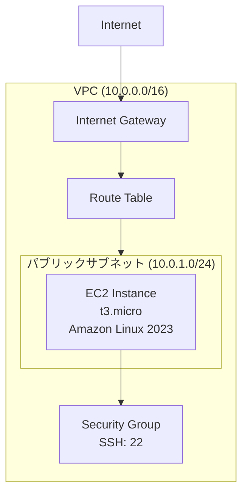

# セッション2：VPC/EC2の設計・構築・検証 詳細ガイド

## 📋 目的

このセッションでは、ContinueのAgent機能を使って、VPC、サブネット、EC2インスタンスを設計・構築・検証します。セッション1で学んだPrompt Engineering、Context Engineering、フィードバックループを実践しながら、実際のAWSインフラを構築する体験をします。

### 学習目標

- Agent形式での実際のAWSインフラ構築体験
- Prompt Engineeringの実践（要件の明確な伝え方）
- Context Engineeringの実践（既存AWSリソース情報の活用）
- フィードバックループの実践（エラー修正、反復的改善、承認ワークフロー）
- 構築結果の検証（terraform plan/apply、SSH接続テスト）

## 🎯 最終的な目標構成

このセッション終了時点で、以下の構成が完成していることを目指します：

### ネットワーク構成図



### ファイル構成

```
terraform/
└── vpc-ec2/
        ├── main.tf          # メインのTerraformコード
        ├── variables.tf     # 変数定義
        └── outputs.tf       # 出力定義
```

### 構築されるAWSリソース

| リソース | 設定値 |
|---------|-------|
| VPC | CIDR: 10.0.0.0/16 |
| パブリックサブネット | 10.0.1.0/24（ap-northeast-1a） |
| インターネットゲートウェイ | VPCにアタッチ |
| ルートテーブル | 0.0.0.0/0 → IGW |
| セキュリティグループ | SSH（ポート22）のみ許可（⚠️ 本番では送信元IPを制限すること） |
| キーペア | SSH接続用 |
| EC2インスタンス | t3.micro, Amazon Linux 2023 |

> **重要**: このEC2インスタンスはセッション4以降のAnsible操作の対象になります。SSH接続ができる状態にしておいてください。

## 📚 事前準備

- [セッション1](session1_guide.md) が完了していること
- AWS認証情報が設定されていること
- Terraformがインストールされていること
- Continueが正しく設定されていること

### SSH鍵ペアの準備

このセッションではSSH接続のためのキーペアが必要です。以下のコマンドで事前に生成してください：

```bash
# SSH鍵ペアの生成（パスフレーズなし）
ssh-keygen -t rsa -b 4096 -f ~/.ssh/training-key -N ""

# 秘密鍵の権限設定
chmod 400 ~/.ssh/training-key
```

> **注意**: `~/.ssh/training-key`（秘密鍵）と `~/.ssh/training-key.pub`（公開鍵）の2ファイルが生成されます。Terraform内では公開鍵（`.pub`）をEC2に登録し、SSH接続時には秘密鍵を使用します。

## 🚀 Agent開発の進め方

### Agent開発のアドバイス

#### 1. Prompt Engineeringのヒント

**悪いプロンプト例**:
```
VPCとEC2を作成してください
```

<details>
<summary>💡 良いプロンプト例（まず自分で考えてからクリック）</summary>

```
terraform/vpc-ec2/ フォルダに、下記条件を満たすVPCとEC2インスタンスを構築するTerraformコードを生成してください。

要件:
- VPC CIDR: 10.0.0.0/16
- パブリックサブネット: 10.0.1.0/24 (ap-northeast-1a)
- インターネットゲートウェイとルートテーブルを設定してインターネットに接続可能にする
- EC2インスタンス: t3.micro, Amazon Linux 2023, パブリックサブネットに配置
- キーペア: SSH接続用のキーペアを作成
- セキュリティグループ: SSH（ポート22）のみ許可、送信は全許可

注意事項:
- 足りていないパラメータがある場合は、そのまま構築するのではなく一度聞き返してください
- SSH接続ができるようにキーペアとパブリックIPを設定してください
- 変数定義を含めてください
- コメントを適切に追加してください
```

</details>

**プロンプト作成のポイント**:
- 明確な要件定義（CIDRブロック、インスタンスタイプなど）
- SSH接続のためのキーペア設定の指示
- 不足パラメータの聞き返し指示
- 変数やコメントの要求

#### 2. Context Engineeringのヒント

**既存リソース情報の取得方法**:

Continueのチャット機能を使って、既存のAWSリソース情報を取得できます：

```
ap-northeast-1リージョンで既存のVPC情報を教えてください。
既存のサブネット情報とCIDRブロックの使用状況も教えてください。
```

取得した情報をコンテキストとして提供することで、既存リソースとの衝突を回避できます。

<details>
<summary>💡 コンテキスト提供のプロンプト例（まず自分で考えてからクリック）</summary>

```
既存のインフラ情報:
- 既存VPC: vpc-xxxxx (10.1.0.0/16)
- 既存サブネット: 10.1.1.0/24, 10.1.2.0/24

上記の情報を考慮して、新しいVPC、サブネット、EC2インスタンスを作成するTerraformコードを生成してください。
既存のリソースと衝突しないように注意してください。
```

</details>

#### 3. フィードバックループの活用方法

**承認ワークフロー**:
- Agentが実行計画を提示したら、必ず確認してから承認してください
- リソースの種類、数、依存関係を確認してください

**エラー修正プロセス**:
- エラーが発生した場合、Agentが自動的に修正提案を提示します
- 修正提案を確認し、適切であれば承認してください

**反復的改善**:
- 構築後、改善したい点があればフィードバックを提供してください
- 例：「セキュリティグループをより厳格にしてください」「タグを追加してください」

### 構築後の検証

構築が完了したら、以下の手順で検証してください：

#### 1. Terraform出力の確認

Agentに以下を指示してください：

```
terraform output コマンドを実行して、構築されたリソースの情報を確認してください。
特にEC2インスタンスのパブリックIPアドレスを教えてください。
```

#### 2. SSH接続テスト

EC2インスタンスに対してSSH接続を試みてください：

```bash
ssh -i ~/.ssh/training-key.pem ec2-user@<EC2のパブリックIP>
```

接続に成功すれば、構築は完了です。

> **ヒント**: SSH接続できることを確認しておくことで、セッション4以降でAnsibleを使ったサーバー操作がスムーズに行えます。

#### 3. リソースの確認

Agentに以下を指示して、構築されたリソースを確認してください：

```
terraform state list コマンドを実行して、構築されたリソース一覧を確認してください。
```

### 考えながら進めるポイント

1. **どのようなプロンプトが効果的か**
   - 必要なリソースの要件をどのように整理すべきか
   - VPCとEC2の依存関係をどのように表現すべきか

2. **どのようなコンテキストが必要か**
   - 既存のAWSリソース情報をどのように取得すべきか
   - どの情報が重要か（CIDRブロック、既存リソース名など）

3. **エラーが発生した場合の対処方法**
   - エラーメッセージをどのようにAgentに伝えるべきか
   - Agentの修正提案をどのように評価すべきか

## 📝 振り返り

以下の点について振り返り、学んだことをまとめてください：

- **Prompt Engineeringの効果**: 要件をどのようにプロンプトに反映したか
- **Context Engineeringの重要性**: 既存リソース情報を活用することで、どのような問題を回避できたか
- **フィードバックループの体験**: エラー修正、反復的改善、承認ワークフローをどのように体験したか
- **構築結果の検証**: terraform plan/apply の結果確認、SSH接続テストをどのように行ったか

<details>
<summary>📝 解答例（クリックで展開）</summary>

### 完成したTerraformコード例

#### variables.tf

```hcl
variable "region" {
  description = "AWSリージョン"
  type        = string
  default     = "ap-northeast-1"
}

variable "vpc_cidr" {
  description = "VPC CIDRブロック"
  type        = string
  default     = "10.0.0.0/16"
}

variable "subnet_cidr" {
  description = "パブリックサブネットのCIDRブロック"
  type        = string
  default     = "10.0.1.0/24"
}

variable "instance_type" {
  description = "EC2インスタンスタイプ"
  type        = string
  default     = "t3.micro"
}

variable "key_name" {
  description = "SSH接続用のキーペア名"
  type        = string
  default     = "training-key"
}
```

#### main.tf

```hcl
provider "aws" {
  region = var.region
}

# 最新のAmazon Linux 2023 AMI
data "aws_ami" "amazon_linux" {
  most_recent = true
  owners      = ["amazon"]

  filter {
    name   = "name"
    values = ["al2023-ami-*-x86_64"]
  }

  filter {
    name   = "virtualization-type"
    values = ["hvm"]
  }
}

# キーペア
resource "aws_key_pair" "training_key" {
  key_name   = var.key_name
  public_key = file("~/.ssh/training-key.pub")
}

# VPC
resource "aws_vpc" "main" {
  cidr_block           = var.vpc_cidr
  enable_dns_hostnames = true
  enable_dns_support   = true

  tags = {
    Name = "training-vpc"
  }
}

# インターネットゲートウェイ
resource "aws_internet_gateway" "main" {
  vpc_id = aws_vpc.main.id

  tags = {
    Name = "training-igw"
  }
}

# パブリックサブネット
resource "aws_subnet" "public" {
  vpc_id                  = aws_vpc.main.id
  cidr_block              = var.subnet_cidr
  availability_zone       = "${var.region}a"
  map_public_ip_on_launch = true

  tags = {
    Name = "training-public-subnet"
  }
}

# ルートテーブル
resource "aws_route_table" "public" {
  vpc_id = aws_vpc.main.id

  route {
    cidr_block = "0.0.0.0/0"
    gateway_id = aws_internet_gateway.main.id
  }

  tags = {
    Name = "training-public-rt"
  }
}

# サブネットとルートテーブルの関連付け
resource "aws_route_table_association" "public" {
  subnet_id      = aws_subnet.public.id
  route_table_id = aws_route_table.public.id
}

# セキュリティグループ
resource "aws_security_group" "ec2_sg" {
  name        = "training-ec2-sg"
  description = "Security group for training EC2"
  vpc_id      = aws_vpc.main.id

  ingress {
    description = "SSH"
    from_port   = 22
    to_port     = 22
    protocol    = "tcp"
    cidr_blocks = ["0.0.0.0/0"]  # ⚠️ ワークショップ用。本番では自分のIPのみに制限すること
  }

  egress {
    from_port   = 0
    to_port     = 0
    protocol    = "-1"
    cidr_blocks = ["0.0.0.0/0"]
  }

  tags = {
    Name = "training-ec2-sg"
  }
}

# EC2インスタンス
resource "aws_instance" "training_ec2" {
  ami           = data.aws_ami.amazon_linux.id
  instance_type = var.instance_type
  subnet_id     = aws_subnet.public.id
  key_name      = aws_key_pair.training_key.key_name

  vpc_security_group_ids = [aws_security_group.ec2_sg.id]

  tags = {
    Name = "training-ec2"
  }
}
```

#### outputs.tf

```hcl
output "vpc_id" {
  description = "VPC ID"
  value       = aws_vpc.main.id
}

output "subnet_id" {
  description = "パブリックサブネットID"
  value       = aws_subnet.public.id
}

output "instance_public_ip" {
  description = "EC2インスタンスのパブリックIP"
  value       = aws_instance.training_ec2.public_ip
}

output "instance_id" {
  description = "EC2インスタンスID"
  value       = aws_instance.training_ec2.id
}

output "security_group_id" {
  description = "セキュリティグループID"
  value       = aws_security_group.ec2_sg.id
}
```

### 検証手順例

```bash
# 1. 構築されたリソースの確認
terraform output

# 2. SSH接続テスト
ssh -i ~/.ssh/training-key.pem ec2-user@$(terraform output -raw instance_public_ip)

# 3. リソース一覧の確認
terraform state list
```

</details>

## ✅ チェックリスト

- [ ] 最終的な目標構成を理解した
- [ ] Agent形式でVPC、サブネット、EC2インスタンスを構築した
- [ ] SSH接続用のキーペアを設定した
- [ ] Prompt Engineeringを実践した（要件の明確な伝え方）
- [ ] Context Engineeringを実践した（既存AWSリソース情報の活用）
- [ ] 承認ワークフローを体験した
- [ ] エラー修正プロセスを体験した
- [ ] 反復的改善プロセスを体験した
- [ ] terraform plan/apply で構築結果を確認した
- [ ] SSH接続テストに成功した
- [ ] Agent形式での開発の振り返りを行った

## 🆘 トラブルシューティング

### 既存リソースとの衝突エラー

- Continueのチャット機能を使って既存リソース情報を取得し、コンテキストとして提供してください
- CIDRブロックが既存のVPCと衝突していないか確認してください

### SSH接続エラー

- セキュリティグループでSSH（ポート22）が許可されているか確認
- キーペアファイルの権限を確認（`chmod 400 ~/.ssh/training-key.pem`）
- パブリックIPが割り当てられているか確認
- EC2インスタンスが起動しているか確認

### エラー修正がうまくいかない

- エラーメッセージを詳しく確認してください
- Agentの修正提案を評価し、必要に応じて手動で修正してください

### 承認ワークフローが機能しない

- ContinueのAgent機能が正しく設定されているか確認してください
- 計画を確認してから承認してください

## ⚠️ リソースの削除

> **重要**: セッション4以降でこのEC2を使用するため、ワークショップ期間中は削除しないでください。**ワークショップ終了後**に以下のコマンドで削除してください。

```bash
cd terraform/vpc-ec2
terraform destroy
```

## 📚 参考資料

- [Terraform公式ドキュメント](https://developer.hashicorp.com/terraform/docs)
- [AWS公式ドキュメント](https://docs.aws.amazon.com/)
- [セッション1ガイド](session1_guide.md)

## ➡️ 次のステップ

セッション2が完了したら、[セッション3：Webシステム構築（任意）](session3_guide.md) に進むか、[セッション4：サーバー再起動の自動化](session4_guide.md) に進んでください。
