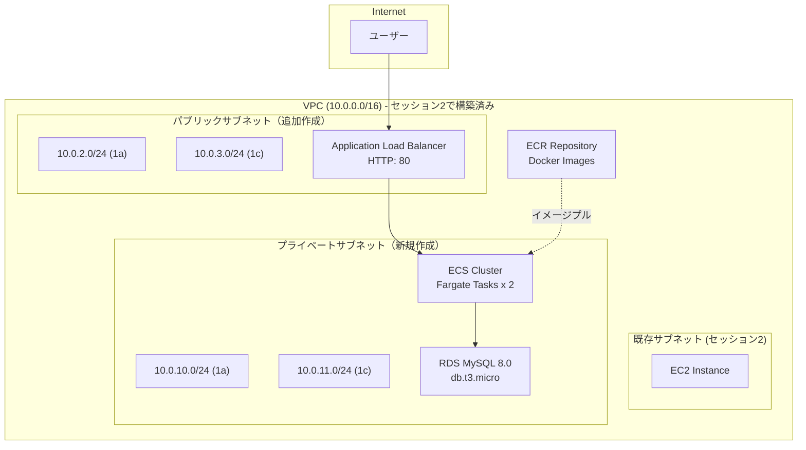

# セッション3：Webシステム構築 詳細ガイド（任意・発展）

## 📋 目的

このセッションでは、ContinueのAgent機能を活用して、ALB、ECS/ECR、RDSを含む実践的なWebアプリケーションインフラを構築します。セッション2で構築したVPC/Subnetを活用し、より複雑なインフラ構成をAgent開発で実現します。

> **注意**: このセッションは**任意（発展課題）**です。構築するリソースが多いため、時間内に完了しなくても問題ありません。`terraform apply` でRDSの作成には10分以上かかる場合があります。段階的に構築し、できた範囲で振り返りを行ってください。

### 学習目標

- 複雑なインフラ構成（ALB、ECS、RDS）をAgent開発で構築する
- セッション2で構築したリソースを活用した拡張構築を体験する
- 依存関係を考慮した段階的な構築アプローチを実践する
- 統合的なワークフローでのAgent開発を実践する

## 🎯 最終的な目標構成

このセッション終了時点で、以下の構成が完成していることを目指します：

### Webアプリケーションインフラ構成図



### ファイル構成

```
terraform/
└── web-app/
    ├── main.tf          # メインのTerraformコード
    ├── variables.tf     # 変数定義
    ├── outputs.tf       # 出力定義
    └── terraform.tfvars # 変数の値
```

### 構築されるAWSリソース

- **追加するサブネット**: パブリック×2（ALB用、マルチAZ）、プライベート×2（ECS/RDS用、マルチAZ）
- ALB（Application Load Balancer） - パブリックサブネット
- ターゲットグループ（ALB用、ヘルスチェック設定）
- ALBリスナー（HTTP: 80）
- ECRリポジトリ - Dockerイメージの保存
- ECSクラスターとサービス（Fargate） - プライベートサブネット
- RDSデータベース（MySQL 8.0, db.t3.micro） - プライベートサブネット
- セキュリティグループ（ALB用、ECS用、RDS用）
- CloudWatch Logsグループ

> **ポイント**: セッション2で構築したVPCを再利用します。ALB/ECS/RDSにはマルチAZのサブネットが必要なため、追加のサブネットを作成します。VPC IDをコンテキストとして提供してください。

## 📚 事前準備

- [セッション2](session2_guide.md) が完了していること（VPC/EC2が構築済み）
- セッション2で構築したVPC IDを把握していること（`terraform output` で確認）
- Continueが正しく設定されていること

## 🚀 Agent開発の進め方

### Agent開発のアドバイス

#### 1. 段階的な構築アプローチ

複雑なインフラは、以下の順序で段階的に構築することを推奨します：

1. **ネットワーク層**: ALB、ターゲットグループ、セキュリティグループ
2. **コンテナ層**: ECRリポジトリ、ECSクラスター、タスク定義、サービス
3. **データ層**: RDSサブネットグループ、セキュリティグループ、RDSインスタンス
4. **統合**: すべてのリソースを連携

各ステップで承認ワークフローを活用し、確認してから次に進みます。

#### 2. Prompt Engineeringのヒント

<details>
<summary>💡 統合構築用プロンプト例（まず自分で考えてからクリック）</summary>

```
terraform/web-app/ フォルダに、下記条件を満たすWebアプリケーションインフラを構築するTerraformコードを生成してください。

前提条件:
- セッション2で構築したVPCとサブネットを使用する
- VPC ID、サブネットIDは変数で指定する

要件:
1. ALB（Application Load Balancer）:
   - 名前: training-web-alb
   - タイプ: application
   - パブリックサブネットに配置
   - HTTP（ポート80）リスナー
   - ヘルスチェック: /, 200 OK

2. ECSクラスターとサービス:
   - クラスター名: training-web-cluster
   - サービス名: training-web-service
   - 起動タイプ: FARGATE
   - 希望タスク数: 2
   - CPU: 256, メモリ: 512
   - プライベートサブネットに配置
   - ALBターゲットグループに接続

3. ECRリポジトリ:
   - 名前: training-web-app
   - プッシュ時のスキャンを有効化

4. RDSデータベース:
   - エンジン: MySQL 8.0
   - インスタンスクラス: db.t3.micro
   - ストレージ: 20GB
   - データベース名: webappdb
   - プライベートサブネットに配置
   - ECSセキュリティグループからのみアクセス可能（ポート3306）

5. セキュリティグループ:
   - ALB用: HTTP（80）を許可、送信は全許可
   - ECS用: ALBセキュリティグループからのみ受信（80）
   - RDS用: ECSセキュリティグループからのみ受信（3306）

注意事項:
- 足りていないパラメータがある場合は、そのまま構築するのではなく一度聞き返してください
- 依存関係を適切に設定してください
- 変数定義を含めてください
- コメントを適切に追加してください
- ベストプラクティスに従ってください
```

</details>

#### 3. Context Engineeringの活用

<details>
<summary>💡 コンテキスト提供のプロンプト例（まず自分で考えてからクリック）</summary>

```
既存のインフラ情報（セッション2で構築済み）:
- VPC ID: vpc-xxxxx (10.0.0.0/16)
- パブリックサブネット: subnet-xxxxx (10.0.1.0/24, ap-northeast-1a)
- 使用中のCIDR: 10.0.1.0/24

上記のVPCを利用して、Webアプリケーションインフラを構築してください。
ALB/ECS/RDSにはマルチAZのサブネットが必要なため、追加のサブネットも作成してください。
既存のCIDRと衝突しないように注意してください。
```

</details>

> **ヒント**: セッション2の `terraform output` の結果をコンテキストとして提供すると効率的です。

#### 4. フィードバックループの実践

**複数ステップの承認ワークフロー**:

1. **ステップ1**: ALBとターゲットグループのコード生成 → 確認 → 承認
2. **ステップ2**: ECSクラスターとサービスのコード生成 → 確認 → 承認
3. **ステップ3**: RDSのコード生成 → 確認 → 承認
4. **ステップ4**: 統合後の最終確認

### 考えながら進めるポイント

1. **どのような構築順序が効果的か**
   - 依存関係を考慮した構築順序
   - 各リソースの作成タイミング

2. **セッション2のリソースをどのように活用するか**
   - VPC IDやサブネットIDの取得方法
   - 既存リソースとの連携

3. **セキュリティ設定の考慮**
   - セキュリティグループの適切な設定
   - プライベートサブネットの活用
   - 最小権限の原則

4. **コスト最適化**
   - 適切なインスタンスサイズの選択
   - 不要なリソースの回避

## 📝 振り返り

以下の点について振り返り、学んだことをまとめてください：

- **複雑なインフラ構築の体験**: ALB、ECS、RDSを含む複雑なインフラをどのように構築したか
- **セッション2からの拡張**: 既存リソースを活用した構築の方法
- **段階的な構築アプローチ**: 依存関係を考慮した構築順序の効果
- **Agent形式での統合開発**: 複数のリソースを統合的に管理する方法

<details>
<summary>📝 解答例（クリックで展開）</summary>

### 完成したTerraformコード例

#### variables.tf

```hcl
variable "region" {
  description = "AWSリージョン"
  type        = string
  default     = "ap-northeast-1"
}

variable "vpc_id" {
  description = "VPC ID（セッション2で構築したVPC）"
  type        = string
}

variable "public_subnet_cidrs" {
  description = "ALB用パブリックサブネットのCIDRブロック（新規作成）"
  type        = list(string)
  default     = ["10.0.2.0/24", "10.0.3.0/24"]
}

variable "private_subnet_cidrs" {
  description = "ECS/RDS用プライベートサブネットのCIDRブロック（新規作成）"
  type        = list(string)
  default     = ["10.0.10.0/24", "10.0.11.0/24"]
}

variable "availability_zones" {
  description = "可用性ゾーン"
  type        = list(string)
  default     = ["ap-northeast-1a", "ap-northeast-1c"]
}

variable "db_username" {
  description = "RDSデータベースユーザー名"
  type        = string
  default     = "admin"
}

variable "db_password" {
  description = "RDSデータベースパスワード"
  type        = string
  sensitive   = true
}
```

#### main.tf

```hcl
provider "aws" {
  region = var.region
}

# ALB用パブリックサブネット（マルチAZ）
resource "aws_subnet" "public" {
  count                   = length(var.public_subnet_cidrs)
  vpc_id                  = var.vpc_id
  cidr_block              = var.public_subnet_cidrs[count.index]
  availability_zone       = var.availability_zones[count.index]
  map_public_ip_on_launch = true

  tags = {
    Name = "training-web-public-${count.index + 1}"
  }
}

# ECS/RDS用プライベートサブネット（マルチAZ）
resource "aws_subnet" "private" {
  count             = length(var.private_subnet_cidrs)
  vpc_id            = var.vpc_id
  cidr_block        = var.private_subnet_cidrs[count.index]
  availability_zone = var.availability_zones[count.index]

  tags = {
    Name = "training-web-private-${count.index + 1}"
  }
}

# ALBセキュリティグループ
resource "aws_security_group" "alb_sg" {
  name        = "training-alb-sg"
  description = "Security group for ALB"
  vpc_id      = var.vpc_id

  ingress {
    description = "HTTP"
    from_port   = 80
    to_port     = 80
    protocol    = "tcp"
    cidr_blocks = ["0.0.0.0/0"]
  }

  egress {
    from_port   = 0
    to_port     = 0
    protocol    = "-1"
    cidr_blocks = ["0.0.0.0/0"]
  }

  tags = {
    Name        = "training-alb-sg"
    Environment = "training"
  }
}

# ECSセキュリティグループ
resource "aws_security_group" "ecs_sg" {
  name        = "training-ecs-sg"
  description = "Security group for ECS"
  vpc_id      = var.vpc_id

  ingress {
    description     = "HTTP from ALB"
    from_port       = 80
    to_port         = 80
    protocol        = "tcp"
    security_groups = [aws_security_group.alb_sg.id]
  }

  egress {
    from_port   = 0
    to_port     = 0
    protocol    = "-1"
    cidr_blocks = ["0.0.0.0/0"]
  }

  tags = {
    Name        = "training-ecs-sg"
    Environment = "training"
  }
}

# RDSセキュリティグループ
resource "aws_security_group" "rds_sg" {
  name        = "training-rds-sg"
  description = "Security group for RDS"
  vpc_id      = var.vpc_id

  ingress {
    description     = "MySQL from ECS"
    from_port       = 3306
    to_port         = 3306
    protocol        = "tcp"
    security_groups = [aws_security_group.ecs_sg.id]
  }

  egress {
    from_port   = 0
    to_port     = 0
    protocol    = "-1"
    cidr_blocks = ["0.0.0.0/0"]
  }

  tags = {
    Name        = "training-rds-sg"
    Environment = "training"
  }
}

# ALB
resource "aws_lb" "web_alb" {
  name               = "training-web-alb"
  internal           = false
  load_balancer_type = "application"
  security_groups    = [aws_security_group.alb_sg.id]
  subnets            = aws_subnet.public[*].id

  enable_deletion_protection = false

  tags = {
    Name        = "training-web-alb"
    Environment = "training"
  }
}

# ターゲットグループ
resource "aws_lb_target_group" "web_tg" {
  name        = "training-web-tg"
  port        = 80
  protocol    = "HTTP"
  vpc_id      = var.vpc_id
  target_type = "ip"

  health_check {
    enabled             = true
    healthy_threshold   = 2
    unhealthy_threshold = 2
    timeout             = 5
    interval            = 30
    path                = "/"
    matcher             = "200"
  }

  tags = {
    Name        = "training-web-tg"
    Environment = "training"
  }
}

# ALBリスナー
resource "aws_lb_listener" "web_listener" {
  load_balancer_arn = aws_lb.web_alb.arn
  port              = "80"
  protocol          = "HTTP"

  default_action {
    type             = "forward"
    target_group_arn = aws_lb_target_group.web_tg.arn
  }
}

# ECRリポジトリ
resource "aws_ecr_repository" "web_app" {
  name                 = "training-web-app"
  image_tag_mutability = "MUTABLE"

  image_scanning_configuration {
    scan_on_push = true
  }

  tags = {
    Name        = "training-web-app"
    Environment = "training"
  }
}

# ECSクラスター
resource "aws_ecs_cluster" "web_cluster" {
  name = "training-web-cluster"

  tags = {
    Name        = "training-web-cluster"
    Environment = "training"
  }
}

# ECSタスク定義
resource "aws_ecs_task_definition" "web_app" {
  family                   = "training-web-app"
  network_mode             = "awsvpc"
  requires_compatibilities = ["FARGATE"]
  cpu                      = "256"
  memory                   = "512"

  container_definitions = jsonencode([{
    name  = "web-app"
    image = "${aws_ecr_repository.web_app.repository_url}:latest"
    portMappings = [{
      containerPort = 80
      protocol      = "tcp"
    }]
    environment = [
      {
        name  = "DB_HOST"
        value = aws_db_instance.web_db.endpoint
      },
      {
        name  = "DB_NAME"
        value = "webappdb"
      }
    ]
    logConfiguration = {
      logDriver = "awslogs"
      options = {
        "awslogs-group"         = "/ecs/training-web-app"
        "awslogs-region"        = var.region
        "awslogs-stream-prefix" = "ecs"
      }
    }
  }])

  tags = {
    Name        = "training-web-app"
    Environment = "training"
  }
}

# ECSサービス
resource "aws_ecs_service" "web_service" {
  name            = "training-web-service"
  cluster         = aws_ecs_cluster.web_cluster.id
  task_definition = aws_ecs_task_definition.web_app.arn
  desired_count   = 2
  launch_type     = "FARGATE"

  network_configuration {
    subnets          = aws_subnet.private[*].id
    security_groups  = [aws_security_group.ecs_sg.id]
    assign_public_ip = false
  }

  load_balancer {
    target_group_arn = aws_lb_target_group.web_tg.arn
    container_name   = "web-app"
    container_port   = 80
  }

  depends_on = [aws_lb_listener.web_listener]

  tags = {
    Name        = "training-web-service"
    Environment = "training"
  }
}

# RDSサブネットグループ
resource "aws_db_subnet_group" "web_db_subnet" {
  name       = "training-web-db-subnet"
  subnet_ids = aws_subnet.private[*].id

  tags = {
    Name        = "training-web-db-subnet"
    Environment = "training"
  }
}

# RDSインスタンス
resource "aws_db_instance" "web_db" {
  identifier              = "training-web-db"
  engine                  = "mysql"
  engine_version          = "8.0"
  instance_class          = "db.t3.micro"
  allocated_storage       = 20
  storage_type            = "gp2"
  db_name                 = "webappdb"
  username                = var.db_username
  password                = var.db_password
  vpc_security_group_ids  = [aws_security_group.rds_sg.id]
  db_subnet_group_name    = aws_db_subnet_group.web_db_subnet.name
  skip_final_snapshot     = true
  backup_retention_period = 7

  tags = {
    Name        = "training-web-db"
    Environment = "training"
  }
}

# CloudWatch Logsグループ
resource "aws_cloudwatch_log_group" "ecs_logs" {
  name              = "/ecs/training-web-app"
  retention_in_days = 7

  tags = {
    Name        = "training-ecs-logs"
    Environment = "training"
  }
}
```

#### outputs.tf

```hcl
output "alb_dns_name" {
  description = "ALBのDNS名"
  value       = aws_lb.web_alb.dns_name
}

output "ecr_repository_url" {
  description = "ECRリポジトリURL"
  value       = aws_ecr_repository.web_app.repository_url
}

output "rds_endpoint" {
  description = "RDSエンドポイント"
  value       = aws_db_instance.web_db.endpoint
  sensitive   = true
}

output "ecs_cluster_name" {
  description = "ECSクラスター名"
  value       = aws_ecs_cluster.web_cluster.name
}
```

</details>

## ✅ チェックリスト

- [ ] 最終的な目標構成を理解した
- [ ] セッション2で構築したVPC IDを取得した
- [ ] Agent形式でALBとターゲットグループを構築した
- [ ] Agent形式でECRリポジトリを作成した
- [ ] Agent形式でECSクラスターとサービスを構築した
- [ ] Agent形式でRDSデータベースを構築した
- [ ] セキュリティグループを適切に設定した
- [ ] すべてのリソースの連携を確認した
- [ ] 段階的な構築アプローチを実践した
- [ ] Agent形式での統合開発の振り返りを行った

## 🆘 トラブルシューティング

### ALB接続エラー

- セキュリティグループの設定を確認（ALB → ECS）
- ターゲットグループのヘルスチェックを確認
- ECSタスクが正常に起動しているか確認

### ECSタスク起動エラー

- タスク定義の確認（コンテナイメージ、リソース設定）
- ネットワーク設定の確認（サブネット、セキュリティグループ）
- IAMロールの確認（タスク実行ロール、タスクロール）
- CloudWatch Logsの確認

### RDS接続エラー

- セキュリティグループの設定を確認（ECS → RDS）
- サブネットグループの設定を確認
- データベース認証情報の確認

### セッション2のリソースが見つからない

- セッション2のTerraformの状態を確認（`terraform state list`）
- `terraform output` でVPC IDを取得

## 📚 参考資料

- [Terraform公式ドキュメント](https://developer.hashicorp.com/terraform/docs)
- [AWS ALB公式ドキュメント](https://docs.aws.amazon.com/elasticloadbalancing/latest/application/)
- [AWS ECS公式ドキュメント](https://docs.aws.amazon.com/ecs/)
- [AWS RDS公式ドキュメント](https://docs.aws.amazon.com/rds/)
- [セッション2ガイド](session2_guide.md)

## ➡️ 次のステップ

セッション3が完了したら、[セッション4：サーバー再起動の自動化](session4_guide.md) に進んでください。

**重要**: 作成したリソースは、ワークショップ終了後に必ず削除してください：

```bash
cd terraform/web-app
terraform destroy
```
