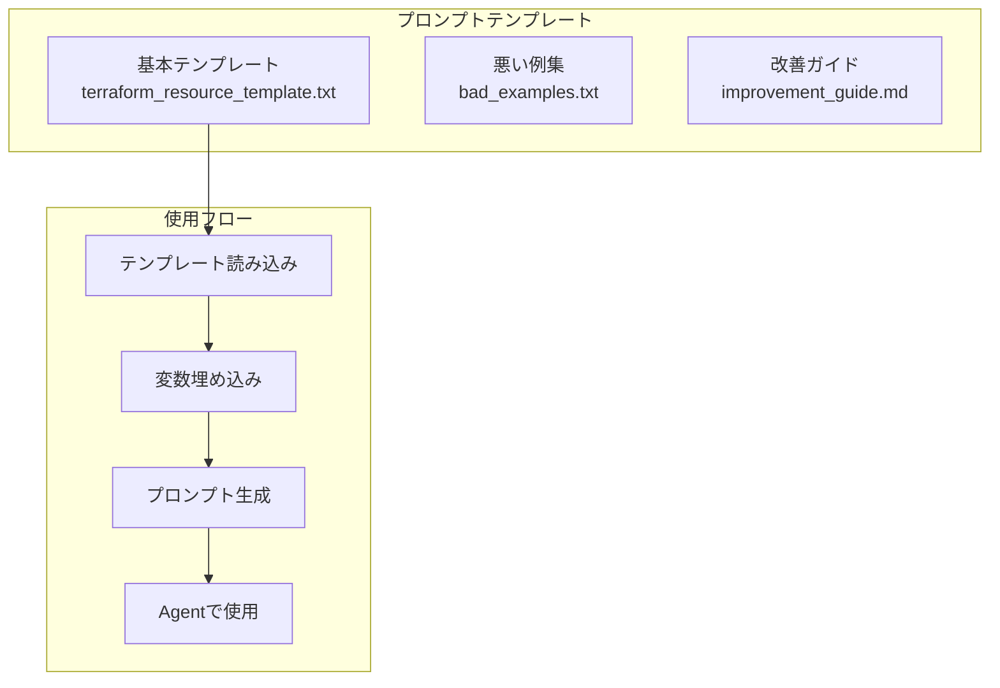

# セッション3：Terraform自動化エージェント開発 詳細ガイド

## 📋 目的

このセッションでは、ContinueのAgent機能を活用して、Terraformコード生成を効率化するためのプロンプトテンプレートを作成し、再利用可能なプロンプトパターンを確立します。セッション1とセッション2で学んだPrompt EngineeringとContext Engineeringを発展させ、より効率的な開発体験を実現します。

### 学習目標

- プロンプトテンプレートの作成方法を理解する
- Context Engineeringの高度化（既存インフラ情報の動的取得、依存関係の考慮）
- フィードバックループの実践（承認ワークフロー、エラー修正、反復的改善）
- Agent形式での開発の深化を実践する
- ContinueのAgent機能を活用した効率的なTerraformコード生成

## 🎯 最終的な目標構成

このセッション終了時点で、以下の構成が完成していることを目指します：

### プロンプトテンプレート構成



### ファイル構成

```
workspace/
└── templates/
    └── prompts/
        ├── terraform_resource_template.txt  # 基本テンプレート
        ├── bad_examples.txt                 # 悪いプロンプト例集
        └── improvement_guide.md             # プロンプト改善ガイド
```

### 成果物

- 再利用可能なプロンプトテンプレート
- プロンプト改善ガイド
- 様々なリソースタイプに対応したプロンプト例

## 📚 事前準備

- [セッション1](session1_guide.md) が完了していること
- [セッション2](session2_guide.md) が完了していること
- Continueが正しく設定されていること

## 🚀 Agent開発の進め方

### Agent開発のアドバイス

#### 1. プロンプトテンプレートの作成

**テンプレートの設計方針**:
- セッション1とセッション2で学んだ良いプロンプトのパターンを抽出
- 変数部分を`{variable_name}`形式で表現
- 再利用可能な構造にする

**基本テンプレート例**:

```
下記条件を満たす{resource_type}を構築するTerraformコードを生成してください。

要件:
- リージョン: {region}
- {specific_requirements}

注意事項:
- 足りていないパラメータなどがある場合は、そのまま構築するのではなく一度聞き返してください
- 既存の{resource_type}と衝突しないように確認してください
- 変数定義を含めてください
- コメントを適切に追加してください
- ベストプラクティスに従ってください

出力形式:
- HCL形式のTerraformコード
- 変数定義を含める
- コメントを適切に追加
```

**テンプレートの活用方法**:
1. テンプレートファイルを作成
2. 必要な変数を埋め込む
3. ContinueのAgent機能で使用

#### 2. Context Engineeringの高度化

**既存インフラ情報の動的取得**:

Continueのチャット機能を使って、既存のAWSリソース情報を取得できます：

```
ap-northeast-1リージョンで既存のVPC情報を教えてください。
既存のサブネット情報、セキュリティグループ情報、利用可能な可用性ゾーンも教えてください。
```

**依存関係の考慮**:

複数のリソースを構築する場合、依存関係を明確にプロンプトに含めます：

```
以下の順序でリソースを構築してください：
1. VPC
2. サブネット（VPCに依存）
3. セキュリティグループ（VPCに依存）
4. EC2インスタンス（サブネットとセキュリティグループに依存）
```

#### 3. フィードバックループの実践

**承認ワークフロー**:
- Agentが生成したコードを確認してから承認
- 特に複雑なリソース構成の場合、段階的に承認

**エラー修正プロセス**:
- エラーが発生した場合、エラーメッセージをコンテキストとして提供
- Agentに修正を依頼

**反復的改善**:
- 生成されたコードを確認し、改善点があればフィードバックを提供
- プロンプトテンプレート自体も改善

### 考えながら進めるポイント

1. **どのようなテンプレート構造が効果的か**
   - 汎用性と具体性のバランス
   - 変数の設計（必須/任意、デフォルト値など）

2. **どのようなコンテキストが必要か**
   - 既存リソース情報の取得方法
   - 依存関係の表現方法

3. **プロンプトテンプレートの改善方法**
   - 実際の使用経験から学んだ改善点
   - 様々なリソースタイプへの対応

4. **効率的な開発フロー**
   - テンプレートの使い回し
   - コンテキスト情報の再利用

## 📝 振り返り

以下の点について振り返り、学んだことをまとめてください：

- **プロンプトテンプレートの効果**: テンプレート化することで、どのような効率化が実現できたか
- **Context Engineeringの高度化**: 既存インフラ情報の動的取得や依存関係の考慮が、どのようにコード生成の品質向上に寄与したか
- **フィードバックループの実践**: 承認ワークフロー、エラー修正、反復的改善をどのように実践したか
- **Agent形式での開発の深化**: セッション1、2と比較して、どのような進化を感じたか

<details>
<summary>📝 解答例（クリックで展開）</summary>

### プロンプトテンプレート例

#### terraform_resource_template.txt

```
下記条件を満たす{resource_type}を構築するTerraformコードを生成してください。

要件:
- リージョン: {region}
- {specific_requirements}

注意事項:
- 足りていないパラメータなどがある場合は、そのまま構築するのではなく一度聞き返してください
- 既存の{resource_type}と衝突しないように確認してください
- 変数定義を含めてください
- コメントを適切に追加してください
- ベストプラクティスに従ってください

出力形式:
- HCL形式のTerraformコード
- 変数定義を含める
- コメントを適切に追加
```

#### 使用例：S3バケット作成

テンプレートを埋め込んだプロンプト：

```
下記条件を満たすS3バケットを構築するTerraformコードを生成してください。

要件:
- リージョン: ap-northeast-1
- バケット名: training-bucket
- バージョニングを有効化
- 暗号化を有効化（AES256）
- パブリックアクセスをブロック

注意事項:
- 足りていないパラメータなどがある場合は、そのまま構築するのではなく一度聞き返してください
- 既存のS3バケットと衝突しないように確認してください
- 変数定義を含めてください
- コメントを適切に追加してください
- ベストプラクティスに従ってください

出力形式:
- HCL形式のTerraformコード
- 変数定義を含める
- コメントを適切に追加
```

#### 生成コード例

```hcl
# variables.tf
variable "bucket_name" {
  description = "S3バケット名"
  type        = string
  default     = "training-bucket"
}

variable "region" {
  description = "AWSリージョン"
  type        = string
  default     = "ap-northeast-1"
}

# main.tf
provider "aws" {
  region = var.region
}

# S3バケット
resource "aws_s3_bucket" "training_bucket" {
  bucket = var.bucket_name

  tags = {
    Name        = var.bucket_name
    Environment = "training"
  }
}

# バージョニング
resource "aws_s3_bucket_versioning" "training_bucket_versioning" {
  bucket = aws_s3_bucket.training_bucket.id

  versioning_configuration {
    status = "Enabled"
  }
}

# 暗号化
resource "aws_s3_bucket_server_side_encryption_configuration" "training_bucket_encryption" {
  bucket = aws_s3_bucket.training_bucket.id

  rule {
    apply_server_side_encryption_by_default {
      sse_algorithm = "AES256"
    }
  }
}

# パブリックアクセスブロック
resource "aws_s3_bucket_public_access_block" "training_bucket_pab" {
  bucket = aws_s3_bucket.training_bucket.id

  block_public_acls       = true
  block_public_policy     = true
  ignore_public_acls      = true
  restrict_public_buckets = true
}
```

### 悪いプロンプト例集

#### bad_examples.txt

```
# 悪いプロンプト例

例1: EC2を作成して
問題点: パラメータが不足、要件が不明確

例2: VPCとEC2を作成してください
問題点: CIDRブロック、可用性ゾーン、インスタンスタイプなどが不明確

例3: S3バケットを作成
問題点: バケット名、リージョン、設定項目が不明確

例4: RDSを作成してください
問題点: エンジンタイプ、インスタンスクラス、ストレージサイズなどが不明確
```

### プロンプト改善ガイド

#### improvement_guide.md

```
# プロンプト改善ガイド

## 改善ステップ

1. **不足パラメータを特定**
   - 生成されたコードを確認
   - 不足しているパラメータをリストアップ

2. **明確な要件定義を追加**
   - リソースタイプ
   - 必須パラメータ（CIDRブロック、インスタンスタイプなど）
   - オプションパラメータ（タグ、設定項目など）

3. **「足りていないパラメータがある場合は聞き返してください」を追加**
   - AIが不足パラメータを検出できるようにする

4. **既存リソースとの衝突回避指示を追加**
   - 既存のリソース情報をコンテキストとして提供
   - 衝突チェックの指示

5. **ベストプラクティスの要求を追加**
   - 変数定義の使用
   - 適切なコメント
   - タグの設定
   - セキュリティ設定

## 改善例

### 改善前
```
EC2を作成してください
```

### 改善後
```
下記条件を満たすEC2インスタンスを構築するTerraformコードを生成してください。

要件:
- リージョン: ap-northeast-1
- インスタンスタイプ: t3.micro
- OS: Amazon Linux 2023
- セキュリティグループ: SSH（ポート22）のみ許可、送信は全許可
- タグ: Name = "training-ec2", Environment = "training"

注意事項:
- 足りていないパラメータなどがある場合は、そのまま構築するのではなく一度聞き返してください
- 既存のEC2インスタンスと衝突しないように確認してください
- 変数定義を含めてください
- コメントを適切に追加してください
- ベストプラクティスに従ってください
```
```

### Context Engineeringの高度化例

**複数リソースの統合構築**:

```
既存のインフラ情報:
- 既存VPC: vpc-xxxxx (10.1.0.0/16)
- 既存サブネット: 10.1.1.0/24, 10.1.2.0/24
- 利用可能な可用性ゾーン: ap-northeast-1a, ap-northeast-1c, ap-northeast-1d

上記の情報を考慮して、以下の順序でリソースを構築するTerraformコードを生成してください：
1. 新しいVPC（既存VPCとCIDRが衝突しないように）
2. パブリックサブネット（2つの可用性ゾーン）
3. プライベートサブネット（2つの可用性ゾーン）
4. インターネットゲートウェイ
5. ルートテーブル
6. セキュリティグループ
7. EC2インスタンス（パブリックサブネットに配置）

依存関係を適切に設定し、既存リソースと衝突しないように注意してください。
```

</details>

## ✅ チェックリスト

- [ ] 最終的な目標構成を理解した
- [ ] プロンプトテンプレートを作成した
- [ ] テンプレートを使用してコード生成を実践した
- [ ] Context Engineeringの高度化を実践した（既存インフラ情報の動的取得、依存関係の考慮）
- [ ] フィードバックループを実践した（承認ワークフロー、エラー修正、反復的改善）
- [ ] 様々なリソースタイプに対応したプロンプト例を作成した
- [ ] Agent形式での開発の振り返りを行った

## 🆘 トラブルシューティング

### テンプレートがうまく機能しない

- 変数の埋め込みが正しいか確認してください
- テンプレートの構造を見直してください
- 実際の使用例から改善点を抽出してください

### コンテキスト情報の取得がうまくいかない

- Continueのチャット機能を使って、段階的に情報を取得してください
- 取得した情報を整理してからコンテキストとして提供してください

### 依存関係が正しく反映されない

- プロンプト内で依存関係を明示的に記述してください
- 段階的な構築アプローチを検討してください

## 📚 参考資料

- [Continue公式ドキュメント](https://continue.dev/docs)
- [Terraform公式ドキュメント](https://developer.hashicorp.com/terraform/docs)
- [セッション1ガイド](session1_guide.md)
- [セッション2ガイド](session2_guide.md)

## ➡️ 次のステップ

セッション3が完了したら、[セッション4：Ansible運用基礎とAgent形式でのPlaybook生成](session4_guide.md) に進んでください。
