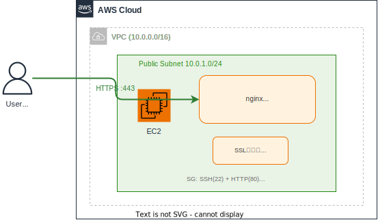

# セッション3：EC2 を count でスケールアウトしよう（任意・45分）

> このセッションは **任意（発展課題）** です。セッション2が完了し、余裕がある方向けです。

## 🎯 このセッションの到達状態

Terraform の `count` を使って EC2 を 2台に増やし、両方の nginx にアクセスできる状態を体験した後、`terraform destroy -target` で1台だけ削除して元に戻っています。



### セッション2からの変化

| | セッション2 | セッション3（途中） | セッション3（最終） |
|---|:---:|:---:|:---:|
| EC2 台数 | 1台 | **2台** | 1台（元に戻す） |
| Terraform の学び | plan/destroy/apply | **count / targeted destroy** | — |

> 🎓 **このセッションのポイント**: Terraform の `count` を使えば、**コード1行の変更でサーバーの台数を増減** できます。手動で同じことをすると、EC2起動 → SG設定 → nginx インストール... と何ステップも必要ですが、IaC なら一瞬です。

---

## 📚 事前準備

> ⚠️ **DevSpacesのワークスペースを再構築した場合**:
> 休憩後のタイムアウトや翌日の作業開始時にワークスペースを再構築した場合は、環境セットアップスクリプトを再実行してください。
> ```bash
> ./scripts/setup_devspaces.sh
> ```
> プロジェクト内のファイル（SSH鍵、Terraformの状態、生成したコード）は保持されています。

- セッション2が完了していること（EC2 に nginx がインストール済み、HTTPでアクセスできる状態）
- EC2のIPアドレスを確認：

```bash
terraform -chdir=terraform/vpc-ec2 output instance_public_ip
```

---

## 構築の流れ

```
Step 1: count で EC2 を2台に増やそう（15分）
    ↓
Step 2: 2台の EC2 を確認しよう（10分）
    ↓
Step 3: targeted destroy で1台だけ削除しよう（15分）
    ↓
振り返り（5分）
```

---

## Step 1: count で EC2 を2台に増やそう（15分）

### やること

Terraform の `count` パラメータを使って、既存の EC2 定義を 2台構成に変更します。

### ゴール

- `aws_instance` リソースに `count = 2` が設定されている
- `outputs.tf` が複数台に対応している（splat 式 `[*]` の使用）
- `terraform plan` で「1台追加」の差分が表示されている
- `terraform apply` が成功し、EC2 が 2台 running になっている

> 💡 **ヒント**: `count` を使うと、リソース名が `aws_instance.training` → `aws_instance.training[0]`, `aws_instance.training[1]` のようにインデックス付きになります。output もこれに合わせて変更が必要です。

### Agentへの指示

<details>
<summary>📝 プロンプト例</summary>

```
terraform/vpc-ec2/ の EC2 定義を以下のように変更してください。

■ 変更内容
1. aws_instance リソースに count = 2 を追加して、EC2を2台に増やす
2. Name タグを "training-ec2-1", "training-ec2-2" のように count.index で区別する
3. outputs.tf を複数台に対応させる：
   - instance_public_ip → instance_public_ips（リスト形式、splat 式 [*] を使用）
   - instance_id → instance_ids（リスト形式）
4. 既存の単数形の output も残して、1台目の値を返すようにする
   （他のセッションで参照しているため）

まず terraform plan を実行して、変更内容を教えてください。
```

</details>

### terraform plan の確認

Agentが `terraform plan` を実行すると、以下のような差分が表示されるはずです：

```
  # aws_instance.training[1] will be created
  + resource "aws_instance" "training" {
      ...
    }

Plan: 1 to add, N to change, 0 to destroy.
```

> 💡 **「1 to add」** = 2台目の EC2 が新規作成されます。1台目は既存のままです（`count` 導入時にインデックスが変わるため change になる場合があります）。

plan を確認したら、Agentに `terraform apply` を実行してもらいましょう。

### 確認

```bash
terraform -chdir=terraform/vpc-ec2 output
```

2台分のIPアドレスとインスタンスIDが表示されれば OK ✅

---

## Step 2: 2台の EC2 を確認しよう（10分）

### やること

2台の EC2 が両方とも正常に稼働していることを確認します。

### ゴール

- 2台とも EC2 が running 状態
- 2台とも nginx が起動し、ブラウザでアクセスできる

### 確認手順

1. **terraform output** で2台のIPアドレスを確認：

```bash
terraform -chdir=terraform/vpc-ec2 output instance_public_ips
```

2. **ブラウザで両方にアクセス**:
   - `http://<1台目のIP>` → nginx ページが表示される
   - `http://<2台目のIP>` → nginx ページが表示される

> 💡 2台目のEC2も `user_data` が適用されているので、**自動的に nginx がインストール・起動** されています。手動で SSH してインストールする必要はありません。`user_data` の実行完了まで1〜2分待ってからアクセスしてください。

<details>
<summary>❓ 2台目のnginxが表示されない場合</summary>

`user_data` の実行に1〜2分かかります。少し待ってからリトライしてください。

それでも表示されない場合は、Agentに確認を依頼しましょう：

```
EC2（<2台目のIPアドレス>）にSSHで接続して、nginxが起動しているか確認してください。
起動していない場合は原因を調べて修正してください。

接続情報:
- SSH鍵: keys/training-key
- ユーザー: ec2-user
```

</details>

2台ともブラウザで nginx ページが表示されれば OK ✅

> 🎓 **ここがIaCの威力**: 手動なら「EC2作成 → SSH → dnf install → systemctl start」を**もう1回繰り返す**必要があります。Terraform + `user_data` なら `count = 2` に変えて `apply` するだけで、**全く同じ構成のサーバーが即座に増えます**。

---

## Step 3: targeted destroy で1台だけ削除しよう（15分）

### やること

`terraform destroy -target` を使って、**2台目の EC2 だけを削除** します。その後、コードを1台構成に戻して整合性を取ります。

### ゴール

- 2台目の EC2 のみが削除されている
- 1台目の EC2 はそのまま稼働中
- Terraform コードが1台構成に戻っている（`count` の削除 or `count = 1`）
- `terraform plan` で差分がない状態

### 手順

#### 3-1. targeted destroy で2台目だけ削除

<details>
<summary>📝 プロンプト例</summary>

```
terraform destroy -target を使って、2台目のEC2（aws_instance.training[1]）だけを削除してください。
1台目は残してください。

terraform -chdir=terraform/vpc-ec2 destroy -target='aws_instance.training[1]'
```

</details>

#### 3-2. コードを1台構成に戻す

targeted destroy はリソースだけを削除するので、**コード上はまだ `count = 2` のまま** です。このままだと次の `terraform apply` で2台目が再作成されてしまいます。

<details>
<summary>📝 プロンプト例</summary>

```
terraform/vpc-ec2/ のEC2定義を1台構成に戻してください。

■ 変更内容
1. aws_instance の count を削除（または count = 1 にする）
2. Name タグを元の形式に戻す（"training-ec2"）
3. outputs.tf を単数形に戻す
   （instance_public_ips → instance_public_ip 等）
   ※ ただしセッション3で追加した複数形の output は削除して構いません

変更後、terraform plan を実行して差分がないことを確認してください。
```

</details>

### 確認

```bash
terraform -chdir=terraform/vpc-ec2 plan
```

`No changes. Your infrastructure matches the configuration.` が表示されれば OK ✅

> 💡 **targeted destroy の注意点**: `-target` は緊急時や一時的な作業向けの機能です。通常の運用では、**コードを変更 → plan → apply** のフローで管理するのが正しい方法です。

---

## 📝 振り返り（5分）

### このセッションで体験したこと

| 作業 | 学び |
|------|------|
| count でEC2を2台に増加 | **コード1行で台数を制御** できるIaCの威力 |
| 2台のnginxを確認 | user_data + count で同一構成を即座にスケールアウト |
| targeted destroy で1台削除 | 特定リソースだけの選択的削除が可能 |
| コードを1台構成に戻す | **コードとインフラの整合性** を保つ重要性 |

### count を使うメリット

- サーバーの台数を **変数1つ** で管理できる
- 全台に同じ `user_data`（セットアップスクリプト）が適用される
- 増設も縮退も `terraform apply` だけで完了

### 実務での活用

| シーン | count の使い方 |
|--------|---------------|
| 負荷テスト | 一時的にサーバーを10台に増やす → テスト後に戻す |
| 障害対応 | 壊れたサーバーを削除 → count を維持して自動再作成 |
| コスト削減 | 夜間はサーバーを減らして費用を抑える |

---

## ファイル構成

セッション完了時、以下の構成になっています（セッション2と同じ）：

```
terraform/
└── vpc-ec2/
    ├── main.tf          # VPC, Subnet, IGW, RT, SG(SSH+HTTP), KP, EC2(user_data付き, count=1)
    ├── variables.tf     # 変数定義
    └── outputs.tf       # VPC ID, Subnet ID, SG ID, Public IP, Instance ID
```

---

## ⚠️ リソースの削除

このセッションではリソースを一時的に増やしましたが、最後に1台構成に戻しています。
追加で削除が必要なリソースはありません。全体のクリーンアップはセッション6で行います。

---

## ✅ 完了チェック

以下のコマンドで、このセッションの完了状態を確認できます：

```bash
./scripts/check.sh session3
```

---

## ➡️ 次のステップ

[セッション4：サーバー再起動の自動化（Ansible入門）](session4_guide.md) に進んでください。
