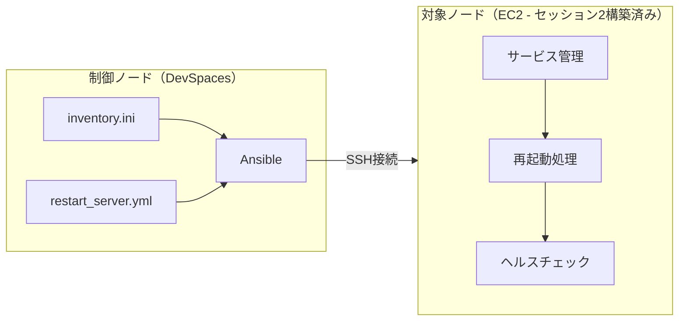

# セッション4：サーバー再起動の自動化 詳細ガイド

## 📋 目的

このセッションでは、ContinueのAgent機能を使って、Ansible Playbookを作成し、セッション2で構築したEC2インスタンスに対してサーバー再起動の自動化を実現します。Ansibleの基礎からPlaybookの作成・実行まで、Agent開発で進めます。

### 学習目標

- Ansibleの基本概念（インベントリ、Playbook、タスク、ハンドラー）を理解する
- Agent形式でインベントリファイルとPlaybookを作成する
- サーバー再起動の自動化（再起動前後の状態確認、サービス管理）を実現する
- Ansible特有のPrompt Engineering（冪等性、エラーハンドリング）を実践する

## 🎯 最終的な目標構成

このセッション終了時点で、以下の構成が完成していることを目指します：

### 自動化ワークフロー



### ファイル構成

```
workspace/
└── ansible/
    ├── inventory.ini              # インベントリファイル
    ├── ansible.cfg                # Ansible設定ファイル
    └── playbooks/
        ├── restart_server.yml     # サーバー再起動Playbook
        ├── check_status.yml       # サーバー状態確認Playbook
        └── manage_services.yml    # サービス管理Playbook
```

### 自動化されるタスク

- **サーバー再起動**: 再起動前の状態確認 → 再起動 → 再起動後のヘルスチェック
- **サーバー状態確認**: OS情報、稼働時間、ディスク使用量、メモリ使用量
- **サービス管理**: サービスの起動/停止/再起動/状態確認

## 📚 事前準備

- [セッション2](session2_guide.md) で構築したEC2インスタンスが起動していること
- EC2インスタンスのパブリックIPアドレスを把握していること
- SSH接続用のキーペアファイルが手元にあること
- Ansibleがインストールされていること
- Continueが正しく設定されていること

> **ヒント**: セッション2の `terraform output` を実行してEC2のパブリックIPを確認してください。

## 🚀 Agent開発の進め方

### Agent開発のアドバイス

#### 1. Prompt Engineeringのヒント（Ansible用）

**悪いプロンプト例**:
```
サーバーを再起動して
```

<details>
<summary>💡 良いプロンプト例（まず自分で考えてからクリック）</summary>

```
ansible/ フォルダに、下記条件を満たすサーバー再起動を自動化するAnsible環境を構築してください。

前提条件:
- 対象サーバー: セッション2で構築したEC2インスタンス（Amazon Linux 2023）
- 接続方法: SSH鍵認証（ec2-user）
- EC2のパブリックIP: <ここにIPを入れる>

作成するファイル:
1. inventory.ini - 対象サーバーの定義
2. ansible.cfg - 基本設定
3. playbooks/restart_server.yml - サーバー再起動Playbook

Playbookの要件:
- 再起動前: 現在の稼働時間、サービス状態を確認・記録
- 再起動: rebootモジュールを使用（タイムアウト300秒）
- 再起動後: 稼働時間の確認、主要サービスの状態確認、ヘルスチェック
- エラーハンドリング: 再起動失敗時の適切な処理

注意事項:
- 足りていないパラメータがある場合は聞き返してください
- 冪等性を確保してください
- ハンドラーを適切に使用してください
- コメントを日本語で追加してください
```

</details>

**Ansible特有のプロンプトポイント**:
- **冪等性**: 何度実行しても同じ結果になることを要求
- **ハンドラー**: 変更があった場合のみ実行するタスク
- **エラーハンドリング**: `ignore_errors`、`failed_when`、`block/rescue`の活用
- **接続情報**: SSH鍵パス、ユーザー名、接続オプション

#### 2. Context Engineeringのヒント

<details>
<summary>💡 コンテキスト提供のプロンプト例（まず自分で考えてからクリック）</summary>

```
セッション2で構築したEC2インスタンスの情報:
- パブリックIP: xxx.xxx.xxx.xxx
- OS: Amazon Linux 2023
- SSHユーザー: ec2-user
- SSH鍵ファイル: ~/.ssh/training-key.pem
- セキュリティグループ: SSH（ポート22）のみ許可

上記の情報を使って、Ansible環境を構築してください。
```

</details>

**サーバー情報の取得**:

初めてAnsibleを使う場合、まずサーバー情報を収集するPlaybookを作成すると良いでしょう：

```
まず、対象サーバーの情報を収集するPlaybook（check_status.yml）を作成してください。
収集する情報: OS情報、カーネルバージョン、稼働時間、ディスク使用量、メモリ使用量、実行中のサービス一覧
```

#### 3. 段階的な構築アプローチ

1. **ステップ1**: インベントリファイルとansible.cfgの作成
2. **ステップ2**: 接続テスト（`ansible all -m ping`）
3. **ステップ3**: 簡単な状態確認Playbook（check_status.yml）の作成・実行
4. **ステップ4**: サーバー再起動Playbook（restart_server.yml）の作成・実行
5. **ステップ5**: サービス管理Playbook（manage_services.yml）の作成・実行

各ステップで動作確認をしながら、段階的に進めてください。

#### 4. フィードバックループの活用

**Ansible実行時のエラー対応**:
- Ansible実行時にエラーが発生した場合、エラーメッセージをそのままAgentに提供してください
- Agentが修正提案を行うので、確認してから承認してください

**Playbookの改善**:
- 基本的なPlaybookが動作したら、改善点をフィードバックしてください
- 例：「ログ出力を追加してください」「通知機能を追加してください」

### 考えながら進めるポイント

1. **Terraformとの違い**
   - Terraformはリソースの作成・管理、Ansibleはサーバーの設定・運用
   - それぞれのツールの得意分野をどう活用するか

2. **再起動時の注意点**
   - 再起動前に確認すべきことは何か
   - 再起動後にどのような検証が必要か

3. **冪等性の重要性**
   - 同じPlaybookを複数回実行しても安全か
   - `changed` と `ok` の違いを意識する

4. **エラーハンドリング**
   - 再起動が失敗した場合にどう対処するか
   - タイムアウトの設定は適切か

## 📝 振り返り

以下の点について振り返り、学んだことをまとめてください：

- **Ansibleの基礎理解**: インベントリ、Playbook、タスクの関係をどのように理解したか
- **Prompt Engineering（Ansible用）**: Ansible特有の要件（冪等性、エラーハンドリング）をどのようにプロンプトに反映したか
- **Context Engineeringの実践**: セッション2のEC2情報をどのように活用したか
- **TerraformとAnsibleの役割の違い**: 構築と運用でのツールの使い分け

<details>
<summary>📝 解答例（クリックで展開）</summary>

### ansible.cfg

```ini
[defaults]
inventory = inventory.ini
remote_user = ec2-user
private_key_file = ~/.ssh/training-key.pem
host_key_checking = False
timeout = 30
```

### inventory.ini

```ini
[webservers]
web1 ansible_host=<EC2のパブリックIP>

[webservers:vars]
ansible_user=ec2-user
ansible_ssh_private_key_file=~/.ssh/training-key.pem
ansible_ssh_common_args='-o StrictHostKeyChecking=no'
```

### playbooks/check_status.yml

```yaml
---
- name: サーバー状態確認
  hosts: webservers
  become: yes
  gather_facts: yes

  tasks:
    - name: OS情報の表示
      debug:
        msg: |
          OS: {{ ansible_distribution }} {{ ansible_distribution_version }}
          カーネル: {{ ansible_kernel }}
          アーキテクチャ: {{ ansible_architecture }}

    - name: 稼働時間の確認
      command: uptime
      register: uptime_result
      changed_when: false

    - name: 稼働時間の表示
      debug:
        msg: "{{ uptime_result.stdout }}"

    - name: ディスク使用量の確認
      command: df -h
      register: disk_result
      changed_when: false

    - name: ディスク使用量の表示
      debug:
        msg: "{{ disk_result.stdout_lines }}"

    - name: メモリ使用量の確認
      command: free -m
      register: memory_result
      changed_when: false

    - name: メモリ使用量の表示
      debug:
        msg: "{{ memory_result.stdout_lines }}"

    - name: 実行中のサービス一覧
      command: systemctl list-units --type=service --state=running --no-pager
      register: services_result
      changed_when: false

    - name: サービス一覧の表示
      debug:
        msg: "{{ services_result.stdout_lines[:20] }}"
```

### playbooks/restart_server.yml

```yaml
---
- name: サーバー再起動の自動化
  hosts: webservers
  become: yes

  vars:
    important_services:
      - sshd
      - crond

  handlers:
    - name: サービスの再起動確認
      debug:
        msg: "すべての重要なサービスが正常に動作しています"

  tasks:
    # === 再起動前の確認 ===
    - name: 再起動前 - 稼働時間の確認
      command: uptime
      register: uptime_before
      changed_when: false

    - name: 再起動前 - 稼働時間の表示
      debug:
        msg: "再起動前の稼働時間: {{ uptime_before.stdout }}"

    - name: 再起動前 - 重要なサービスの状態確認
      systemd:
        name: "{{ item }}"
      register: service_status_before
      loop: "{{ important_services }}"
      changed_when: false
      ignore_errors: yes

    - name: 再起動前 - サービス状態の表示
      debug:
        msg: "{{ item.item }}: {{ item.status.ActiveState | default('不明') }}"
      loop: "{{ service_status_before.results }}"
      loop_control:
        label: "{{ item.item }}"

    # === サーバー再起動 ===
    - name: サーバーを再起動
      reboot:
        reboot_timeout: 300
        pre_reboot_delay: 10
        post_reboot_delay: 30
        msg: "Ansible managed reboot"

    # === 再起動後のヘルスチェック ===
    - name: 再起動後 - 稼働時間の確認
      command: uptime
      register: uptime_after
      changed_when: false

    - name: 再起動後 - 稼働時間の表示
      debug:
        msg: "再起動後の稼働時間: {{ uptime_after.stdout }}"

    - name: 再起動後 - 重要なサービスの状態確認
      systemd:
        name: "{{ item }}"
        state: started
        enabled: yes
      loop: "{{ important_services }}"

    - name: 再起動後 - ネットワーク接続の確認
      command: ping -c 3 8.8.8.8
      register: ping_result
      changed_when: false
      ignore_errors: yes

    - name: 再起動後 - ネットワーク状態の表示
      debug:
        msg: "ネットワーク接続: {{ 'OK' if ping_result.rc == 0 else 'NG' }}"

    - name: 再起動完了メッセージ
      debug:
        msg: "サーバーの再起動が正常に完了しました"
      notify: サービスの再起動確認
```

### playbooks/manage_services.yml

```yaml
---
- name: サービス管理
  hosts: webservers
  become: yes

  vars:
    target_service: "crond"
    target_action: "restarted"  # started, stopped, restarted

  tasks:
    - name: サービスの現在の状態を確認
      systemd:
        name: "{{ target_service }}"
      register: service_status
      changed_when: false
      ignore_errors: yes

    - name: 現在のサービス状態を表示
      debug:
        msg: "{{ target_service }}: {{ service_status.status.ActiveState | default('不明') }}"

    - name: サービスの状態を変更
      systemd:
        name: "{{ target_service }}"
        state: "{{ target_action }}"
        enabled: yes

    - name: 変更後のサービス状態を確認
      systemd:
        name: "{{ target_service }}"
      register: service_status_after
      changed_when: false

    - name: 変更後のサービス状態を表示
      debug:
        msg: "{{ target_service }}: {{ service_status_after.status.ActiveState }}"
```

### 検証コマンド例

```bash
# 1. 接続テスト
ansible all -m ping

# 2. サーバー状態確認
ansible-playbook playbooks/check_status.yml

# 3. サーバー再起動
ansible-playbook playbooks/restart_server.yml

# 4. サービス管理（crondを再起動する例）
ansible-playbook playbooks/manage_services.yml -e "target_service=crond target_action=restarted"
```

</details>

## ✅ チェックリスト

- [ ] 最終的な目標構成を理解した
- [ ] Ansibleの基本概念（インベントリ、Playbook、タスク）を理解した
- [ ] Agent形式でインベントリファイルを作成した
- [ ] Ansible接続テスト（`ansible all -m ping`）に成功した
- [ ] サーバー状態確認Playbookを作成・実行した
- [ ] サーバー再起動Playbookを作成・実行した
- [ ] サービス管理Playbookを作成・実行した
- [ ] Prompt Engineering（Ansible用）を実践した
- [ ] Context Engineering（セッション2のEC2情報活用）を実践した
- [ ] TerraformとAnsibleの役割の違いを理解した
- [ ] Agent形式での開発の振り返りを行った

## 🆘 トラブルシューティング

### SSH接続エラー

- セッション2で設定したキーペアファイルの権限を確認（`chmod 400 ~/.ssh/training-key.pem`）
- セキュリティグループでSSH（ポート22）が許可されているか確認
- EC2インスタンスが起動しているか確認
- パブリックIPが変わっていないか確認

### Ansible接続テスト失敗

- `ansible.cfg` の設定を確認
- `inventory.ini` のIPアドレスとSSH鍵パスを確認
- `host_key_checking = False` が設定されているか確認

### 権限エラー

- `become: yes` を使用してsudo権限を取得
- 適切なユーザー（ec2-user）で実行しているか確認

### 再起動タイムアウトエラー

- `reboot_timeout` を増やす（デフォルト300秒）
- ネットワーク接続を確認
- セキュリティグループの設定を確認

## 📚 参考資料

- [Ansible公式ドキュメント](https://docs.ansible.com/)
- [Ansible Rebootモジュール](https://docs.ansible.com/ansible/latest/collections/ansible/builtin/reboot_module.html)
- [セッション2ガイド](session2_guide.md)

## ➡️ 次のステップ

セッション4が完了したら、[セッション5：エージェントインストール・セットアップ](session5_guide.md) に進んでください。
