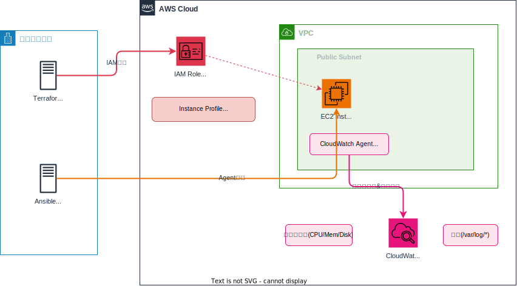

# セッション4：Ansible によるサーバー運用自動化（必須・2時間）

## 🎯 このセッションの到達状態

Ansibleでサーバーの状態確認・再起動・サービス管理が自動化され、Playbookを実行するだけで一連の運用タスクが完了する状態になっています。さらに、**障害対応シミュレーション**を通じて、Claude Code と協力してトラブルシューティングする実践力が身についています。



| 作成するもの | 内容 |
|-------------|------|
| inventory.ini | 接続先サーバーの定義 |
| ansible.cfg | Ansible基本設定 |
| check_status.yml | サーバー状態確認 |
| restart_server.yml | サーバー再起動（前後チェック付き） |
| manage_services.yml | サービスの起動/停止/再起動 |
| maintain_nginx.yml | nginx診断・復旧 Playbook |

> 🔧 **このセッションの特徴 — AIとの実践的トラブルシューティング**
>
> このセッションの後半（Step 6）では、**nginx の障害を意図的に再現し、Claude Code に原因調査から復旧まで一貫して対応してもらう** 体験をします。実務でサービスが止まったときにAIとどう協力するかを学びます。

### 構築の流れ

```
Step 1: Ansible の接続設定（15分）
    ↓
Step 2: 接続テスト - ping（5分）
    ↓
Step 3: サーバー状態を確認する Playbook（20分）
    ↓
Step 4: サーバー再起動の Playbook（25分）
    ↓
Step 5: サービス管理の Playbook（15分）
    ↓
Step 6: 🔧 障害対応シミュレーション — Webサイトが表示されない！（30分）
    ↓
振り返り（10分）
```

---

## 📚 事前準備

> ⚠️ **DevSpacesのワークスペースを再構築した場合**:
> 休憩後のタイムアウトや翌日の作業開始時にワークスペースを再構築した場合は、環境セットアップスクリプトを再実行してください。
> ```bash
> ./scripts/setup_devspaces.sh
> ```
> プロジェクト内のファイル（SSH鍵、Terraformの状態、生成したコード）は保持されています。

- セッション1のEC2が起動していること
- あなたのターミナルで EC2 のパブリックIPを確認して **メモしておく**：

```bash
terraform -chdir=terraform/vpc-ec2 output instance_public_ip
```

> 💡 IPアドレスは `13.xxx.xxx.xxx` のような形式です。このセッションで何度も使うのでコピーしておきましょう。

> ⚠️ **作業ディレクトリ**: すべての操作は **プロジェクトルート** から実行してください。

---

## Step 1: Ansibleの接続設定を作ろう（15分）

### やること

EC2に接続するための設定ファイル（`ansible.cfg` と `inventory.ini`）を作成します。

### ゴール

`ansible/` フォルダに以下の2ファイルが存在する：

- **ansible.cfg**: インベントリファイルのパス、リモートユーザー（`ec2-user`）、SSH鍵のパス、host_key_checking無効 が設定されている
- **inventory.ini**: `webservers` グループに EC2 の実際のIPアドレスが登録されている

> 💡 **ヒント**: Claude Code に「どの設定項目が必要か」を伝えましょう。

> ⚠️ **重要**: プロンプトの中のIPアドレスは、**事前準備でメモした実際のIPアドレス**に置き換えてから Claude Code に渡してください。`<EC2のIP>` のままだとファイルにプレースホルダーがそのまま書き込まれてしまいます。

<details>
<summary>📝 プロンプト例</summary>

```
ansible/ フォルダに、以下の設定ファイルを作成してください。
SSH鍵はプロジェクトルートの keys/training-key にあります。

1. ansible.cfg:
   - インベントリ: inventory.ini
   - リモートユーザー: ec2-user
   - SSH秘密鍵: ../keys/training-key（ansible/からの相対パス）
   - host_key_checking 無効

2. inventory.ini:
   - グループ名: webservers
   - ホスト: web1 (IPアドレス: 13.xxx.xxx.xxx)  ← 実際のIPに書き換えること！
   - SSH鍵: ../keys/training-key（ansible/からの相対パス）
   - StrictHostKeyChecking 無効
```

</details>

---

## Step 2: 接続テスト（5分）

### やること

Ansible の `ping` モジュールで EC2 への接続を確認します。

Claude Code に `プロジェクトルートから Ansible の接続テスト（ansible all -m ping）を実行して` と指示しましょう。

`web1 | SUCCESS` と表示されれば OK ✅

> 💡 手動で実行する場合（プロジェクトルートから）：
> ```bash
> ANSIBLE_CONFIG=ansible/ansible.cfg ansible -i ansible/inventory.ini all -m ping
> ```

<details>
<summary>❓ 接続できない場合</summary>

接続に失敗した場合は、**エラーメッセージをそのまま Claude Code に共有** してみましょう。Claude Code がエラーの原因を分析し、修正してくれます。

よくある原因：
- `inventory.ini` のIPアドレスが正しいか確認（プレースホルダー `<EC2のIP>` のままになっていませんか？）
- EC2が起動しているか確認
- IPアドレスが正しいか確認（`terraform -chdir=terraform/vpc-ec2 output instance_public_ip`）
- SSH鍵の権限を確認（`chmod 400 keys/training-key`）
- セキュリティグループでSSHが許可されているか確認

</details>

> 💡 **トラブルシューティングの基本パターン**: セッション1で紹介した「エラー → Claude Code に共有 → 原因分析 → 修正 → 再確認」のパターンをここでも活用しましょう。何か問題が起きたら、エラーメッセージをそのまま Claude Code に貼り付けてください。

---

## Step 3: サーバー状態を確認しよう（20分）

### やること

OS情報・メモリ・ディスクなどを確認するPlaybookを作成します。

### ゴール

`ansible/playbooks/check_status.yml` が作成され、実行すると以下の情報が表示される：

- OS情報（ディストリビューション、バージョン）
- 稼働時間
- メモリ使用量
- ディスク使用量
- 実行中のサービス一覧

> 💡 **ヒント**: Ansibleの `gather_facts: yes` を使うとOS情報が自動収集されます。コマンド実行は `command` モジュール、結果表示は `debug` モジュールを使います。

<details>
<summary>📝 プロンプト例</summary>

```
ansible/playbooks/check_status.yml を作成してください。

対象: webserversグループ
確認する情報:
- OS情報（ディストリビューション、バージョン）
- 稼働時間（uptime）
- メモリ使用量（free -m）
- ディスク使用量（df -h）
- 実行中のサービス一覧

作成後、Playbookを実行してください。
```

</details>

サーバー情報が表示されれば OK ✅

> 💡 **Playbookの実行方法**: Claude Code に「作成後、Playbookを実行してください」と指示すると Claude Code が自動で実行してくれます。あなたが手動で実行する場合は `ANSIBLE_CONFIG=ansible/ansible.cfg ansible-playbook -i ansible/inventory.ini ansible/playbooks/check_status.yml` です。

---

## Step 4: サーバー再起動を自動化しよう（25分）

### やること

再起動前後の状態チェック付きの再起動Playbookを作成します。

### ゴール

`ansible/playbooks/restart_server.yml` が作成され、実行すると以下が行われる：

1. **再起動前**: 稼働時間と重要サービス（sshd, crond）の状態が表示される
2. **再起動**: サーバーが再起動される（タイムアウト300秒）
3. **再起動後**: 稼働時間とサービスの正常性が再確認される

> 💡 **ヒント**: 再起動には `reboot` モジュールが使えます。`become: yes` が必要です。再起動前後で同じ情報を取得・比較すると、運用で役立つPlaybookになります。

<details>
<summary>📝 プロンプト例</summary>

```
ansible/playbooks/restart_server.yml を作成してください。

対象: webserversグループ
処理の流れ:
1. 再起動前: 稼働時間と重要サービス（sshd, crond）の状態を確認・表示
2. 再起動: reboot モジュールを使用（タイムアウト300秒）
3. 再起動後: 稼働時間の確認、サービスの状態確認、ネットワーク接続確認

注意:
- become: yes を使用してください
- エラーハンドリングを含めてください

作成後、Playbookを実行してください。
```

</details>

再起動前後のログが表示され、「再起動完了」メッセージが出れば OK ✅

---

## Step 5: サービス管理を自動化しよう（15分）

### やること

任意のサービスを起動/停止/再起動するPlaybookを作成します。

### ゴール

`ansible/playbooks/manage_services.yml` が作成されている：

- 変数でサービス名とアクション（started / stopped / restarted）を指定できる
- 変更前後のサービス状態が表示される

> 💡 **ヒント**: Ansible の変数機能（`vars` セクション）を使うと、Playbookの再利用性が上がります。`systemd` モジュールでサービスの状態を管理できます。

<details>
<summary>📝 プロンプト例</summary>

```
ansible/playbooks/manage_services.yml を作成してください。

対象: webserversグループ
機能:
- 変数 target_service でサービス名を指定（デフォルト: crond）
- 変数 target_action でアクション指定（started/stopped/restarted）
- 変更前後のサービス状態を表示

作成後、crond を再起動するように実行してください。
```

</details>

サービスの状態変更が確認できれば OK ✅

---

## Step 6: 🔧 障害対応シミュレーション — Webサイトが表示されない！（30分）

### やること

実務では、サーバーのサービスが予期せず停止したり、設定ファイルが壊れたりすることがあります。このステップでは **nginx を意図的に壊して障害を再現** し、Claude Code と協力して **原因調査 → 診断 → 復旧** を体験します。

> 🎓 **なぜ「わざと壊す」のか？**: 実際の障害は予測できないタイミングで起きます。事前に「障害 → 復旧」の流れを体験しておくことで、本番の障害時にも落ち着いて対応できます。

---

### Phase 1: 障害を再現する — あなたが手動で実行（5分）

まず、**あなたのターミナルで** nginx を停止し、設定ファイルを壊します。以下のコマンドを **1行ずつ** 実行してください（Claude Code は使いません）：

設定ファイルのバックアップを作成：
```bash
ssh -i keys/training-key ec2-user@<EC2のIP> "sudo cp /etc/nginx/nginx.conf /etc/nginx/nginx.conf.bak"
```

設定ファイルを壊す：
```bash
ssh -i keys/training-key ec2-user@<EC2のIP> "echo 'INVALID CONFIG' | sudo tee /etc/nginx/nginx.conf"
```

nginx を停止：
```bash
ssh -i keys/training-key ec2-user@<EC2のIP> "sudo systemctl stop nginx"
```

> ⚠️ `<EC2のIP>` は事前準備でメモした実際のIPアドレスに置き換えてください。

### 障害の確認（あなたがブラウザで確認）

**あなたが** ブラウザで `http://<EC2のIP>` にアクセスしてみてください。**ページが表示されない**（接続がタイムアウトする）ことを確認します。

---

### Phase 2: Claude Code にトラブルシューティングを依頼する（15分）

障害の状況だけを **Claude Code に** 伝えて、原因調査から復旧まで一貫して Claude Code に対応してもらいます。

<details>
<summary>📝 プロンプト例</summary>

```
ウェブサイト http://<EC2のIP> がダウンしています。
原因を調べて復旧してください。

■ 接続情報
- IP: <EC2のIP>
- SSH鍵: keys/training-key
- ユーザー: ec2-user

■ 復旧後にやること
- nginx が正常に起動していることを確認
- curl http://localhost でレスポンスが返ることを確認
```

</details>

### Claude Code が行うこと（観察してください）

Claude Code は以下のような流れで問題を解決するはずです：

1. **SSH で EC2 に接続** し、状況を確認
2. **nginx の状態を確認**: `systemctl status nginx` → inactive / dead
3. **nginx を起動しようとする**: `systemctl start nginx` → **失敗する**
4. **なぜ起動しないか調査**: `nginx -t` → 設定ファイルの構文エラーを発見
5. **設定ファイルを確認**: `/etc/nginx/nginx.conf` が壊れていることを検出
6. **設定ファイルを修復**: バックアップから復元 or デフォルト設定を再生成
7. **設定テスト**: `nginx -t` → OK
8. **nginx を起動**: `systemctl start nginx` → 成功
9. **動作確認**: `curl http://localhost` → レスポンス確認

> 💡 **ここがポイント**: Claude Code は「起動しない → なぜ？ → 設定が壊れている → 修復 → 再起動」と、**複数のステップを自動的に繰り返して** 問題を解決します。人間が1つずつコマンドを打って調べるのと同じ思考プロセスを AI が実行しています。

**あなたが** ブラウザで `http://<EC2のIP>` にアクセスして、ページが表示されれば **復旧成功** ✅

---

### Phase 3: 復旧手順を Playbook 化する — Claude Code に依頼（10分）

同じ障害が将来起きたときにすぐ対応できるよう、Claude Code に **nginx の診断・復旧 Playbook** を作成してもらいましょう。

<details>
<summary>📝 プロンプト例</summary>

```
今の復旧作業をもとに、ansible/playbooks/maintain_nginx.yml を作成してください。

対象: webserversグループ
処理の流れ:
1. nginx の起動状態を確認して表示
2. nginx の設定テスト（nginx -t）を実行
3. 設定テストが失敗した場合 → 設定ファイルを再生成して修復
4. nginx を再起動（設定テスト成功時のみ）
5. curl http://localhost でヘルスチェック
6. すべての結果をサマリーとして表示

注意:
- become: yes を使用
- ヘルスチェック結果のHTTPステータスコードを表示

作成後、Playbookを実行してください。
```

</details>

Playbook が実行されて nginx のヘルスチェックが成功すれば OK ✅

> 🎓 **学び**: Phase 2 の「手動で復旧」→ Phase 3 の「Playbook化で自動化」という流れは、実務でも非常に重要です。**一度手動で対応した作業を自動化する** — これが IaC・自動化の本質です。

---

## 📝 振り返り（10分）

### TerraformとAnsibleの使い分け

| Terraform（セッション1〜3） | Ansible（セッション4〜6） |
|:---:|:---:|
| リソースの **作成・変更・削除** | サーバーの **設定・運用** |
| AWSリソースを構築・管理 | 構築済みサーバーを操作 |
| `terraform apply` / `destroy` | `ansible-playbook` |

### このセッションで作ったPlaybook

| Playbook | 用途 | 実務での活用場面 |
|----------|------|-----------------|
| check_status.yml | サーバー状態確認 | 定期的なヘルスチェック |
| restart_server.yml | サーバー再起動 | メンテナンス作業 |
| manage_services.yml | サービス管理 | 障害対応・デプロイ |
| maintain_nginx.yml | nginx診断・復旧 | **障害対応（インシデントレスポンス）** |

### 🔧 トラブルシューティングの学び

| 体験 | 学んだこと |
|------|-----------|
| あなたが nginx を壊し、Claude Code が復旧 | Claude Code は「確認 → 起動失敗 → 原因特定 → 修復 → 再起動 → 確認」を自動で繰り返す |
| エラーメッセージを Claude Code に共有 | **具体的なエラー情報が、正確な診断につながる** |
| 手動復旧 → Playbook 化 | **一度手動で対応したら、次回のために自動化する** |

> 🎓 **このパターンを覚えておきましょう**: 何か問題が起きたら → **あなたがエラーメッセージを Claude Code に共有** → Claude Code が原因を分析・修正。このパターンはセッション5以降でも使えます。

---

## ファイル構成

```
ansible/
├── inventory.ini
├── ansible.cfg
└── playbooks/
    ├── check_status.yml
    ├── restart_server.yml
    ├── manage_services.yml
    └── maintain_nginx.yml
```

<details>
<summary>📝 完成形のコード例（クリックで展開）</summary>

### ansible.cfg

```ini
[defaults]
inventory = inventory.ini
remote_user = ec2-user
private_key_file = ../keys/training-key
host_key_checking = False
timeout = 30
```

### inventory.ini

```ini
[webservers]
web1 ansible_host=13.xxx.xxx.xxx  # ← 実際のEC2パブリックIPに置き換えてください

[webservers:vars]
ansible_user=ec2-user
ansible_ssh_private_key_file=../keys/training-key
ansible_ssh_common_args='-o StrictHostKeyChecking=no'
```

### playbooks/check_status.yml

```yaml
---
- name: サーバー状態確認
  hosts: webservers
  become: yes
  gather_facts: yes

  tasks:
    - name: OS情報の表示
      debug:
        msg: "{{ ansible_distribution }} {{ ansible_distribution_version }} ({{ ansible_kernel }})"

    - name: 稼働時間の確認
      command: uptime
      register: uptime_result
      changed_when: false

    - name: 稼働時間の表示
      debug:
        msg: "{{ uptime_result.stdout }}"

    - name: メモリ使用量
      command: free -m
      register: memory_result
      changed_when: false

    - name: メモリの表示
      debug:
        msg: "{{ memory_result.stdout_lines }}"

    - name: ディスク使用量
      command: df -h
      register: disk_result
      changed_when: false

    - name: ディスクの表示
      debug:
        msg: "{{ disk_result.stdout_lines }}"
```

### playbooks/restart_server.yml

```yaml
---
- name: サーバー再起動の自動化
  hosts: webservers
  become: yes

  vars:
    important_services:
      - sshd
      - crond

  tasks:
    - name: 再起動前 - 稼働時間
      command: uptime
      register: uptime_before
      changed_when: false

    - name: 再起動前 - 表示
      debug:
        msg: "再起動前: {{ uptime_before.stdout }}"

    - name: サーバーを再起動
      reboot:
        reboot_timeout: 300
        pre_reboot_delay: 10
        post_reboot_delay: 30

    - name: 再起動後 - 稼働時間
      command: uptime
      register: uptime_after
      changed_when: false

    - name: 再起動後 - 表示
      debug:
        msg: "再起動後: {{ uptime_after.stdout }}"

    - name: 再起動後 - サービス確認
      systemd:
        name: "{{ item }}"
        state: started
        enabled: yes
      loop: "{{ important_services }}"

    - name: 再起動完了
      debug:
        msg: "サーバーの再起動が正常に完了しました"
```

### playbooks/manage_services.yml

```yaml
---
- name: サービス管理
  hosts: webservers
  become: yes

  vars:
    target_service: "crond"
    target_action: "restarted"

  tasks:
    - name: 変更前の状態確認
      systemd:
        name: "{{ target_service }}"
      register: before
      changed_when: false
      ignore_errors: yes

    - name: 変更前の表示
      debug:
        msg: "{{ target_service }}: {{ before.status.ActiveState | default('不明') }}"

    - name: サービスの状態変更
      systemd:
        name: "{{ target_service }}"
        state: "{{ target_action }}"
        enabled: yes

    - name: 変更後の状態確認
      systemd:
        name: "{{ target_service }}"
      register: after
      changed_when: false

    - name: 変更後の表示
      debug:
        msg: "{{ target_service }}: {{ after.status.ActiveState }}"
```

### playbooks/maintain_nginx.yml（障害対応シミュレーション後に作成）

```yaml
---
- name: nginx診断・復旧
  hosts: webservers
  become: yes

  tasks:
    - name: nginx の起動状態確認
      systemd:
        name: nginx
      register: nginx_status
      changed_when: false
      ignore_errors: yes

    - name: 起動状態の表示
      debug:
        msg: "nginx: {{ nginx_status.status.ActiveState | default('不明') }}"

    - name: nginx 設定テスト
      command: nginx -t
      register: config_test
      changed_when: false
      ignore_errors: yes

    - name: 設定テスト結果
      debug:
        msg: "設定テスト: {{ '成功 ✅' if config_test.rc == 0 else '失敗 ❌ → 設定を修復します' }}"

    - name: 設定ファイルをバックアップから復元
      copy:
        src: /etc/nginx/nginx.conf.bak
        dest: /etc/nginx/nginx.conf
        remote_src: yes
      when: config_test.rc != 0
      ignore_errors: yes

    - name: 復元後の設定テスト
      command: nginx -t
      register: config_test_after
      changed_when: false
      ignore_errors: yes
      when: config_test.rc != 0

    - name: nginx を起動/再起動
      systemd:
        name: nginx
        state: restarted
      when: (config_test.rc == 0) or (config_test_after.rc | default(1) == 0)

    - name: ヘルスチェック
      uri:
        url: http://localhost
        return_content: no
        status_code: 200
      register: health
      ignore_errors: yes

    - name: サマリー
      debug:
        msg: |
          === nginx 診断・復旧レポート ===
          起動状態: {{ nginx_status.status.ActiveState | default('不明') }}
          設定テスト: {{ '成功' if config_test.rc == 0 else '失敗（修復実施）' }}
          ヘルスチェック: {{ 'OK (HTTP ' ~ health.status ~ ')' if health.status is defined else '失敗' }}
```

</details>

---

## ✅ 完了チェック

あなたのターミナルで以下のコマンドを実行して、このセッションの完了状態を確認できます：

```bash
./scripts/check.sh session4
```

---

## ➡️ 次のステップ

[セッション5：SSM Agent & CloudWatch Agent の導入](session5_guide.md) に進んでください。

> 💡 セッション5で問題が起きた場合も、このセッションで学んだ「エラーメッセージを Claude Code に共有 → Claude Code が原因分析 → 修正」のパターンで対応できます。
