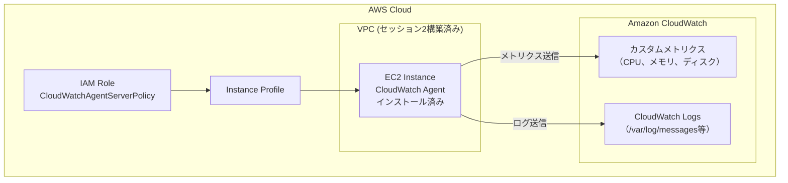

# セッション5：CloudWatch Agentインストール・セットアップ 詳細ガイド

## 📋 目的

このセッションでは、ContinueのAgent機能を使って、CloudWatch Agentのインストールと設定をAgent開発で実現します。Terraform（IAMロール作成）とAnsible（Agent設定）を組み合わせた、ツール横断的なAgent開発を体験します。

### 学習目標

- TerraformとAnsibleを組み合わせたAgent開発を体験する
- CloudWatch Agentのインストール・設定を自動化する
- IAMロール/インスタンスプロファイルの設定を理解する
- より複雑なAnsible Playbookの作成を体験する

## 🎯 最終的な目標構成

このセッション終了時点で、以下の構成が完成していることを目指します：

### CloudWatch Agent 構成図



### ファイル構成

```
terraform/
└── cloudwatch-iam/
│       ├── main.tf          # IAMロール・インスタンスプロファイル
│       ├── variables.tf     # 変数定義
│       └── outputs.tf       # 出力定義
ansible/
├── inventory.ini              # セッション4で作成済み
├── ansible.cfg                # セッション4で作成済み
└── playbooks/
    ├── install_cwagent.yml    # CloudWatch Agentインストール
    └── configure_cwagent.yml  # CloudWatch Agent設定
```

### 構築されるリソースと設定

**Terraform（IAM関連）**:
- IAMロール（CloudWatchAgentServerPolicy付き）
- インスタンスプロファイル
- EC2インスタンスへのプロファイル関連付け

**Ansible（Agent設定）**:
- CloudWatch Agentのインストール
- CloudWatch Agent設定ファイルの配置
- CloudWatch Agentの起動・有効化
- 動作確認

## 📚 事前準備

- [セッション2](session2_guide.md) で構築したEC2インスタンスが起動していること
- [セッション4](session4_guide.md) でAnsible環境が構築済みであること（inventory.ini、ansible.cfg）
- Ansible接続テスト（`ansible all -m ping`）が成功すること
- Continueが正しく設定されていること

## 🚀 Agent開発の進め方

### Agent開発のアドバイス

#### 1. 作業の流れ

このセッションではTerraformとAnsibleの2つのツールを使います。以下の順序で進めてください：

1. **Terraform**: IAMロール・インスタンスプロファイルの作成
2. **Terraform**: EC2インスタンスへのプロファイル関連付け
3. **Ansible**: CloudWatch Agentのインストール
4. **Ansible**: CloudWatch Agent設定ファイルの配置と起動
5. **検証**: メトリクスとログがCloudWatchに送信されていることを確認

#### 2. Prompt Engineeringのヒント

<details>
<summary>💡 Terraform部分のプロンプト例（まず自分で考えてからクリック）</summary>

```
terraform/cloudwatch-iam/ フォルダに、CloudWatch AgentをEC2インスタンスで利用するためのIAMリソースを作成するTerraformコードを生成してください。

前提条件:
- セッション2で構築したEC2インスタンスが対象

要件:
1. IAMロール:
   - 名前: training-cloudwatch-agent-role
   - 信頼ポリシー: EC2からのAssumeRole
   - アタッチするポリシー: CloudWatchAgentServerPolicy、AmazonSSMManagedInstanceCore
   
2. インスタンスプロファイル:
   - 名前: training-cloudwatch-agent-profile
   - 上記IAMロールを関連付け

注意事項:
- 足りていないパラメータがある場合は聞き返してください
- 既存のIAMリソースと衝突しないように確認してください
```

</details>

<details>
<summary>💡 Ansible部分のプロンプト例（まず自分で考えてからクリック）</summary>

```
ansible/playbooks/ フォルダに、CloudWatch Agentをインストール・設定するAnsible Playbookを生成してください。

前提条件:
- 対象サーバー: セッション2で構築したEC2インスタンス（Amazon Linux 2023）
- IAMロール: 既にCloudWatchAgentServerPolicyが付与済み
- セッション4で作成したインベントリを使用

作成するPlaybook:
1. install_cwagent.yml - CloudWatch Agentのインストール
2. configure_cwagent.yml - 設定ファイルの配置と起動

install_cwagent.yml の要件:
- amazon-cloudwatch-agent パッケージのインストール
- インストール確認

configure_cwagent.yml の要件:
- CloudWatch Agent設定ファイル（JSON）の生成・配置
- 収集するメトリクス: CPU使用率、メモリ使用率、ディスク使用率
- 収集するログ: /var/log/messages, /var/log/secure
- メトリクス収集間隔: 60秒
- CloudWatch Agentの起動・有効化
- 動作確認（ステータスチェック）

注意事項:
- 冪等性を確保してください
- エラーハンドリングを含めてください
- コメントを日本語で追加してください
```

</details>

#### 3. Context Engineeringの活用

<details>
<summary>💡 コンテキスト提供のプロンプト例（まず自分で考えてからクリック）</summary>

```
既存のインフラ情報:
- EC2インスタンスID: i-xxxxx
- パブリックIP: xxx.xxx.xxx.xxx
- OS: Amazon Linux 2023
- リージョン: ap-northeast-1

Ansible環境（セッション4で構築済み）:
- inventory.ini に対象サーバーが登録済み
- SSH接続確認済み

上記の情報を使って、CloudWatch Agentの環境を構築してください。
```

</details>

#### 4. フィードバックループの活用

**TerraformとAnsibleの連携**:
- Terraformでリソース作成後、結果をAnsibleのコンテキストとして提供
- 例：IAMロールARN、インスタンスプロファイル名など

**CloudWatch Agent設定のチューニング**:
- 基本設定が動作したら、メトリクスの追加やログの追加をフィードバック
- 例：「Nginxのアクセスログも収集してください」「ディスクI/Oメトリクスも追加してください」

### 考えながら進めるポイント

1. **TerraformとAnsibleの使い分け**
   - なぜIAMロールはTerraformで作成するのか
   - なぜAgentインストールはAnsibleで行うのか
   - それぞれのツールの得意分野

2. **CloudWatch Agentの設定**
   - どのメトリクスを収集すべきか
   - どのログを収集すべきか
   - 収集間隔はどの程度が適切か

3. **セキュリティの考慮**
   - 最小権限の原則（必要なポリシーのみ付与）
   - IAMロールの設計

## 📝 振り返り

以下の点について振り返り、学んだことをまとめてください：

- **ツール横断的なAgent開発**: TerraformとAnsibleを組み合わせた開発の体験
- **IAMロールの設計**: CloudWatch Agentに必要な権限の理解
- **複雑なPlaybook作成**: 設定ファイルの生成・配置を含むPlaybook
- **Agent開発の効率性**: 複数ツールを使う場合のAgent開発のメリット

<details>
<summary>📝 解答例（クリックで展開）</summary>

### Terraform: IAMリソース

#### terraform/cloudwatch-iam/variables.tf

```hcl
variable "region" {
  description = "AWSリージョン"
  type        = string
  default     = "ap-northeast-1"
}

variable "ec2_instance_id" {
  description = "対象EC2インスタンスID"
  type        = string
}
```

#### terraform/cloudwatch-iam/main.tf

```hcl
provider "aws" {
  region = var.region
}

# IAMロールの信頼ポリシー
data "aws_iam_policy_document" "ec2_assume_role" {
  statement {
    actions = ["sts:AssumeRole"]
    principals {
      type        = "Service"
      identifiers = ["ec2.amazonaws.com"]
    }
  }
}

# IAMロール
resource "aws_iam_role" "cloudwatch_agent_role" {
  name               = "training-cloudwatch-agent-role"
  assume_role_policy = data.aws_iam_policy_document.ec2_assume_role.json

  tags = {
    Name        = "training-cloudwatch-agent-role"
    Environment = "training"
  }
}

# CloudWatchAgentServerPolicy をアタッチ
resource "aws_iam_role_policy_attachment" "cloudwatch_agent_policy" {
  role       = aws_iam_role.cloudwatch_agent_role.name
  policy_arn = "arn:aws:iam::aws:policy/CloudWatchAgentServerPolicy"
}

# AmazonSSMManagedInstanceCore をアタッチ
resource "aws_iam_role_policy_attachment" "ssm_policy" {
  role       = aws_iam_role.cloudwatch_agent_role.name
  policy_arn = "arn:aws:iam::aws:policy/AmazonSSMManagedInstanceCore"
}

# インスタンスプロファイル
resource "aws_iam_instance_profile" "cloudwatch_agent_profile" {
  name = "training-cloudwatch-agent-profile"
  role = aws_iam_role.cloudwatch_agent_role.name

  tags = {
    Name        = "training-cloudwatch-agent-profile"
    Environment = "training"
  }
}
```

#### terraform/cloudwatch-iam/outputs.tf

```hcl
output "iam_role_arn" {
  description = "IAMロールARN"
  value       = aws_iam_role.cloudwatch_agent_role.arn
}

output "instance_profile_name" {
  description = "インスタンスプロファイル名"
  value       = aws_iam_instance_profile.cloudwatch_agent_profile.name
}

output "instance_profile_arn" {
  description = "インスタンスプロファイルARN"
  value       = aws_iam_instance_profile.cloudwatch_agent_profile.arn
}
```

### Ansible: CloudWatch Agentインストール・設定

#### ansible/playbooks/install_cwagent.yml

```yaml
---
- name: CloudWatch Agentのインストール
  hosts: webservers
  become: yes

  tasks:
    - name: CloudWatch Agentパッケージのインストール
      yum:
        name: amazon-cloudwatch-agent
        state: present
      register: install_result

    - name: インストール結果の表示
      debug:
        msg: "CloudWatch Agent インストール: {{ '成功' if install_result.changed else '既にインストール済み' }}"

    - name: CloudWatch Agentのバージョン確認
      command: /opt/aws/amazon-cloudwatch-agent/bin/amazon-cloudwatch-agent-ctl -a status
      register: agent_version
      changed_when: false
      ignore_errors: yes

    - name: バージョン情報の表示
      debug:
        msg: "{{ agent_version.stdout_lines }}"
      when: agent_version.rc == 0
```

#### ansible/playbooks/configure_cwagent.yml

```yaml
---
- name: CloudWatch Agentの設定と起動
  hosts: webservers
  become: yes

  vars:
    cwagent_config:
      agent:
        metrics_collection_interval: 60
        run_as_user: root
      metrics:
        namespace: Training/EC2
        metrics_collected:
          cpu:
            measurement:
              - cpu_usage_idle
              - cpu_usage_user
              - cpu_usage_system
            metrics_collection_interval: 60
            totalcpu: true
          mem:
            measurement:
              - mem_used_percent
              - mem_available_percent
            metrics_collection_interval: 60
          disk:
            measurement:
              - disk_used_percent
              - disk_free
            metrics_collection_interval: 60
            resources:
              - "/"
      logs:
        logs_collected:
          files:
            collect_list:
              - file_path: /var/log/messages
                log_group_name: /training/ec2/messages
                log_stream_name: "{instance_id}"
                retention_in_days: 7
              - file_path: /var/log/secure
                log_group_name: /training/ec2/secure
                log_stream_name: "{instance_id}"
                retention_in_days: 7

  handlers:
    - name: CloudWatch Agentを再起動
      command: >
        /opt/aws/amazon-cloudwatch-agent/bin/amazon-cloudwatch-agent-ctl
        -a fetch-config
        -m ec2
        -c file:/opt/aws/amazon-cloudwatch-agent/etc/amazon-cloudwatch-agent.json
        -s

  tasks:
    - name: CloudWatch Agent設定ファイルの配置
      copy:
        content: "{{ cwagent_config | to_nice_json }}"
        dest: /opt/aws/amazon-cloudwatch-agent/etc/amazon-cloudwatch-agent.json
        owner: root
        group: root
        mode: '0644'
      notify: CloudWatch Agentを再起動

    - name: CloudWatch Agentの起動
      command: >
        /opt/aws/amazon-cloudwatch-agent/bin/amazon-cloudwatch-agent-ctl
        -a fetch-config
        -m ec2
        -c file:/opt/aws/amazon-cloudwatch-agent/etc/amazon-cloudwatch-agent.json
        -s

    - name: CloudWatch Agentのステータス確認
      command: /opt/aws/amazon-cloudwatch-agent/bin/amazon-cloudwatch-agent-ctl -a status
      register: agent_status
      changed_when: false

    - name: ステータスの表示
      debug:
        msg: "{{ agent_status.stdout_lines }}"

    - name: 設定完了メッセージ
      debug:
        msg: |
          CloudWatch Agentの設定が完了しました。
          数分後にAWSコンソールのCloudWatchで以下を確認してください:
          - メトリクス: Training/EC2 名前空間
          - ログ: /training/ec2/messages, /training/ec2/secure
```

### 検証コマンド例

```bash
# 1. Terraform: IAMリソース作成
cd terraform/cloudwatch-iam
terraform init
terraform plan
terraform apply

# 2. EC2にインスタンスプロファイルを関連付け（AWS CLI）
aws ec2 associate-iam-instance-profile \
  --instance-id <EC2インスタンスID> \
  --iam-instance-profile Name=training-cloudwatch-agent-profile

# 3. Ansible: CloudWatch Agentインストール
cd ansible
ansible-playbook playbooks/install_cwagent.yml

# 4. Ansible: CloudWatch Agent設定・起動
ansible-playbook playbooks/configure_cwagent.yml

# 5. CloudWatch Agentのステータス確認（リモート）
ansible webservers -m command -a "/opt/aws/amazon-cloudwatch-agent/bin/amazon-cloudwatch-agent-ctl -a status"
```

</details>

## ✅ チェックリスト

- [ ] 最終的な目標構成を理解した
- [ ] Agent形式でIAMロール・インスタンスプロファイルを作成した（Terraform）
- [ ] EC2インスタンスにインスタンスプロファイルを関連付けた
- [ ] Agent形式でCloudWatch Agentインストール用Playbookを作成・実行した
- [ ] Agent形式でCloudWatch Agent設定用Playbookを作成・実行した
- [ ] CloudWatch Agentが正常に動作していることを確認した
- [ ] TerraformとAnsibleの組み合わせを体験した
- [ ] Agent形式での開発の振り返りを行った

## 🆘 トラブルシューティング

### IAMロール関連のエラー

- IAMロールの信頼ポリシーにEC2が含まれているか確認
- CloudWatchAgentServerPolicyが正しくアタッチされているか確認
- インスタンスプロファイルがEC2に関連付けられているか確認

### CloudWatch Agentインストールエラー

- Amazon Linux 2023の場合、`yum` でインストール可能
- インターネット接続が必要（パブリックサブネットに配置されているか確認）

### CloudWatch Agent設定エラー

- 設定ファイルのJSON形式が正しいか確認
- ログファイルのパスが正しいか確認
- Agent起動コマンドの実行結果を確認

### メトリクスが表示されない

- IAMロールの権限を確認
- CloudWatch Agentのステータスを確認
- CloudWatchコンソールで正しい名前空間を確認
- メトリクスが反映されるまで数分待つ

## ⚠️ リソースの削除

ワークショップ終了後は、作成したIAMリソースを削除してください：

```bash
cd terraform/cloudwatch-iam
terraform destroy
```

> **注意**: CloudWatch AgentはEC2上にインストールされているだけなので、EC2を削除すれば一緒に削除されます。IAMロール・インスタンスプロファイルはTerraformで管理しているため、別途削除が必要です。

## 📚 参考資料

- [CloudWatch Agent公式ドキュメント](https://docs.aws.amazon.com/AmazonCloudWatch/latest/monitoring/Install-CloudWatch-Agent.html)
- [CloudWatch Agent設定リファレンス](https://docs.aws.amazon.com/AmazonCloudWatch/latest/monitoring/CloudWatch-Agent-Configuration-File-Details.html)
- [Ansible公式ドキュメント](https://docs.ansible.com/)
- [セッション2ガイド](session2_guide.md)
- [セッション4ガイド](session4_guide.md)

## ➡️ 次のステップ

セッション5が完了したら、[セッション6：サーバー情報取得・運用レポート作成（任意）](session6_guide.md) に進んでください。
