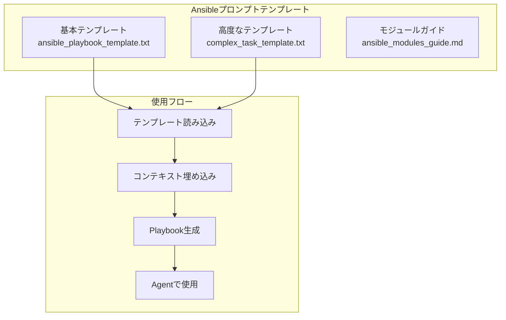

# セッション5：Ansible自動化エージェント開発 詳細ガイド

## 📋 目的

このセッションでは、ContinueのAgent機能を活用して、より高度なAnsible Playbookを生成し、複雑な運用タスクを自動化します。セッション4で学んだ基礎を発展させ、プロンプトテンプレートの作成やContext Engineeringの高度化を実践します。

### 学習目標

- Prompt Engineeringの実践（高度なAnsible Playbook生成用）
- Context Engineeringの実践（サーバー情報の動的取得と活用）
- フィードバックループの実践（承認ワークフロー、エラー修正、反復的改善）
- Agent形式での開発の深化を実践する
- ContinueのAgent機能を活用した効率的なPlaybook生成
- 複雑なタスクの自動化

## 🎯 最終的な目標構成

このセッション終了時点で、以下の構成が完成していることを目指します：

### プロンプトテンプレート構成



### ファイル構成

```
workspace/
└── templates/
    └── prompts/
        ├── ansible_playbook_template.txt  # 基本テンプレート
        ├── complex_task_template.txt       # 複雑なタスク用テンプレート
        └── ansible_modules_guide.md         # Ansibleモジュールガイド
```

### 成果物

- 再利用可能なAnsibleプロンプトテンプレート
- 複雑なタスクを自動化するPlaybook
- サーバー情報の動的取得と活用の実践

## 📚 事前準備

- [セッション4](session4_guide.md) が完了していること
- Ansibleの基本理解
- Continueが正しく設定されていること
- セッション2で構築したEC2インスタンスが起動していること

## 🚀 Agent開発の進め方

### Agent開発のアドバイス

#### 1. 高度なPrompt Engineering

**複雑なタスク用プロンプト例**:

```
ansible/playbooks/ フォルダに、下記条件を満たす複雑な運用タスクを自動化するAnsible Playbookを生成してください。

要件:
- パッケージ（htop, git, curl, nginx）をインストール
- 設定ファイルをテンプレートから生成してコピー
- サービス（nginx）を開始し、自動起動を有効化
- ログローテーションの設定
- ファイアウォールルールの設定（必要に応じて）
- 冪等性を確保
- エラーハンドリングを含める
- ロールバック機能を含める

注意事項:
- 足りていないパラメータがある場合は、そのまま実行するのではなく一度聞き返してください
- ハンドラーを適切に使用してください
- タスクの依存関係を明確にしてください
- コメントを適切に追加してください
- ベストプラクティスに従ってください

出力形式:
- YAML形式のAnsible Playbook
- 適切なモジュールを使用
- 変数定義を含める（group_varsまたはvars）
```

**プロンプトテンプレートの作成**:

セッション3で学んだTerraformのプロンプトテンプレートと同様に、Ansible用のテンプレートも作成できます：

```
下記条件を満たす{task_type}を自動化するAnsible Playbookを生成してください。

要件:
- 対象サーバー: {target_hosts}
- {specific_requirements}

既存のサーバー情報:
{server_context}

注意事項:
- 足りていないパラメータがある場合は、そのまま実行するのではなく一度聞き返してください
- 冪等性を確保してください
- ハンドラーを使用してください
- エラーハンドリングを含めてください
- コメントを適切に追加してください
- ベストプラクティスに従ってください

出力形式:
- YAML形式のAnsible Playbook
- 適切なモジュールを使用
```

#### 2. Context Engineeringの高度化

**サーバー情報の動的取得**:

Continueのチャット機能を使って、サーバー情報を段階的に取得できます：

```
セッション2で構築したEC2インスタンスの詳細情報を教えてください。
OS情報、インストールされているパッケージ、実行中のサービス、ディスク使用状況などを含めてください。
```

取得した情報をコンテキストとして提供：

```
既存のサーバー情報:
- OS: Amazon Linux 2023
- インストール済みパッケージ: 基本パッケージのみ
- 実行中サービス: sshd, crond
- ディスク使用状況: /dev/xvda1 8.0G 1.2G 6.8G 15% /
- メモリ: 1GB

上記の情報を考慮して、以下のタスクを自動化するAnsible Playbookを生成してください：
1. 必要なパッケージのインストール
2. 設定ファイルの配置
3. サービスの設定と起動
4. ログローテーションの設定
```

**複数のサーバー情報の統合**:

複数のサーバーがある場合、それぞれの情報を統合してコンテキストとして提供：

```
サーバー情報:
- web1: Amazon Linux 2023, nginx未インストール
- web2: Amazon Linux 2023, nginx未インストール

上記の情報を考慮して、両方のサーバーにnginxをインストール・設定するAnsible Playbookを生成してください。
```

#### 3. フィードバックループの実践

**承認ワークフロー**:
- 複雑なタスクの場合、段階的に承認
- 特にサービス再起動や設定変更など、影響の大きい操作は必ず確認

**エラー修正プロセス**:
- Playbook実行時のエラーをコンテキストとして提供
- エラーメッセージと実行環境情報を一緒に提供

**反復的改善**:
- 生成されたPlaybookを確認し、改善点があれば具体的にフィードバック
- 例：「エラーハンドリングをより詳細にしてください」「ログ出力を追加してください」「パフォーマンス最適化を行ってください」

### 考えながら進めるポイント

1. **どのようなテンプレート構造が効果的か**
   - タスクタイプごとのテンプレート（パッケージインストール、サービス管理、ファイル操作など）
   - 複雑なタスクをどのように分解すべきか

2. **どのようなコンテキストが必要か**
   - サーバー情報のどの部分が重要か
   - 複数のサーバー情報をどのように統合すべきか

3. **複雑なタスクの自動化方法**
   - タスクの依存関係をどのように表現すべきか
   - エラーハンドリングとロールバックをどのように実装すべきか

4. **効率的な開発フロー**
   - テンプレートの使い回し
   - コンテキスト情報の再利用
   - 段階的な構築アプローチ

## 📝 振り返り

以下の点について振り返り、学んだことをまとめてください：

- **高度なPrompt Engineeringの効果**: 複雑なタスクをどのようにプロンプトに反映したか
- **Context Engineeringの高度化**: サーバー情報の動的取得と活用が、どのようにPlaybook生成の品質向上に寄与したか
- **フィードバックループの実践**: 承認ワークフロー、エラー修正、反復的改善をどのように実践したか
- **Agent形式での開発の深化**: セッション4と比較して、どのような進化を感じたか

<details>
<summary>📝 解答例（クリックで展開）</summary>

### プロンプトテンプレート例

#### ansible_playbook_template.txt

```
下記条件を満たす{task_type}を自動化するAnsible Playbookを生成してください。

要件:
- 対象サーバー: {target_hosts}
- {specific_requirements}

既存のサーバー情報:
{server_context}

注意事項:
- 足りていないパラメータがある場合は、そのまま実行するのではなく一度聞き返してください
- 冪等性を確保してください
- ハンドラーを使用してください
- エラーハンドリングを含めてください
- コメントを適切に追加してください
- ベストプラクティスに従ってください

出力形式:
- YAML形式のAnsible Playbook
- 適切なモジュールを使用
```

### 高度なPlaybook例

#### complex_setup.yml

```yaml
---
- name: 複雑なサーバーセットアップ
  hosts: webservers
  become: yes
  vars:
    packages:
      - htop
      - git
      - curl
      - nginx
    nginx_config_path: /etc/nginx/nginx.conf
    log_dir: /var/log/nginx
  
  handlers:
    - name: restart nginx
      systemd:
        name: nginx
        state: restarted
    
    - name: reload nginx
      systemd:
        name: nginx
        state: reloaded
  
  tasks:
    - name: パッケージキャッシュの更新
      yum:
        update_cache: yes
        cache_valid_time: 3600
      changed_when: false
    
    - name: 必要なパッケージをインストール
      yum:
        name: "{{ packages }}"
        state: present
      register: package_result
      failed_when: package_result.failed and package_result.rc != 0
    
    - name: パッケージインストール結果の確認
      debug:
        msg: "パッケージインストール結果: {{ package_result }}"
      when: package_result.failed
    
    - name: ログディレクトリの作成
      file:
        path: "{{ log_dir }}"
        state: directory
        owner: nginx
        group: nginx
        mode: '0755'
    
    - name: nginx設定ファイルのテンプレート生成
      template:
        src: nginx.conf.j2
        dest: "{{ nginx_config_path }}"
        owner: root
        group: root
        mode: '0644'
        backup: yes
      notify: reload nginx
      register: config_result
    
    - name: 設定ファイルの検証
      command: nginx -t
      changed_when: false
      failed_when: false
      register: nginx_test
    
    - name: nginx設定の検証結果
      debug:
        msg: "{{ nginx_test.stdout }}"
      when: nginx_test.rc != 0
    
    - name: nginxサービスを開始
      systemd:
        name: nginx
        state: started
        enabled: yes
    
    - name: ログローテーション設定
      copy:
        content: |
          /var/log/nginx/*.log {
              daily
              rotate 7
              compress
              delaycompress
              missingok
              notifempty
              create 0640 nginx nginx
              sharedscripts
              postrotate
                  /bin/kill -USR1 `cat /run/nginx.pid 2>/dev/null` 2>/dev/null || true
              endscript
          }
        dest: /etc/logrotate.d/nginx
        owner: root
        group: root
        mode: '0644'
    
    - name: ファイアウォールルールの設定（firewalld使用時）
      firewalld:
        service: http
        permanent: yes
        state: enabled
        immediate: yes
      when: ansible_os_family == "RedHat" and ansible_distribution_major_version|int >= 7
      ignore_errors: yes
    
    - name: セットアップ完了の確認
      debug:
        msg: "セットアップが完了しました"
```

### エラーハンドリング例

#### error_handling_example.yml

```yaml
---
- name: エラーハンドリングを含むPlaybook
  hosts: webservers
  become: yes
  
  tasks:
    - name: パッケージのインストール（エラーハンドリング付き）
      yum:
        name: "{{ item }}"
        state: present
      loop:
        - htop
        - git
        - curl
      register: package_results
      rescue:
        - name: パッケージインストールエラーの処理
          debug:
            msg: "パッケージ {{ item.item }} のインストールに失敗しました: {{ item.msg }}"
          loop: "{{ package_results.results }}"
          loop_control:
            label: "{{ item.item }}"
          when: item.failed
      
      always:
        - name: インストール結果のサマリー
          debug:
            msg: "パッケージインストール完了"
```

### プロンプト例

**複雑なタスク用プロンプト**:

```
ansible/playbooks/ フォルダに、下記条件を満たす複雑な運用タスクを自動化するAnsible Playbookを生成してください。

要件:
- パッケージ（htop, git, curl, nginx）をインストール
- nginx設定ファイルをテンプレートから生成して配置
- nginxサービスを開始し、自動起動を有効化
- ログローテーションの設定
- 設定ファイル変更時の自動リロード
- エラーハンドリングとロールバック機能

既存のサーバー情報:
- OS: Amazon Linux 2023
- パッケージマネージャー: yum
- サービス管理: systemd

注意事項:
- 足りていないパラメータがある場合は、そのまま実行するのではなく一度聞き返してください
- ハンドラーを適切に使用してください
- タスクの依存関係を明確にしてください
- 冪等性を確保してください
- エラーハンドリングを含めてください
- コメントを適切に追加してください
- ベストプラクティスに従ってください
```

</details>

## ✅ チェックリスト

- [ ] 最終的な目標構成を理解した
- [ ] プロンプトテンプレートを作成した
- [ ] 高度なPrompt Engineeringを実践した
- [ ] Context Engineeringの高度化を実践した（サーバー情報の動的取得）
- [ ] 複雑なタスクを自動化するPlaybookを生成した
- [ ] フィードバックループを実践した（承認ワークフロー、エラー修正、反復的改善）
- [ ] エラーハンドリングを含むPlaybookを作成した
- [ ] Agent形式での開発の振り返りを行った

## 🆘 トラブルシューティング

### 複雑なPlaybookがうまく生成されない

- タスクを分解して、段階的に生成してください
- 各タスクの依存関係を明確にプロンプトに含めてください

### サーバー情報の取得がうまくいかない

- Continueのチャット機能を使って、段階的に情報を取得してください
- 取得した情報を整理してからコンテキストとして提供してください

### エラーハンドリングが適切に実装されない

- エラーハンドリングの要件を明確にプロンプトに含めてください
- 具体的なエラーシナリオを提示してください

## 📚 参考資料

- [Ansible公式ドキュメント](https://docs.ansible.com/)
- [Ansibleモジュール一覧](https://docs.ansible.com/ansible/latest/collections/index.html)
- [セッション3ガイド](session3_guide.md)
- [セッション4ガイド](session4_guide.md)

## ➡️ 次のステップ

セッション5が完了したら、[セッション6：統合管理エージェント開発](session6_guide.md) に進んでください。
