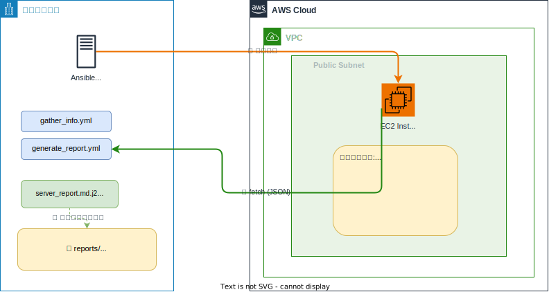

# セッション5：CloudWatch Agent & SSM Agent のインストール（必須・2時間）

## 🎯 このセッションの到達状態

EC2に SSM Agent と CloudWatch Agent がインストール・稼働し、AWSコンソールからリモート管理と CPU/メモリの監視ができる状態になっています。このセッションでは **Terraform は使わず、Ansible のみ** で実施します。



| Step | インストールするもの | 目的 |
|------|---------------------|------|
| 前半 | SSM Agent | AWSコンソールからのリモート管理 |
| 後半 | CloudWatch Agent | メトリクス・ログの収集 |

> 🎓 **なぜ2つのAgent（ソフトウェア）を入れるのか？**
> - **SSM Agent**: AWSコンソールからEC2にリモートアクセス（Session Manager）。SSHなしで管理できる。
> - **CloudWatch Agent**: CPU/メモリ/ディスクのメトリクスやログをCloudWatchに送信。監視に必須。
>
> ⚠️ **用語の注意**: ここでの「Agent」は **EC2上で動くAWSのソフトウェア**（SSM Agent, CloudWatch Agent）です。Claude Code（AIコーディングエージェント）とは別物です。

> 🔧 **このセッションの特徴 — トラブルシューティング体験**
>
> このセッションでは、**意図的にエラーが発生する手順** を含んでいます。エラーが出ても慌てず、Claude Code に原因を調べてもらいましょう。Agent が自動的にエラーを検知 → 原因を特定 → 修正 → 再実行する様子を観察してください。

---

## 📚 事前準備

> ⚠️ **DevSpacesのワークスペースを再構築した場合**:
> 休憩後のタイムアウトや翌日の作業開始時にワークスペースを再構築した場合は、環境セットアップスクリプトを再実行してください。
> ```bash
> ./scripts/setup_devspaces.sh
> ```
> プロジェクト内のファイル（SSH鍵、Terraformの状態、Ansibleの設定、生成したコード）は保持されています。

- セッション4のAnsible環境が構築済みであること
- 接続確認：

```bash
ANSIBLE_CONFIG=ansible/ansible.cfg ansible -i ansible/inventory.ini all -m ping
```

> ⚠️ **作業ディレクトリ**: すべての操作は **プロジェクトルート** から実行してください。

---

## 構築の流れ

```
Step 1: SSM Agent のインストール（15分）
    ↓
Step 2: SSM Agent の動作確認 → トラブルシューティング（20分）  ← 🔧 Trap 1
    ↓
Step 3: SSM Run Command の体験（15分）
    ↓
Step 4: CloudWatch Agent のインストール（15分）
    ↓
Step 5: CloudWatch Agent の設定・起動（20分）
    ↓
Step 6: CloudWatch での確認 → トラブルシューティング（15分）  ← 🔧 Trap 2
    ↓
Step 7: CloudWatch Alarm の作成（10分）
    ↓
振り返り（10分）
```

---

## Step 1: SSM Agent をインストールしよう（15分）

### やること

Ansible Playbook で EC2 に SSM Agent をインストールします。

> ⚠️ **このステップではIAMロールは作成しません。** 先にSSM Agentをインストールして動作確認を行い、何が起こるか見てみましょう。

> 💡 Amazon Linux 2023 には SSM Agent が**プリインストール**されている場合があります。Playbook では「インストール確認 → 未インストールならインストール → 起動」の流れにすると安全です。

### ゴール

`ansible/playbooks/install_ssm_agent.yml` が作成され、実行すると：

- SSM Agent がインストールされている
- SSM Agent が起動・有効化されている
- ステータスが `active (running)` と表示される

<details>
<summary>📝 プロンプト例</summary>

```
ansible/playbooks/install_ssm_agent.yml を作成してください。

対象: webserversグループ
タスク:
- amazon-ssm-agent がインストール済みか確認
- 未インストールの場合は yum でインストール
- amazon-ssm-agent サービスを起動・有効化（systemd）
- ステータスを確認して表示

作成後、Playbookを実行してください。
```

</details>

Agent が `active (running)` 状態になれば OK ✅

> ⚠️ **Agent が IAMロールも一緒に作成してしまった場合**: Claude Code が SSM の要件を判断して、プロンプトに含まれていない IAMロールまで自動的に作成することがあります。その場合は Step 2 のトラブルシューティングは発生しません。Step 2 の「Agent が行うこと」を読んで流れを理解し、フリートマネージャーで EC2 が表示されることを確認したら Step 3 に進んでください。

---

## Step 2: SSM Agent の動作確認 → トラブルシューティング 🔧（20分）

### やること

AWSコンソールで SSM Agent が正しく動作しているか確認します。

### 手順

1. **AWSコンソール**にログインし、上部の検索バーに `Systems Manager` と入力して開く
2. 左メニューから **「ノード管理」→「フリートマネージャー」** をクリック
3. EC2 インスタンスが **マネージドインスタンス** として表示されていることを確認

### 🔧 あれ？ EC2 が表示されない！

フリートマネージャーを確認しても、**EC2 が表示されない** はずです。

> 💡 SSM Agent はインストール・起動されていますが、AWS の Systems Manager と通信するための **権限（IAMロール）が EC2 に付与されていません**。これが原因です。

### Agent にトラブルシューティングを依頼しよう

ここで Claude Code に「なぜ表示されないのか」を調べてもらい、自動的に修正してもらいましょう。

<details>
<summary>📝 プロンプト例</summary>

```
SSM Agent をインストール・起動しましたが、AWS コンソールの Systems Manager フリートマネージャーに EC2 が表示されません。

原因を調べて修正してください。

■ ヒント
- EC2 が AWS サービスと通信するには適切な権限が必要です
- EC2 のインスタンスID: terraform -chdir=terraform/vpc-ec2 output instance_id で確認できます

■ 修正後にやること
- SSM Agent を再起動して、フリートマネージャーに表示されるか確認
```

</details>

### Agent が行うこと（観察してください）

Claude Code は以下のような流れで問題を解決するはずです：

1. **原因の特定**: EC2 に IAM ロール（インスタンスプロファイル）がアタッチされていないことを発見
2. **IAM ロールの作成**: `training-ec2-agent-role` を AWS CLI で作成
3. **ポリシーのアタッチ**: `AmazonSSMManagedInstanceCore` ポリシーをアタッチ
4. **インスタンスプロファイルの作成・関連付け**: EC2 にプロファイルを関連付け
5. **SSM Agent の再起動**: 新しい権限を認識させる
6. **確認**: フリートマネージャーで表示されるか確認

> ⚠️ IAMロールの反映に 1〜2分かかることがあります。Agent が「まだ表示されない」と報告しても、少し待ってからリトライしてもらってください。

### ゴール

以下のリソースが AWS 上に作成されている：

- IAMロール: `training-ec2-agent-role`（EC2 の AssumeRole）
- アタッチ済みポリシー: `AmazonSSMManagedInstanceCore`（＋後で `CloudWatchAgentServerPolicy` も追加）
- インスタンスプロファイル: `training-ec2-agent-profile`
- EC2 にプロファイルが関連付けられている
- **フリートマネージャーに EC2 が表示されている**

<details>
<summary>❓ Agent が IAM ロールの作成でエラーになった場合</summary>

すでにプロファイルが関連付けられている場合は **このStepはスキップしてOK** です。

関連付けを変更したい場合：

現在の関連付けIDを確認：
```bash
aws ec2 describe-iam-instance-profile-associations --filters "Name=instance-id,Values=<インスタンスID>"
```

関連付けを解除：
```bash
aws ec2 disassociate-iam-instance-profile --association-id <association-id>
```

再度関連付け：
```bash
aws ec2 associate-iam-instance-profile --instance-id <ID> --iam-instance-profile Name=training-ec2-agent-profile
```

</details>

SSM でインスタンスが管理対象として表示されれば OK ✅

> 🎓 **学び**: 「ソフトウェアを入れただけではダメ」— AWS サービスと連携するには、適切な **IAM 権限** が必要です。Agent はエラーの原因を自動的に特定し、解決策を実行してくれました。

---

## Step 3: SSM Run Command を体験しよう（15分）

### やること

SSM Agent が入ったことで、**AWSコンソール から直接コマンドを実行** できるようになりました。SSH不要のリモート管理を体験します。

### 手順

1. **AWSコンソール**にログインし、上部の検索バーに `Systems Manager` と入力して開く
2. 左メニューから **「ノード管理」→「Run Command」** をクリック
3. オレンジ色の **「コマンドを実行」** ボタンをクリック
4. 「コマンドドキュメント」の検索欄に `AWS-RunShellScript` と入力して選択
5. 「コマンドパラメータ」欄に以下を入力：

```bash
echo "=== SSM Run Command テスト ==="
hostname
uptime
free -m
df -h
```

6. 下にスクロールして **「ターゲット」** セクションで「インスタンスを手動で選択する」を選び、EC2 にチェック
7. さらに下にスクロールしてオレンジ色の **「実行」** ボタンをクリック
8. ステータスが「成功」になったら、インスタンスIDをクリックして **出力を確認**

> 💡 **これが SSM の真価**: SSHポートを開けなくても、AWSコンソールからサーバー管理ができます。

### Ansible との比較を考えてみましょう

| 項目 | SSM Run Command | Ansible |
|------|----------------|---------|
| 接続方式 | AWS API 経由 | SSH |
| 実行場所 | AWSコンソール | ターミナル |
| 適した用途 | 緊急対応、一回限りの操作 | 繰り返す定型作業、自動化 |

出力にサーバー情報が表示されれば OK ✅

---

## Step 4: CloudWatch Agent をインストールしよう（15分）

### やること

Ansible Playbook で CloudWatch Agent をインストールします。

### ゴール

`ansible/playbooks/install_cwagent.yml` が作成され、実行すると：

- `amazon-cloudwatch-agent` パッケージがインストールされている
- インストール結果とバージョンが表示される

> 💡 **ヒント**: CloudWatch Agent のコマンドは `/opt/aws/amazon-cloudwatch-agent/bin/amazon-cloudwatch-agent-ctl` にあります。`-a status` でステータスを確認できます。

### Agentへの指示

CloudWatch Agent のインストール前に、IAM ロールに CloudWatch 用のポリシーも追加する必要があります。Agent にまとめて依頼しましょう。

<details>
<summary>📝 プロンプト例</summary>

```
以下の2つの作業を実行してください。

■ 1. IAMロールに CloudWatch ポリシーを追加
training-ec2-agent-role に CloudWatchAgentServerPolicy をアタッチしてください。
（Step 2 で SSM 用のポリシーは追加済みです）

■ 2. CloudWatch Agent のインストール
ansible/playbooks/install_cwagent.yml を作成してください。

対象: webserversグループ
タスク:
- amazon-cloudwatch-agent パッケージをyumでインストール
- インストール結果を表示
- バージョン確認（/opt/aws/amazon-cloudwatch-agent/bin/amazon-cloudwatch-agent-ctl -a status）

作成後、Playbookを実行してください。
```

</details>

インストール成功のメッセージが出れば OK ✅

---

## Step 5: CloudWatch Agent を設定・起動しよう（20分）

### やること

CloudWatch Agent の設定ファイルを配置し、Agent を起動します。

> ⚠️ **このステップのプロンプトでは、わざと設定要件を一部省略しています。** 何が起こるか、Step 6 で確認してみましょう。

### ゴール

`ansible/playbooks/configure_cwagent.yml` が作成され、実行すると：

1. 設定ファイル（JSON）が `/opt/aws/amazon-cloudwatch-agent/etc/` に配置されている
2. CloudWatch Agent が `running` 状態で起動している
3. ステータスが正常と表示される

### Agentへの指示

以下のプロンプトで設定してください（**あえて名前空間の指定を省略しています**）：

<details>
<summary>📝 プロンプト例（そのまま使ってください）</summary>

```
ansible/playbooks/configure_cwagent.yml を作成してください。

対象: webserversグループ
タスク:
1. CloudWatch Agent設定ファイル（JSON）を /opt/aws/amazon-cloudwatch-agent/etc/ に配置
2. CloudWatch Agentを起動
3. ステータス確認

設定内容:
- メトリクス収集間隔: 60秒
- 収集するメトリクス: CPU使用率、メモリ使用率、ディスク使用率
- 収集するログ: /var/log/messages, /var/log/secure

作成後、Playbookを実行してください。
```

</details>

> 💡 上記のプロンプトでは **メトリクスの名前空間（namespace）を指定していません**。Agent がデフォルト値を使うか、独自に設定するかは Agent 次第です。

Agent が running 状態になれば OK ✅（ただし、Step 6 で問題が見つかるかもしれません）

> ⚠️ **Agent が `Training/EC2` 名前空間を自動的に設定した場合**: Claude Code が CloudWatch のベストプラクティスを判断して、プロンプトに含まれていない名前空間を適切に設定することがあります。その場合は Step 6 のトラブルシューティングは発生しません。CloudWatch コンソールでメトリクスが正しく表示されることを確認し、Step 7 に進んでください。

---

## Step 6: CloudWatch での確認 → トラブルシューティング 🔧（15分）

### やること

AWSコンソールで CloudWatch Agent のメトリクスを確認します。

### 確認手順

1. **AWSコンソール**の検索バーに `CloudWatch` と入力して開く
2. 左メニューから **「メトリクス」→「すべてのメトリクス」** をクリック
3. **カスタム名前空間** の一覧から `Training/EC2` を探す

> 💡 メトリクスが表示されるまで **数分かかる** ことがあります。表示されない場合は2〜3分待ってからページをリロードしてください。

### 🔧 あれ？ Training/EC2 が見つからない！

`Training/EC2` 名前空間が**見つからない**はずです。代わりに `CWAgent` という名前空間が表示されているかもしれません。

> 💡 これは Step 5 のプロンプトで **名前空間を `Training/EC2` に指定しなかった** ためです。CloudWatch Agent のデフォルト名前空間は `CWAgent` です。

### Agent にトラブルシューティングを依頼しよう

<details>
<summary>📝 プロンプト例</summary>

```
CloudWatch Agent を設定しましたが、CloudWatch コンソールの「Training/EC2」名前空間にメトリクスが表示されません。
「CWAgent」という名前空間にメトリクスが入っているようです。

■ 修正内容
1. CloudWatch Agent の設定ファイルを修正して、名前空間を「Training/EC2」に変更
2. ログの収集先ロググループ名を以下に設定:
   - /var/log/messages → /training/ec2/messages
   - /var/log/secure → /training/ec2/secure
   - retention_in_days: 7
3. CloudWatch Agent を再起動して反映

configure_cwagent.yml を更新して、Playbookを再実行してください。
```

</details>

### Agent が行うこと（観察してください）

1. **原因の特定**: 設定ファイルの namespace が指定されていない（またはデフォルトの `CWAgent`）
2. **設定ファイルの修正**: namespace を `Training/EC2` に変更
3. **ログ設定の追加**: ロググループ名と retention を設定
4. **Playbook の更新・再実行**: 修正した設定を配置して CloudWatch Agent を再起動

### 再確認

修正後、数分待ってから：

1. **CloudWatch → メトリクス → カスタム名前空間 → Training/EC2** でメトリクスを確認
2. **CloudWatch → ロググループ → /training/ec2/** でログを確認

> 💡 メトリクスとログが反映されるまで数分かかることがあります。

メトリクスまたはロググループが表示されれば OK ✅

> 🎓 **学び**: プロンプトで要件を正確に伝えないと、Agent はデフォルト値を使って動くものを作ってしまいます。**要件の漏れはエラーにならないため気づきにくい** — 結果を確認して初めてわかることもあります。

---

## Step 7: CloudWatch Alarm を作成しよう（10分）

### やること

CloudWatch Agent が収集したメトリクスに対してアラームを設定します。Agentに AWS CLI で作成してもらいます。

### ゴール

CPU使用率が80%を超えたらアラーム状態になる CloudWatch Alarm `training-cpu-alarm` が作成されている。

> 💡 **ヒント**: Agentに「CloudWatch Alarmを作成して」と伝えると、必要なAWS CLIコマンドを実行してくれます。

<details>
<summary>📝 プロンプト例</summary>

```
AWS CLI で以下の CloudWatch Alarm を作成してください。

- アラーム名: training-cpu-alarm
- メトリクス: Training/EC2 名前空間の cpu_usage_user
- 条件: 1分間の平均が80%以上
- 比較期間: 1期間
- アクション: なし（通知は不要）

作成後、CloudWatch のアラームコンソールで確認できるか教えてください。
```

</details>

### 確認

**AWS コンソール** → **CloudWatch → アラーム** で `training-cpu-alarm` が表示されていれば OK ✅

> 💡 現時点ではCPU使用率が低いため、ステータスは「OK」のはずです。

---

## 📝 振り返り（10分）

### このセッションで体験したこと

| 作業 | ツール | 学び |
|------|--------|------|
| SSM Agent導入 | Ansible | パッケージ管理の自動化 |
| 🔧 IAMロール問題の解決 | Claude Code | **権限不足のトラブルシューティング** |
| SSM Run Command | AWSコンソール | SSH不要のリモート管理 |
| CW Agent導入 | Ansible | パッケージ管理の自動化 |
| 🔧 名前空間問題の解決 | Claude Code | **要件不備の発見と修正** |
| CW Alarm | AWS CLI (Agent) | 監視設定もAgentで自動化 |

### トラブルシューティングの学び

| Trap | 原因 | 気づき |
|------|------|--------|
| **Trap 1**: SSM がフリートマネージャーに出ない | IAMロールがない | ソフトウェアだけでなく **権限（IAM）** も必要 |
| **Trap 2**: メトリクスが Training/EC2 にない | namespace 未指定 | プロンプトの **要件漏れ** は動くけど結果が違う |

### Agent のトラブルシューティング能力

Claude Code は以下のパターンでトラブルを解決しました：

```
1. エラー/問題の検知（ログ確認、状態確認）
2. 原因の特定（権限不足、設定不備など）
3. 修正の実行（IAMロール作成、設定ファイル修正など）
4. 再実行して確認
```

実務でもこのパターンは非常に有用です。エラーが出たときに **Agent にまず調べてもらう** ことで、解決までの時間を大幅に短縮できます。

### ツールの使い分け

| ツール | 用途 | このセッションでの使い方 |
|--------|------|------------------------|
| Terraform | インフラの構築 | 今回は使わなかった |
| Ansible | サーバー内の設定・ソフトウェア管理 | SSM/CW Agentのインストール・設定 |
| AWS CLI | AWSリソースの操作 | IAMロール、CloudWatch Alarm |
| SSM | 緊急時のリモート管理 | Run Commandでサーバー操作 |

---

## ファイル構成

```
ansible/
├── inventory.ini            # セッション4で作成済み
├── ansible.cfg              # セッション4で作成済み
└── playbooks/
    ├── install_ssm_agent.yml
    ├── install_cwagent.yml
    └── configure_cwagent.yml
```

<details>
<summary>📝 完成形のコード例（クリックで展開）</summary>

### playbooks/install_ssm_agent.yml

```yaml
---
- name: SSM Agentのインストール
  hosts: webservers
  become: yes

  tasks:
    - name: SSM Agentがインストール済みか確認
      command: rpm -q amazon-ssm-agent
      register: ssm_installed
      changed_when: false
      ignore_errors: yes

    - name: インストール状態の表示
      debug:
        msg: "{{ '既にインストール済み' if ssm_installed.rc == 0 else '未インストール → インストールします' }}"

    - name: SSM Agentインストール
      yum:
        name: amazon-ssm-agent
        state: present
      when: ssm_installed.rc != 0

    - name: SSM Agent起動・有効化
      systemd:
        name: amazon-ssm-agent
        state: started
        enabled: yes

    - name: ステータス確認
      command: systemctl status amazon-ssm-agent
      register: ssm_status
      changed_when: false

    - name: ステータス表示
      debug:
        msg: "{{ ssm_status.stdout_lines[:5] }}"
```

### playbooks/install_cwagent.yml

```yaml
---
- name: CloudWatch Agentのインストール
  hosts: webservers
  become: yes

  tasks:
    - name: CloudWatch Agentインストール
      yum:
        name: amazon-cloudwatch-agent
        state: present
      register: install_result

    - name: インストール結果
      debug:
        msg: "{{ '新規インストール' if install_result.changed else '既にインストール済み' }}"

    - name: バージョン確認
      command: /opt/aws/amazon-cloudwatch-agent/bin/amazon-cloudwatch-agent-ctl -a status
      register: status
      changed_when: false
      ignore_errors: yes

    - name: ステータス表示
      debug:
        msg: "{{ status.stdout_lines }}"
      when: status.rc == 0
```

### playbooks/configure_cwagent.yml（修正後の完成版）

```yaml
---
- name: CloudWatch Agent設定・起動
  hosts: webservers
  become: yes

  vars:
    cwagent_config:
      agent:
        metrics_collection_interval: 60
        run_as_user: root
      metrics:
        namespace: Training/EC2
        metrics_collected:
          cpu:
            measurement: [cpu_usage_idle, cpu_usage_user, cpu_usage_system]
            totalcpu: true
          mem:
            measurement: [mem_used_percent, mem_available_percent]
          disk:
            measurement: [disk_used_percent]
            resources: ["/"]
      logs:
        logs_collected:
          files:
            collect_list:
              - file_path: /var/log/messages
                log_group_name: /training/ec2/messages
                log_stream_name: "{instance_id}"
                retention_in_days: 7
              - file_path: /var/log/secure
                log_group_name: /training/ec2/secure
                log_stream_name: "{instance_id}"
                retention_in_days: 7

  tasks:
    - name: 設定ファイル配置
      copy:
        content: "{{ cwagent_config | to_nice_json }}"
        dest: /opt/aws/amazon-cloudwatch-agent/etc/amazon-cloudwatch-agent.json
        mode: '0644'

    - name: CloudWatch Agent起動
      command: >
        /opt/aws/amazon-cloudwatch-agent/bin/amazon-cloudwatch-agent-ctl
        -a fetch-config -m ec2
        -c file:/opt/aws/amazon-cloudwatch-agent/etc/amazon-cloudwatch-agent.json
        -s

    - name: ステータス確認
      command: /opt/aws/amazon-cloudwatch-agent/bin/amazon-cloudwatch-agent-ctl -a status
      register: status
      changed_when: false

    - name: ステータス表示
      debug:
        msg: "{{ status.stdout_lines }}"
```

</details>

---

## ⚠️ リソースの削除

ワークショップ終了後に IAM リソースを削除してください：

インスタンスプロファイルからロールを削除：
```bash
aws iam remove-role-from-instance-profile --instance-profile-name training-ec2-agent-profile --role-name training-ec2-agent-role
```

ポリシーのデタッチ：
```bash
aws iam detach-role-policy --role-name training-ec2-agent-role --policy-arn arn:aws:iam::aws:policy/CloudWatchAgentServerPolicy
```

```bash
aws iam detach-role-policy --role-name training-ec2-agent-role --policy-arn arn:aws:iam::aws:policy/AmazonSSMManagedInstanceCore
```

リソース削除：
```bash
aws iam delete-instance-profile --instance-profile-name training-ec2-agent-profile
```

```bash
aws iam delete-role --role-name training-ec2-agent-role
```

> 💡 Agentに「training-ec2-agent-role と training-ec2-agent-profile を削除して」と伝えれば、上記コマンドを実行してくれます。

CloudWatch Alarm の削除：
```bash
aws cloudwatch delete-alarms --alarm-names training-cpu-alarm
```

CloudWatch ロググループの削除（作成した場合のみ）：
```bash
aws logs delete-log-group --log-group-name /training/ec2/messages
```

```bash
aws logs delete-log-group --log-group-name /training/ec2/secure
```

> CloudWatch Agent と SSM Agent は EC2 上のソフトウェアなので、EC2 削除時に一緒に消えます。

---

## ✅ 完了チェック

以下のコマンドで、このセッションの完了状態を確認できます：

```bash
./scripts/check.sh session5
```

---

## ➡️ 次のステップ

[セッション6：サーバー情報取得・運用レポート作成（任意）](session6_guide.md) に進んでください。
