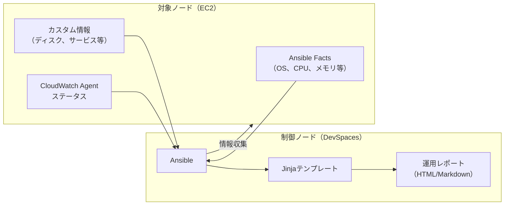

# セッション6：サーバー情報取得・運用レポート作成 詳細ガイド（任意・発展）

## 📋 目的

このセッションでは、ContinueのAgent機能を使って、Ansibleによるサーバー情報の自動収集と運用レポートの生成を実現します。Ansible factsとカスタムタスクを組み合わせて、運用で活用できる情報収集の仕組みをAgent開発で構築します。

### 学習目標

- Ansible factsを活用したサーバー情報収集を理解する
- Jinjaテンプレートを使ったレポート生成を実践する
- 複数サーバーの情報を一括収集する仕組みを構築する
- 運用で活用できるレベルの自動化をAgent開発で実現する

## 🎯 最終的な目標構成

このセッション終了時点で、以下の構成が完成していることを目指します：

### 情報収集ワークフロー



### ファイル構成

```
workspace/
└── ansible/
    ├── inventory.ini                # セッション4で作成済み
    ├── ansible.cfg                  # セッション4で作成済み
    ├── playbooks/
    │   ├── gather_info.yml          # サーバー情報収集Playbook
    │   └── generate_report.yml     # 運用レポート生成Playbook
    └── templates/
        └── server_report.md.j2     # レポートテンプレート（Jinja2）
```

### 収集される情報

- **OS情報**: ディストリビューション、バージョン、カーネルバージョン
- **ハードウェア情報**: CPU数、メモリ容量
- **ディスク情報**: 使用量、空き容量、使用率
- **ネットワーク情報**: IPアドレス、ホスト名
- **サービス状態**: 主要サービスの稼働状況
- **CloudWatch Agent**: 動作状態（セッション5で設定した場合）
- **セキュリティ情報**: 最終ログイン、SSHセッション

## 📚 事前準備

- [セッション4](session4_guide.md) でAnsible環境が構築済みであること（inventory.ini、ansible.cfg）
- Ansible接続テスト（`ansible all -m ping`）が成功すること
- Continueが正しく設定されていること

## 🚀 Agent開発の進め方

### Agent開発のアドバイス

#### 1. Prompt Engineeringのヒント

<details>
<summary>💡 情報収集Playbookのプロンプト例（まず自分で考えてからクリック）</summary>

```
ansible/playbooks/ フォルダに、サーバー情報を自動収集するAnsible Playbookを生成してください。

前提条件:
- 対象サーバー: セッション4で構築したインベントリのwebserversグループ
- OS: Amazon Linux 2023

収集する情報:
1. OS情報（ディストリビューション、バージョン、カーネル）
2. CPU情報（コア数、モデル名）
3. メモリ情報（合計、使用量、空き容量）
4. ディスク情報（マウントポイント、容量、使用率）
5. ネットワーク情報（IPアドレス、ホスト名）
6. 稼働時間
7. 実行中のサービス一覧
8. CloudWatch Agentのステータス（存在する場合）
9. 最終ログイン情報

要件:
- Ansible facts を活用してください
- カスタムコマンドでの情報収集も含めてください
- 収集した情報をJSON形式で保存してください
- エラーが発生しても他の情報収集は継続してください

注意事項:
- 冪等性を確保してください
- changed_when: false を適切に使用してください
- コメントを日本語で追加してください
```

</details>

<details>
<summary>💡 レポート生成Playbookのプロンプト例（まず自分で考えてからクリック）</summary>

```
ansible/playbooks/ フォルダに、収集した情報から運用レポートを生成するPlaybookと、
ansible/templates/ フォルダに、Jinja2テンプレートを生成してください。

要件:
- Markdown形式のレポートを生成
- サーバーごとの情報を見やすく整理
- ディスク使用率が80%以上の場合はアラートを表示
- レポートファイルは reports/ フォルダに保存
- ファイル名に日付を含める（例: server_report_2026-02-20.md）

テンプレートに含める情報:
- レポート生成日時
- サーバー概要（ホスト名、IP、OS）
- リソース使用状況（CPU、メモリ、ディスク）
- サービス状態
- アラート（閾値超過の項目）
- サマリー
```

</details>

#### 2. Context Engineeringの活用

<details>
<summary>💡 コンテキスト提供のプロンプト例（まず自分で考えてからクリック）</summary>

```
これまでのセッションで構築した環境の情報:
- セッション4: サーバー再起動Playbook、サービス管理Playbook
- セッション5: CloudWatch Agentインストール済み（存在する場合）
- インベントリ: webserversグループに登録済み

上記の環境に対して、サーバー情報を収集するPlaybookを作成してください。
セッション5でCloudWatch Agentを設定した場合は、その状態も確認してください。
```

</details>

#### 3. 段階的な構築アプローチ

1. **ステップ1**: 基本的なサーバー情報収集（facts活用）
2. **ステップ2**: カスタム情報の収集（コマンド実行）
3. **ステップ3**: Jinja2テンプレートの作成
4. **ステップ4**: レポート生成Playbookの作成・実行
5. **ステップ5**: レポートの確認・改善

#### 4. フィードバックループの活用

**レポートの改善**:
- 基本レポートが生成されたら、内容を確認してフィードバック
- 例：「ディスク使用率の閾値を変更してください」「グラフ表示を追加してください」

### 考えながら進めるポイント

1. **どの情報が運用で重要か**
   - サーバーの状態監視で必要な情報
   - 障害対応時に必要な情報

2. **Ansible factsの活用方法**
   - `gather_facts: yes` で自動収集される情報
   - カスタムfactsの活用

3. **Jinja2テンプレートの設計**
   - 見やすいレポートフォーマット
   - 条件分岐によるアラート表示

4. **自動化の拡張性**
   - 定期実行への拡張（cronなど）
   - 複数サーバーへの対応

## 📝 振り返り

以下の点について振り返り、学んだことをまとめてください：

- **Ansible factsの活用**: サーバー情報の自動収集方法の理解
- **Jinja2テンプレート**: レポート生成の自動化方法
- **運用自動化**: 実務で活用できるレベルの自動化の実現
- **全セッションの振り返り**: セッション1から通して、Agent開発で何を学んだか

<details>
<summary>📝 解答例（クリックで展開）</summary>

### ansible/playbooks/gather_info.yml

```yaml
---
- name: サーバー情報の自動収集
  hosts: webservers
  become: yes
  gather_facts: yes

  tasks:
    # === OS情報 ===
    - name: OS情報の収集
      set_fact:
        os_info:
          distribution: "{{ ansible_distribution }}"
          version: "{{ ansible_distribution_version }}"
          kernel: "{{ ansible_kernel }}"
          architecture: "{{ ansible_architecture }}"
          hostname: "{{ ansible_hostname }}"
          fqdn: "{{ ansible_fqdn }}"

    # === CPU情報 ===
    - name: CPU情報の収集
      set_fact:
        cpu_info:
          cores: "{{ ansible_processor_cores }}"
          count: "{{ ansible_processor_count }}"
          model: "{{ ansible_processor[2] | default('不明') }}"

    # === メモリ情報 ===
    - name: メモリ情報の収集
      set_fact:
        memory_info:
          total_mb: "{{ ansible_memtotal_mb }}"
          free_mb: "{{ ansible_memfree_mb }}"
          used_mb: "{{ ansible_memtotal_mb | int - ansible_memfree_mb | int }}"
          usage_percent: "{{ ((ansible_memtotal_mb | int - ansible_memfree_mb | int) / ansible_memtotal_mb | int * 100) | round(1) }}"

    # === ディスク情報 ===
    - name: ディスク使用量の確認
      command: df -h --output=target,size,used,avail,pcent
      register: disk_result
      changed_when: false

    # === 稼働時間 ===
    - name: 稼働時間の確認
      command: uptime -p
      register: uptime_result
      changed_when: false

    # === 実行中のサービス一覧 ===
    - name: 実行中のサービス一覧
      command: systemctl list-units --type=service --state=running --no-pager --plain
      register: services_result
      changed_when: false

    # === CloudWatch Agent ステータス ===
    - name: CloudWatch Agentのステータス確認
      command: /opt/aws/amazon-cloudwatch-agent/bin/amazon-cloudwatch-agent-ctl -a status
      register: cwagent_status
      changed_when: false
      ignore_errors: yes

    # === 最終ログイン情報 ===
    - name: 最終ログイン情報の確認
      command: last -n 5 --time-format iso
      register: last_login
      changed_when: false

    # === ネットワーク情報 ===
    - name: ネットワーク情報の収集
      set_fact:
        network_info:
          ipv4: "{{ ansible_default_ipv4.address | default('不明') }}"
          gateway: "{{ ansible_default_ipv4.gateway | default('不明') }}"
          interface: "{{ ansible_default_ipv4.interface | default('不明') }}"

    # === 情報の表示 ===
    - name: 収集した情報のサマリーを表示
      debug:
        msg: |
          === サーバー情報サマリー ===
          ホスト名: {{ os_info.hostname }}
          OS: {{ os_info.distribution }} {{ os_info.version }}
          カーネル: {{ os_info.kernel }}
          CPU: {{ cpu_info.cores }}コア x {{ cpu_info.count }}
          メモリ: {{ memory_info.used_mb }}MB / {{ memory_info.total_mb }}MB ({{ memory_info.usage_percent }}%)
          稼働時間: {{ uptime_result.stdout }}
          IPアドレス: {{ network_info.ipv4 }}
          CloudWatch Agent: {{ 'インストール済み' if cwagent_status.rc == 0 else '未インストール' }}

    # === JSON形式で保存 ===
    - name: 収集情報をJSONファイルに保存
      copy:
        content: |
          {{ {
            'timestamp': ansible_date_time.iso8601,
            'hostname': os_info.hostname,
            'os': os_info,
            'cpu': cpu_info,
            'memory': memory_info,
            'disk': disk_result.stdout_lines,
            'uptime': uptime_result.stdout,
            'services': services_result.stdout_lines[:30],
            'network': network_info,
            'cwagent_installed': cwagent_status.rc == 0,
            'last_login': last_login.stdout_lines
          } | to_nice_json }}
        dest: /tmp/server_info.json
        mode: '0644'

    - name: JSON情報をローカルに取得
      fetch:
        src: /tmp/server_info.json
        dest: "reports/{{ inventory_hostname }}_info.json"
        flat: yes
```

### ansible/templates/server_report.md.j2

```jinja2
# サーバー運用レポート

**生成日時**: {{ ansible_date_time.iso8601 }}
**生成者**: Ansible自動レポート

---

## サーバー概要

| 項目 | 値 |
|------|-----|
| ホスト名 | {{ ansible_hostname }} |
| IPアドレス | {{ ansible_default_ipv4.address | default('不明') }} |
| OS | {{ ansible_distribution }} {{ ansible_distribution_version }} |
| カーネル | {{ ansible_kernel }} |
| アーキテクチャ | {{ ansible_architecture }} |
| 稼働時間 | {{ uptime_result.stdout }} |

---

## リソース使用状況

### CPU
- コア数: {{ ansible_processor_cores }} x {{ ansible_processor_count }}

### メモリ
- 合計: {{ ansible_memtotal_mb }} MB
- 使用量: {{ ansible_memtotal_mb | int - ansible_memfree_mb | int }} MB
- 空き: {{ ansible_memfree_mb }} MB
- **使用率: {{ ((ansible_memtotal_mb | int - ansible_memfree_mb | int) / ansible_memtotal_mb | int * 100) | round(1) }}%**



> **アラート**: メモリ使用率が80%を超えています ({{ mem_usage }}%)


### ディスク
```
{{ disk_result.stdout }}
```




{% set usage = parts[-1] | replace('%', '') | int %}

> **アラート**: {{ parts[0] }} のディスク使用率が80%を超えています ({{ parts[-1] }})




---

## サービス状態

実行中のサービス一覧（上位20件）:


- {{ service }}


---

## CloudWatch Agent


- 状態: **稼働中**

- 状態: 未インストール または 停止中


---

## 最終ログイン情報

```

{{ line }}

```

---

## サマリー



{% set _ = alerts.append('メモリ使用率が高い (' + mem_usage | string + '%)') %}



### アラート ({{ alerts | length }}件)

- {{ alert }}


アラートなし - すべてのリソースは正常範囲内です。


---

*このレポートはAnsibleにより自動生成されました。*
```

### ansible/playbooks/generate_report.yml

```yaml
---
- name: 運用レポートの生成
  hosts: webservers
  become: yes
  gather_facts: yes

  tasks:
    - name: 稼働時間の確認
      command: uptime -p
      register: uptime_result
      changed_when: false

    - name: ディスク使用量の確認
      command: df -h
      register: disk_result
      changed_when: false

    - name: 実行中のサービス一覧
      command: systemctl list-units --type=service --state=running --no-pager --plain
      register: services_result
      changed_when: false

    - name: CloudWatch Agentのステータス確認
      command: /opt/aws/amazon-cloudwatch-agent/bin/amazon-cloudwatch-agent-ctl -a status
      register: cwagent_status
      changed_when: false
      ignore_errors: yes

    - name: 最終ログイン情報の確認
      command: last -n 5 --time-format iso
      register: last_login
      changed_when: false

    - name: ローカルにreportsフォルダを作成
      delegate_to: localhost
      become: no
      file:
        path: "{{ playbook_dir }}/../reports"
        state: directory
        mode: '0755'

    - name: 運用レポートの生成
      delegate_to: localhost
      become: no
      template:
        src: "../templates/server_report.md.j2"
        dest: "{{ playbook_dir }}/../reports/server_report_{{ inventory_hostname }}_{{ ansible_date_time.date }}.md"
        mode: '0644'

    - name: レポート生成完了メッセージ
      debug:
        msg: "レポートが生成されました: reports/server_report_{{ inventory_hostname }}_{{ ansible_date_time.date }}.md"
```

### 検証コマンド例

```bash
# 1. サーバー情報の収集
cd workspace/ansible
ansible-playbook playbooks/gather_info.yml

# 2. 運用レポートの生成
ansible-playbook playbooks/generate_report.yml

# 3. レポートの確認
cat reports/server_report_web1_$(date +%Y-%m-%d).md
```

</details>

## ✅ チェックリスト

- [ ] 最終的な目標構成を理解した
- [ ] Agent形式でサーバー情報収集Playbookを作成・実行した
- [ ] Ansible factsを活用した情報収集を実践した
- [ ] カスタムコマンドでの情報収集を実践した
- [ ] Jinja2テンプレートを作成した
- [ ] 運用レポートを生成した
- [ ] レポートの内容を確認・改善した
- [ ] 全セッションを通したAgent開発の振り返りを行った

## 🆘 トラブルシューティング

### facts収集エラー

- `gather_facts: yes` が設定されているか確認
- SSH接続が正常か確認
- 対象サーバーのPython環境を確認

### テンプレートエラー

- Jinja2テンプレートの構文を確認
- 変数名が正しいか確認（`ansible_*` 変数）
- テンプレートファイルのパスを確認

### レポートが生成されない

- `delegate_to: localhost` が正しく設定されているか確認
- reportsフォルダの権限を確認
- テンプレートのパスを確認

### 情報収集がタイムアウトする

- サーバーの負荷を確認
- タイムアウト設定を調整（`ansible.cfg`）

## 📚 参考資料

- [Ansible Facts公式ドキュメント](https://docs.ansible.com/ansible/latest/playbook_guide/playbooks_vars_facts.html)
- [Jinja2テンプレート公式ドキュメント](https://jinja.palletsprojects.com/)
- [Ansible Templateモジュール](https://docs.ansible.com/ansible/latest/collections/ansible/builtin/template_module.html)
- [セッション4ガイド](session4_guide.md)
- [セッション5ガイド](session5_guide.md)

## 🎉 ワークショップ完了

セッション6が完了したら、ワークショップは完了です！お疲れ様でした！

### 全セッションの振り返り

| セッション | 学んだこと |
|-----------|-----------|
| 1 | Prompt Engineering、Context Engineering、Chat vs Agent |
| 2 | VPC/EC2の構築、Terraform + Agent開発 |
| 3 | Webシステム構築、複雑なインフラ構成（任意） |
| 4 | サーバー再起動の自動化、Ansible基礎 + Agent開発 |
| 5 | CloudWatch Agentの導入、Terraform + Ansible統合 |
| 6 | サーバー情報収集、運用レポート自動生成（任意） |

**重要**: 作成したリソースは、ワークショップ終了後に必ず削除してください：

```bash
# Terraform リソースの削除
cd workspace/terraform/vpc-ec2
terraform destroy

cd workspace/terraform/cloudwatch-iam
terraform destroy

# (セッション3を実施した場合)
cd workspace/terraform/web-app
terraform destroy
```
