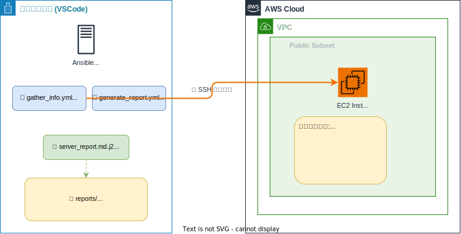

# セッション6：サーバー情報取得・運用レポート作成（任意・1時間）

## 🎯 このセッションのゴール

Ansibleでサーバー情報を自動収集し、Jinja2テンプレートで運用レポートを生成します。



| 作成するもの | 内容 |
|-------------|------|
| gather_info.yml | サーバー情報の自動収集 |
| generate_report.yml | レポート生成 Playbook |
| server_report.md.j2 | レポートテンプレート（Jinja2） |

### 構築の流れ

```
Step 1: サーバー情報を収集する Playbook
    ↓
Step 2: レポートテンプレートを作成
    ↓
Step 3: レポートを自動生成
```

---

## 📚 事前準備

- セッション4のAnsible環境が構築済みであること（`cd ansible && ansible all -m ping && cd ..` で確認）

> ⚠️ **作業ディレクトリについて**: Continueへのプロンプトは **プロジェクトルート** から実行してください。Ansible コマンドの手動実行時は `ansible/` ディレクトリに移動してください。

---

## Step 1: サーバー情報を収集しよう（20分）

### ゴール

`ansible/playbooks/gather_info.yml` を作成して、以下の情報を収集する：

- OS情報（distribution, version, kernel）
- CPU情報（コア数）
- メモリ情報（合計、使用量、使用率）
- ディスク使用量
- 稼働時間
- 実行中のサービス一覧
- CloudWatch Agentのステータス（セッション5を実施した場合）
- 最終ログイン情報

追加の要件：
- 収集した情報をJSON形式で `/tmp/server_info.json` に保存
- JSONファイルをローカルの `reports/` フォルダに取得

> 💡 **ヒント**: Ansible の `gather_facts: yes` で OS 情報やメモリ情報が自動的に取得されます（`ansible_memtotal_mb` などの変数で参照可能）。`fetch` モジュールでリモートファイルをローカルに取得できます。

<details>
<summary>📝 プロンプト例</summary>

```
ansible/playbooks/gather_info.yml を作成してください。

対象: webserversグループ
収集する情報:
- OS情報（ansible facts: distribution, version, kernel）
- CPU情報（コア数）
- メモリ情報（合計、使用量、使用率）
- ディスク使用量（df -h）
- 稼働時間（uptime）
- 実行中のサービス一覧
- CloudWatch Agentのステータス（存在する場合、ignore_errors）
- 最終ログイン情報（last -n 5）

要件:
- gather_facts: yes を使用
- コマンド実行のタスクには changed_when: false を設定
- 収集した情報をJSON形式で /tmp/server_info.json に保存
- JSON情報をローカルの reports/ フォルダに取得

作成後、実行してください。
```

</details>

情報が収集・表示されれば OK ✅

---

## Step 2: レポートテンプレートを作ろう（15分）

### ゴール

`ansible/templates/server_report.md.j2` に Jinja2 テンプレートを作成する。

テンプレートに含める内容：
- タイトル: サーバー運用レポート
- 生成日時
- サーバー概要テーブル（ホスト名、IP、OS、カーネル、稼働時間）
- リソース使用状況（CPU、メモリ、ディスク）
- メモリ使用率が80%超の場合のアラート表示
- ディスク使用率が80%超の場合のアラート表示
- 実行中サービス一覧（上位20件）
- CloudWatch Agentの状態
- サマリー（アラート件数）

> 💡 **ヒント**: Jinja2 では `...` で条件分岐、`...` でループを書けます。Ansible の変数がそのまま使えます。

<details>
<summary>📝 プロンプト例</summary>

```
ansible/templates/server_report.md.j2 を作成してください。

Jinja2テンプレートの内容:
- タイトル: サーバー運用レポート
- 生成日時
- サーバー概要テーブル（ホスト名、IP、OS、カーネル、稼働時間）
- リソース使用状況（CPU、メモリ、ディスク）
- メモリ使用率が80%超の場合はアラート表示
- ディスク使用率が80%超の場合はアラート表示
- 実行中サービス一覧（上位20件）
- CloudWatch Agentの状態
- サマリー（アラート件数）
```

</details>

---

## Step 3: レポートを自動生成しよう（15分）

### ゴール

`ansible/playbooks/generate_report.yml` を作成して、Step 1 の情報収集 + Step 2 のテンプレートを使ってレポートを自動生成する。

- 保存先: `reports/server_report_<ホスト名>_<日付>.md`

> 💡 **ヒント**: Ansible の `template` モジュールでJinja2テンプレートからファイルを生成できます。`delegate_to: localhost` を使えばローカルにファイルを保存できます。

<details>
<summary>📝 プロンプト例</summary>

```
ansible/playbooks/generate_report.yml を作成してください。

対象: webserversグループ
処理:
1. uptime, df, サービス一覧, CloudWatch Agent状態, 最終ログインを収集
2. ローカルに reports/ フォルダを作成
3. ansible/templates/server_report.md.j2 テンプレートを使ってレポート生成
4. 保存先: reports/server_report_<ホスト名>_<日付>.md

作成後、実行してください。
```

</details>

### 確認

プロジェクトルートから確認します：

```bash
ls ansible/reports/
cat ansible/reports/server_report_web1_*.md
```

> 💡 ファイルが見つからない場合は、Playbookの `dest` パスを確認してください。`playbook_dir` の値によってパスが変わることがあります。

レポートが生成されていれば **セッション6完了** 🎉

---

## ファイル構成

```
ansible/
├── inventory.ini              # セッション4で作成済み
├── ansible.cfg                # セッション4で作成済み
├── playbooks/
│   ├── gather_info.yml
│   └── generate_report.yml
├── templates/
│   └── server_report.md.j2
└── reports/                   # 生成されたレポート
    └── server_report_web1_YYYY-MM-DD.md
```

<details>
<summary>📝 完成形のコード例（クリックで展開）</summary>

### playbooks/gather_info.yml

```yaml
---
- name: サーバー情報の自動収集
  hosts: webservers
  become: yes
  gather_facts: yes

  tasks:
    - name: ディスク使用量
      command: df -h --output=target,size,used,avail,pcent
      register: disk_result
      changed_when: false

    - name: 稼働時間
      command: uptime -p
      register: uptime_result
      changed_when: false

    - name: 実行中サービス
      command: systemctl list-units --type=service --state=running --no-pager --plain
      register: services_result
      changed_when: false

    - name: CloudWatch Agentステータス
      command: /opt/aws/amazon-cloudwatch-agent/bin/amazon-cloudwatch-agent-ctl -a status
      register: cwagent_status
      changed_when: false
      ignore_errors: yes

    - name: 最終ログイン
      command: last -n 5 --time-format iso
      register: last_login
      changed_when: false

    - name: サマリー表示
      debug:
        msg: |
          ホスト: {{ ansible_hostname }}
          OS: {{ ansible_distribution }} {{ ansible_distribution_version }}
          メモリ: {{ ansible_memtotal_mb }}MB
          稼働: {{ uptime_result.stdout }}

    - name: JSON保存
      copy:
        content: |
          {{ {
            'timestamp': ansible_date_time.iso8601,
            'hostname': ansible_hostname,
            'os': ansible_distribution + ' ' + ansible_distribution_version,
            'kernel': ansible_kernel,
            'memory_total_mb': ansible_memtotal_mb,
            'memory_free_mb': ansible_memfree_mb,
            'disk': disk_result.stdout_lines,
            'uptime': uptime_result.stdout,
            'services_count': services_result.stdout_lines | length
          } | to_nice_json }}
        dest: /tmp/server_info.json
        mode: '0644'

    - name: ローカルにreportsフォルダ作成
      delegate_to: localhost
      become: no
      file:
        path: "{{ playbook_dir }}/../reports"
        state: directory

    - name: JSONをローカルに取得
      fetch:
        src: /tmp/server_info.json
        dest: "{{ playbook_dir }}/../reports/{{ inventory_hostname }}_info.json"
        flat: yes
```

### templates/server_report.md.j2

```jinja2
# サーバー運用レポート

**生成日時**: {{ ansible_date_time.iso8601 }}

---

## サーバー概要

| 項目 | 値 |
|------|-----|
| ホスト名 | {{ ansible_hostname }} |
| IP | {{ ansible_default_ipv4.address | default('不明') }} |
| OS | {{ ansible_distribution }} {{ ansible_distribution_version }} |
| カーネル | {{ ansible_kernel }} |
| 稼働時間 | {{ uptime_result.stdout }} |

---

## リソース使用状況

### メモリ
- 合計: {{ ansible_memtotal_mb }} MB
- 空き: {{ ansible_memfree_mb }} MB

- **使用率: {{ mem_usage }}%**


> ⚠️ **アラート**: メモリ使用率が80%超 ({{ mem_usage }}%)


### ディスク
```
{{ disk_result.stdout }}
```

---

## サービス（上位20件）


- {{ service }}


---

## CloudWatch Agent


- 状態: **稼働中** ✅

- 状態: 未インストール / 停止中


---

*Ansible自動生成レポート*
```

### playbooks/generate_report.yml

```yaml
---
- name: 運用レポート生成
  hosts: webservers
  become: yes
  gather_facts: yes

  tasks:
    - name: 稼働時間
      command: uptime -p
      register: uptime_result
      changed_when: false

    - name: ディスク使用量
      command: df -h
      register: disk_result
      changed_when: false

    - name: 実行中サービス
      command: systemctl list-units --type=service --state=running --no-pager --plain
      register: services_result
      changed_when: false

    - name: CloudWatch Agent状態
      command: /opt/aws/amazon-cloudwatch-agent/bin/amazon-cloudwatch-agent-ctl -a status
      register: cwagent_status
      changed_when: false
      ignore_errors: yes

    - name: reportsフォルダ作成
      delegate_to: localhost
      become: no
      file:
        path: "{{ playbook_dir }}/../reports"
        state: directory

    - name: レポート生成
      delegate_to: localhost
      become: no
      template:
        src: "../templates/server_report.md.j2"
        dest: "{{ playbook_dir }}/../reports/server_report_{{ inventory_hostname }}_{{ ansible_date_time.date }}.md"
```

</details>

---

## 🎉 ワークショップ完了

お疲れ様でした！全セッションの振り返り：

| セッション | 学んだこと | ツール |
|-----------|-----------|-------|
| 1 | VPC/EC2 段階的構築、Agent開発入門 | Terraform |
| 2 | Webアプリ公開、デプロイの流れ | Terraform + Agent |
| 3 | 動的Webアプリ構築（任意） | Python Flask + SQLite |
| 4 | サーバー再起動の自動化 | Ansible |
| 5 | SSM/CW Agent導入 | Ansible + AWS CLI |
| 6 | サーバー情報収集・レポート生成（任意） | Ansible |

---

## ⚠️ リソースの削除

ワークショップ終了後に **すべて** 削除してください。

> ⚠️ **必ず以下の順序で削除**してください（依存関係があるため逆順だとエラーになります）。

プロジェクトルートから実行：

```bash
# 1. セッション5: IAMリソース（実施した場合のみ）
# Agentに「training-ec2-agent-role と training-ec2-agent-profile を削除して」と伝えてください

# 2. セッション1〜2: VPC/EC2
cd terraform/vpc-ec2
terraform destroy
cd ../..
```
