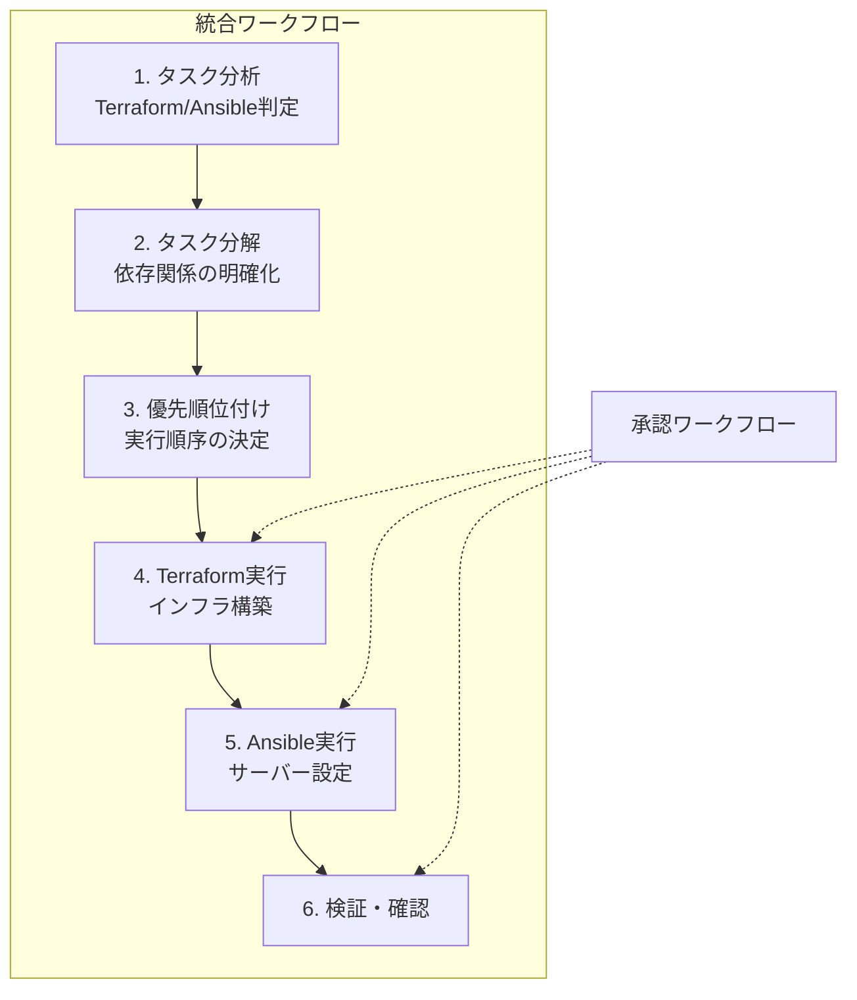

# セッション6：統合管理エージェント開発 詳細ガイド

## 📋 目的

このセッションでは、ContinueのAgent機能を活用して、TerraformとAnsibleを統合的に管理する方法を実践します。複雑なワークフローを自動化し、複数のリソースやタスクを効率的に管理する方法を学びます。

### 学習目標

- 複雑なPrompt Engineeringの実践（複数リソースの統合構築用プロンプト）
- 高度なContext Engineeringの実践（複数のコンテキストソースの統合）
- 複雑なワークフローでのフィードバックループの実践（複数ステップの承認ワークフロー、エラー発生時のロールバックと再試行、人間の判断が必要な場面での中断と確認）
- Agent形式での開発の総合理解を実践する
- TerraformとAnsibleの統合的な活用方法を理解する
- タスク分解と依存関係解決の考え方を理解する
- ワークフロー自動化の考え方を理解する

## 🎯 最終的な目標構成

このセッション終了時点で、以下の構成が完成していることを目指します：

### 統合管理のワークフロー



### ファイル構成

```
workspace/
├── terraform/
│   └── integrated/
│       └── (統合構築用のTerraformコード)
└── ansible/
    └── playbooks/
        └── (統合運用用のPlaybook)
```

### 成果物

- TerraformとAnsibleを統合的に活用したワークフロー
- 複雑なタスクを分解・実行する実践経験
- 統合管理の考え方とベストプラクティス

## 📚 事前準備

- [セッション3](session3_guide.md) が完了していること
- [セッション5](session5_guide.md) が完了していること
- TerraformとAnsibleの基本理解
- Continueが正しく設定されていること

## 🚀 Agent開発の進め方

### Agent開発のアドバイス

#### 1. 複雑なPrompt Engineering

**複数リソースの統合構築用プロンプト例**:

```
terraform/integrated/ フォルダに、下記条件を満たすWebアプリケーションインフラを構築するTerraformコードを生成してください。

要件:
- VPC: 10.0.0.0/16
- パブリックサブネット: 10.0.1.0/24, 10.0.2.0/24（2つのAZ）
- プライベートサブネット: 10.0.10.0/24, 10.0.11.0/24（2つのAZ）
- EC2インスタンス: t3.micro x 2（パブリックサブネット、Auto Scaling Group）
- RDS: db.t3.micro, MySQL 8.0（プライベートサブネット）
- ALB: Application Load Balancer（パブリックサブネット）
- セキュリティグループ: 適切に設定

依存関係:
1. VPC → サブネット → セキュリティグループ
2. サブネット → EC2インスタンス、RDS、ALB
3. セキュリティグループ → EC2インスタンス、RDS

注意事項:
- 足りていないパラメータがある場合は、そのまま構築するのではなく一度聞き返してください
- 既存のリソースと衝突しないように確認してください
- 依存関係を適切に設定してください
- 変数定義を含めてください
- コメントを適切に追加してください
- ベストプラクティスに従ってください
```

**タスク分解の考え方**:

複雑なタスクは、以下のように分解して考えることができます：

1. **Terraformタスク**: インフラリソースの作成（VPC、サブネット、EC2、RDSなど）
2. **Ansibleタスク**: サーバー設定（パッケージインストール、サービス設定など）
3. **依存関係**: Terraformタスク完了後にAnsibleタスクを実行

#### 2. 高度なContext Engineering

**複数のコンテキストソースの統合**:

Continueのチャット機能を使って、複数の情報源からコンテキストを取得できます：

```
以下の情報を統合して、Webアプリケーションインフラの構築と設定を行ってください：

1. 既存のAWSリソース情報:
   - 既存VPC: vpc-xxxxx (10.1.0.0/16)
   - 既存サブネット: 10.1.1.0/24, 10.1.2.0/24

2. サーバー情報:
   - OS: Amazon Linux 2023
   - 必要なパッケージ: nginx, node.js, pm2

3. 既存コード:
   - セッション2で作成したVPC/Subnet/EC2のTerraformコードを参考にしてください

上記の情報を考慮して、新しいWebアプリケーションインフラを構築し、サーバー設定も行ってください。
```

**段階的なコンテキスト提供**:

1. まずAWSリソース情報を取得
2. 次にサーバー情報を取得
3. 最後に既存コードを参照
4. すべてを統合してコンテキストとして提供

#### 3. 複雑なワークフローでのフィードバックループ

**複数ステップの承認ワークフロー**:

複雑なワークフローでは、各ステップごとに承認を求めることが重要です：

1. **ステップ1の承認**: Terraformコード生成後、計画を確認して承認
2. **ステップ2の承認**: Terraform実行後、結果を確認して承認
3. **ステップ3の承認**: Ansible Playbook生成後、内容を確認して承認
4. **ステップ4の承認**: Ansible実行前、最終確認

**エラー発生時のロールバックと再試行**:

エラーが発生した場合、以下のような対処が考えられます：

1. エラーメッセージをコンテキストとして提供
2. Agentに修正を依頼
3. 修正案を確認して承認
4. 必要に応じて、前のステップから再実行

**人間の判断が必要な場面での中断と確認**:

以下のような場面では、必ず人間の判断を求めます：

- リソースの削除
- 重要な設定の変更
- コストがかかる操作
- 本番環境への影響がある操作

### 考えながら進めるポイント

1. **タスクの分類方法**
   - どのタスクがTerraformで、どのタスクがAnsibleで実行すべきか
   - 複合タスクをどのように分解すべきか

2. **依存関係の明確化**
   - どのタスクが他のタスクに依存しているか
   - 実行順序をどのように決定すべきか

3. **コンテキストの統合方法**
   - 複数の情報源から取得した情報をどのように統合すべきか
   - どの情報が重要か

4. **ワークフローの設計**
   - 複数のステップをどのように組み合わせるべきか
   - エラーハンドリングをどのように実装すべきか

## 📝 振り返り

以下の点について振り返り、学んだことをまとめてください：

- **複雑なPrompt Engineeringの効果**: 複数リソースの統合構築をどのようにプロンプトに反映したか
- **高度なContext Engineering**: 複数のコンテキストソースを統合することで、どのような品質向上が実現できたか
- **複雑なワークフローでのフィードバックループ**: 複数ステップの承認ワークフロー、エラー発生時のロールバック、人間の判断が必要な場面での中断をどのように実践したか
- **Agent形式での開発の総合理解**: これまでのセッションで学んだことを統合して、どのような開発体験を実現できたか

<details>
<summary>📝 解答例（クリックで展開）</summary>

### 統合ワークフローの例

#### シナリオ1: 新規サーバー追加と設定

**ステップ1: Terraformでサーバー作成**

```
terraform/integrated/ フォルダに、下記条件を満たすEC2インスタンスを作成するTerraformコードを生成してください。

要件:
- インスタンスタイプ: t3.micro
- OS: Amazon Linux 2023
- セキュリティグループ: SSH（ポート22）のみ許可
- タグ: Name = "web-server-new", Environment = "training"

既存のインフラ情報:
- VPC: vpc-xxxxx (10.0.0.0/16)
- パブリックサブネット: subnet-xxxxx (10.0.1.0/24)
```

**ステップ2: Ansibleでサーバー設定**

```
ansible/playbooks/ フォルダに、新しく作成したEC2インスタンスに以下の設定を行うAnsible Playbookを生成してください。

要件:
- nginxをインストール
- nginx設定ファイルを配置
- nginxサービスを開始
- 自動起動を有効化

対象サーバー:
- 新しく作成したEC2インスタンス（インベントリに追加済み）

注意事項:
- 冪等性を確保してください
- エラーハンドリングを含めてください
```

#### シナリオ2: 監視エージェントのセットアップ

**統合プロンプト例**:

```
以下のワークフローを実行してください：

1. Terraformタスク:
   - 既存のEC2インスタンスにCloudWatchエージェントをインストールするためのIAMロールを作成
   - IAMロールをEC2インスタンスにアタッチ

2. Ansibleタスク:
   - CloudWatchエージェントをインストール
   - 設定ファイルを配置
   - サービスを開始

依存関係:
- Terraformタスク完了後にAnsibleタスクを実行

既存のインフラ情報:
- EC2インスタンスID: i-xxxxx
- 既存のIAMロール: なし
```

#### シナリオ3: 複数リソースの一括管理

**プロンプト例**:

```
以下のリソースを順番に作成・設定してください：

1. VPCとサブネットの作成（Terraform）
2. EC2インスタンスの作成（Terraform）
3. セキュリティグループの設定（Terraform）
4. EC2インスタンスへのSSH接続設定（Ansible）
5. 必要なパッケージのインストール（Ansible）
6. アプリケーションのデプロイ（Ansible）

各ステップで承認を求めてください。
エラーが発生した場合は、ロールバックを検討してください。
```

### タスク分解の考え方

**複合タスクの分解例**:

```
以下のタスクを、TerraformタスクとAnsibleタスクに分解してください。

タスク: Webアプリケーション環境の構築

分解結果:
- Terraformタスク:
  1. VPC、サブネットの作成
  2. EC2インスタンスの作成
  3. セキュリティグループの設定
  4. ALBの作成

- Ansibleタスク:
  1. パッケージのインストール（nginx, node.js）
  2. アプリケーションコードのデプロイ
  3. サービスの起動
  4. ヘルスチェックの設定

- 依存関係:
  - AnsibleタスクはTerraformタスク完了後に実行
  - アプリケーションデプロイはパッケージインストール後に実行
```

### エラーハンドリングとロールバック

**エラー発生時の対処例**:

```
エラーが発生しました：
- Terraform実行時: Resource 'aws_instance.web' already exists

このエラーを解決する方法を教えてください。
また、既に作成されたリソースがある場合、それを活用する方法も検討してください。
```

Agentが修正案を提示したら、それを確認して承認します。

</details>

## ✅ チェックリスト

- [ ] 最終的な目標構成を理解した
- [ ] 複雑なPrompt Engineeringを実践した（複数リソースの統合構築用プロンプト）
- [ ] 高度なContext Engineeringを実践した（複数のコンテキストソースの統合）
- [ ] タスク分解と依存関係解決の考え方を理解した
- [ ] TerraformとAnsibleを統合的に活用したワークフローを実践した
- [ ] 複数ステップの承認ワークフローを実践した
- [ ] エラー発生時のロールバックと再試行を実践した
- [ ] 人間の判断が必要な場面での中断と確認を実践した
- [ ] Agent形式での開発の総合理解を深めた

## 🆘 トラブルシューティング

### タスク分類がうまくいかない

- プロンプト内で明示的にタスクタイプを指定してください
- 複合タスクの場合は、段階的に分解してください

### 依存関係が正しく反映されない

- プロンプト内で依存関係を明示的に記述してください
- 各ステップの実行順序を明確にしてください

### エラー発生時の対処がわからない

- エラーメッセージを詳しく確認してください
- エラーメッセージをコンテキストとして提供し、Agentに修正を依頼してください

### ワークフローが複雑になりすぎる

- ワークフローを小さなステップに分解してください
- 各ステップごとに確認・承認を行ってください

## 📚 参考資料

- [Continue公式ドキュメント](https://continue.dev/docs)
- [Terraform公式ドキュメント](https://developer.hashicorp.com/terraform/docs)
- [Ansible公式ドキュメント](https://docs.ansible.com/)
- [セッション3ガイド](session3_guide.md)
- [セッション5ガイド](session5_guide.md)

## ➡️ 次のステップ

セッション6が完了したら、[セッション7：Webシステム構築（任意）](session7_guide.md) に進むか、ワークショップを完了してください。
